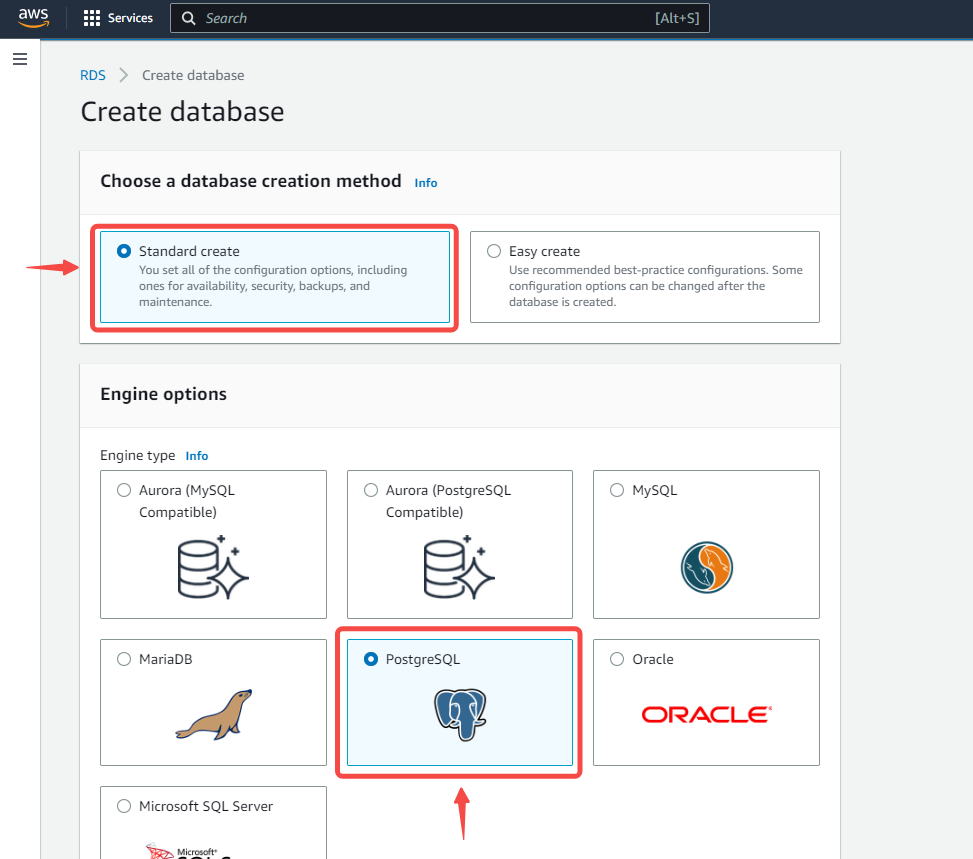
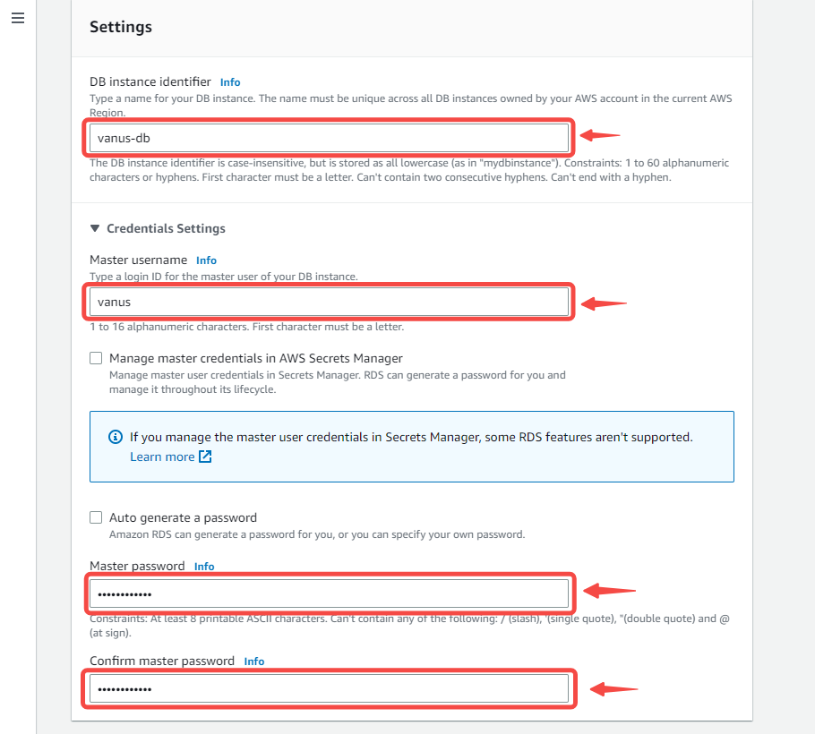
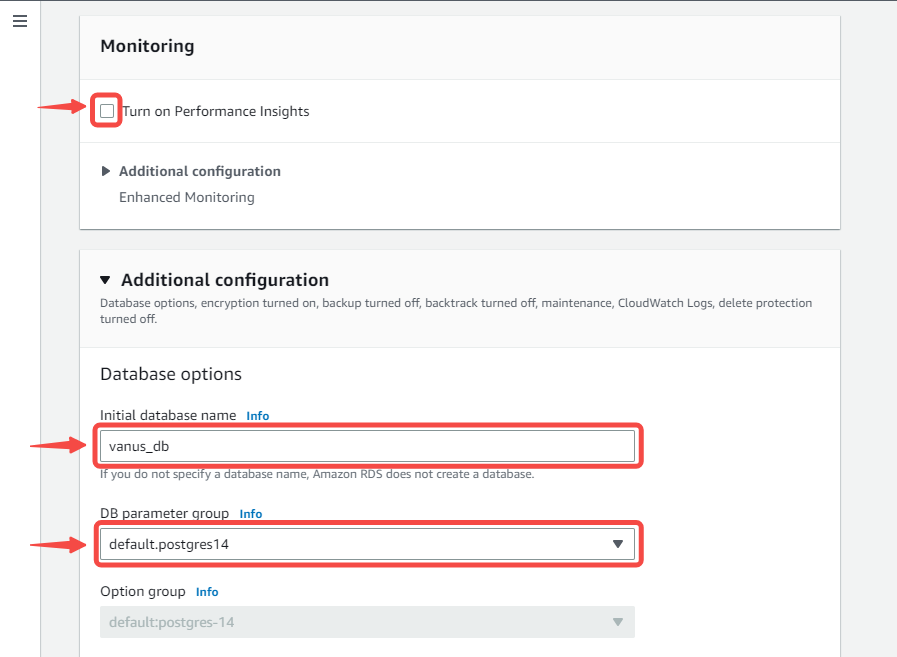
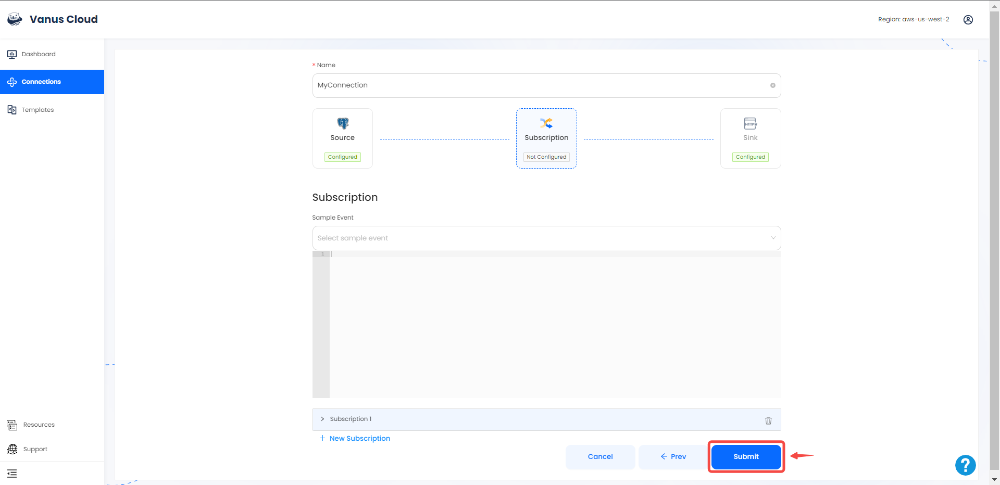
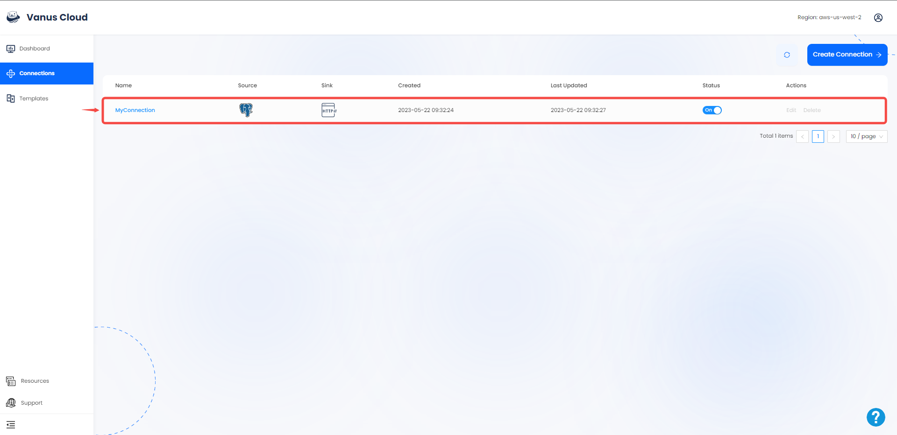

# AWS-PostgreSQL   

This guide contains information required in setting up an Amazon PostgreSQL Source in Vanus Cloud.  

## Introduction  

### PostqreSQL  

PostgreSQL is a reliable and feature-rich open-source database system with advanced features like multi-version concurrency control(MVCC), full-text search, and geospatial data management. It's commonly used for data-intensive applications and web applications due to its scalability and robustness. PostgreSQL works on various operating systems and provides both command-line and graphical user interface tools for data management and application development.

### AWS-PostgreSQL  

AWS PostgreSQL is a managed database service offered by Amazon Web Services (AWS) that provides a fully-managed, scalable, and secure PostgreSQL database in the cloud. It simplifies tasks like database backups, software patching, and replication, allowing users to focus on their application development and business needs. AWS PostgreSQL features high availability, automated backups and recovery, automatic failover, and advanced security features like encryption. It also supports popular PostgreSQL extensions like PostGIS and pgAdmin. Overall, AWS PostgreSQL is a reliable option for running PostgreSQL databases in the cloud with flexibility and scalability.

### PostgreSQL CDC  

PostgreSQL CDC (Change Data Capture) is a feature that captures and tracks real-time changes made to a PostgreSQL database. It works by monitoring the database's transaction log and capturing any detected changes, which are stored separately for further analysis or processing. CDC is useful for real-time data integration and synchronization in scenarios such as data warehousing, business intelligence, or ETL processes, ensuring that downstream systems have access to the latest information and data is synchronized across different systems in real-time.

### PostgreSQL CDC Source  

The Vanus PostgreSQL Source connector is a connector provided by Vanus, that identifies and tracks data changes from a PostgreSQL database in real-time. It extracts this data from the users postgresql database, converts it to cloud events and streams it to a sink connector of their choice.  
CDC is a technique used to identify and track changes made to a database, such as insertions, updates, and deletions.  

---

## Prerequisites  

Before creating your PostgreSQL connection, you must have:

- A Vanus cloud account 
- An SQL client
- A running PostgreSQL server
- A database, schema and Table  

---

## Getting Started 

### Step 1: Setup A PostgreSQL database server in AWS using RDS  

#### Creating an RDS account  

1. Log in to the [AWS Management Console](https://aws.amazon.com/)   

2. Click on the left navigation pane called **services** click on database and select **RDS**.   
   

3. Click on Create database in the Create Database section.  
   

#### Create Database  
Now you have options to select your engine.  

1. Select standard create and choose the PostgreSQL icon.   
   

2. Select the **Free tier** template.   
   

>**Note** Multi-AZ deployment is not available for the free tier, you will have to pay for it. Using a Multi-AZ deployment automatically provisions and maintains a synchronous standby replica in a different Availability Zone.   

##### Settings   

   

1. 
    - DB Instance Identifier: Type a name unique to the region your DB instance has been set in.  

    - Master Username: This is the username that would be used to log in to your DB instance.  

    - Master Password: Type a password that takes the given constraints into consideration.  

    - Confirm password: Type the password again.   

##### Instance configuration and storage

2. 
    - Leave the default Instance configuration.  

    - Select the gp2 storage type, it's efficient and cost effective for our intended use.  

    - Turn off autoscaling to avoid extra cost. Unless your use-case requires it.   
       

##### Connectivity  

3.
    - Leave the default VPC and subnet group.  

    - Enable public access, this allocates an IP to your database instance and allows direct connection to the database from your own device.  
       

4.
    - Select **Create new VPC security group**. This would create a security group that allows connection from the IP address of the device that you are currently using, to the database you created.

    - Leave Database port on 5432   

    - Select the password method of authentication.
       

5.
    - Enable or disable performance insight depending on your database needs. We disabled it for this tutorial.  

    - Set a database name. If you do not provide one, Amazon RDS will not create a database on the instance being created.   
       

6.
    - Set your preferred backup retention period.  

    - Enable or disable backup replication, based on your database needs. We disabled it for this tutorial.  
       

7.
    - Leave Deletion protection unchecked, checking the box prevents you from being able to delete the database.  
       

8.
    - Click on **Create Database**  
       

    - Your DB is now being created.  
       

---

### Step 2: Finish Your Connection in Vanus Cloud  

1. Log in to your [Vanus](https://cloud.vanus.ai) account and click on **connections**  
  

2. Click on **Create Connections**  
  

3. Name your connection and choose a source 
 

4. Provide the following credentials: 

- Host 
- Port 
- Username 
- Password 
- Database 
- Schemas 
- Tables   

5. Click next to continue. 

6. Choose your sink and click **Next** 
 

7. Click on submit to finish the configuration. 
  

8. You've successfully created your Vanus aws-s3 source connection.  
 

Learn more about Vanus and Vanus Cloud in our [documentation](https://docs.vanus.ai/getting-started/what-is-vanus)