# Amazon S3

This guide contains information to set up a S3 Source in Vanus Cloud.

## Introduction

S3 is Amazon's cloud storage service that offers scalable and durable storage for various data types. It provides easy management and retrieval of data from anywhere with high availability and low latency.

Vanus Cloud provides the Amazon S3 Source connector, which retrieves S3 events from a designated bucket and converts them into CloudEvents. With this connector, users can also set up an SQS queue to receive S3 event notifications. If a queue isn't specified, the connector will create one automatically.

## Prerequisites

Before obtaining S3 events, you must have:
- A [Vanus Cloud account](https://cloud.vanus.ai)

## Getting Started

### Step 1: Create a new AWS user

1. Log in to the AWS [Management Console](https://aws.amazon.com) using your root account credentials.
2. Navigate to the [IAM](https://console.aws.amazon.com/iam/) service by searching for IAM and click the IAM service.
   
3. Click on the **Users tab** in the left navigation menu, and then click the **Add user** button.
   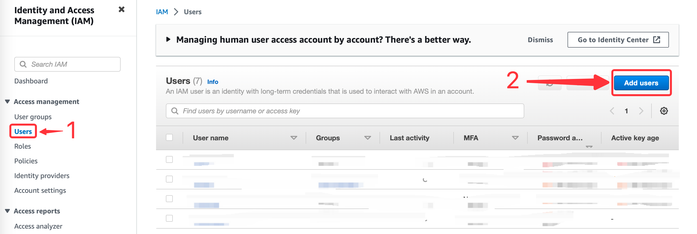
4. Write the name for your user and click **next**.
   
5. Select **Attach policy directly**, and **Create policy**.
   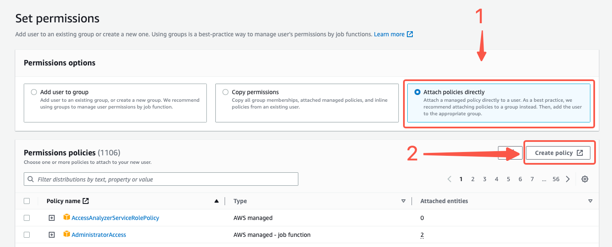
6. Search for s3 and select it.
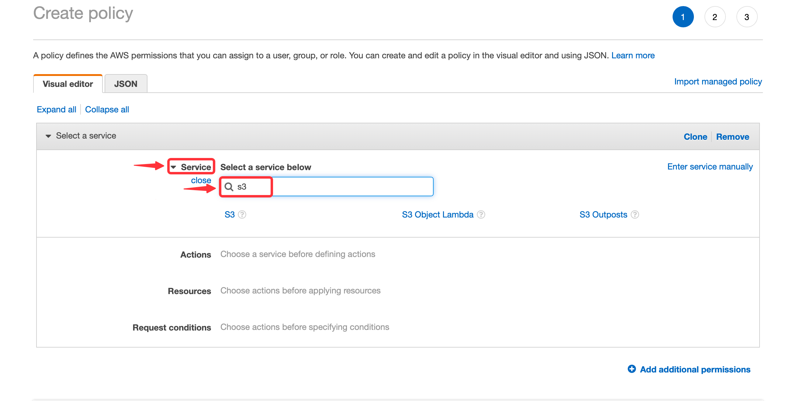   
7. Next search for the following policy. 
   - PutBucketNotification
   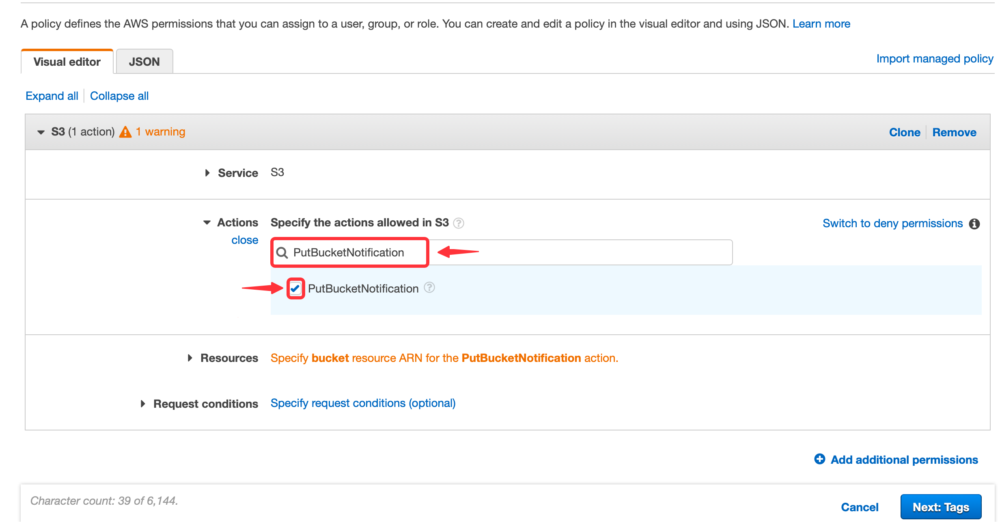
8. Click **Add additional permissions**.
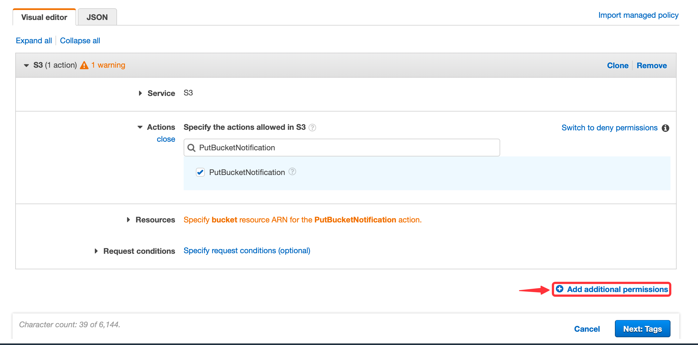
9. Now search for SQS.
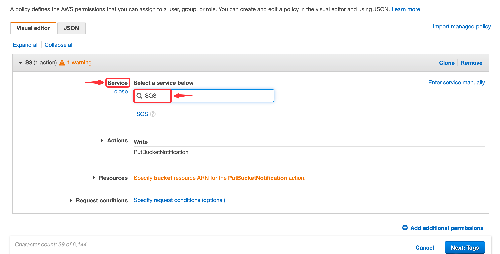
10. Next search for the following policies.
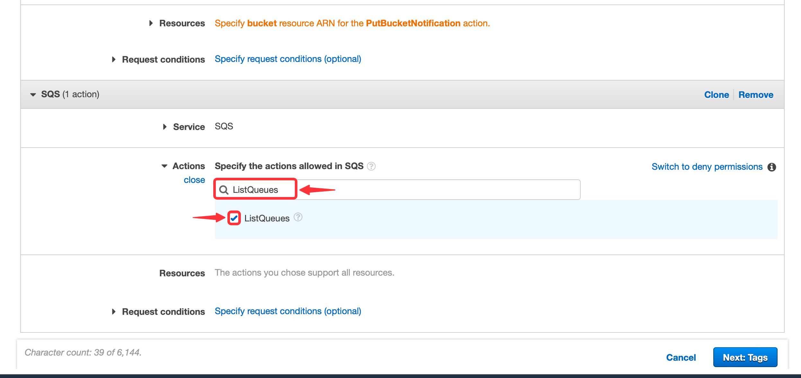
    - ListQueues
    - GetQueueUrl
    - ReceiveMessage
    - GetQueueAttributes
    - CreateQueue
    - SetQueueAttributes
    - DeleteMessage
11. Press **Next** and proceed to the next page.
   
12. Name your policy and click **Create policy**.
13. Return back to your previous `TAB`.
    
14. Search for your custom policy and add it to your account, and press **Next**.
    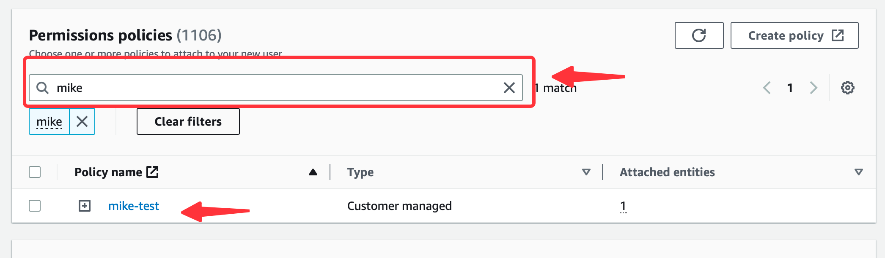
15. Review and press **Create user**.
    

### Step 2: Create an Create Access Key
1. Now click on the user you just created.
   
2. Under **Security and credential** scroll down the page to `Access Key`, and Click **Create access key**.
   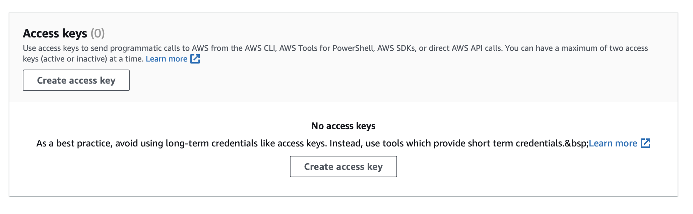
3. Select Command line interface CLI, and press **Next**.
   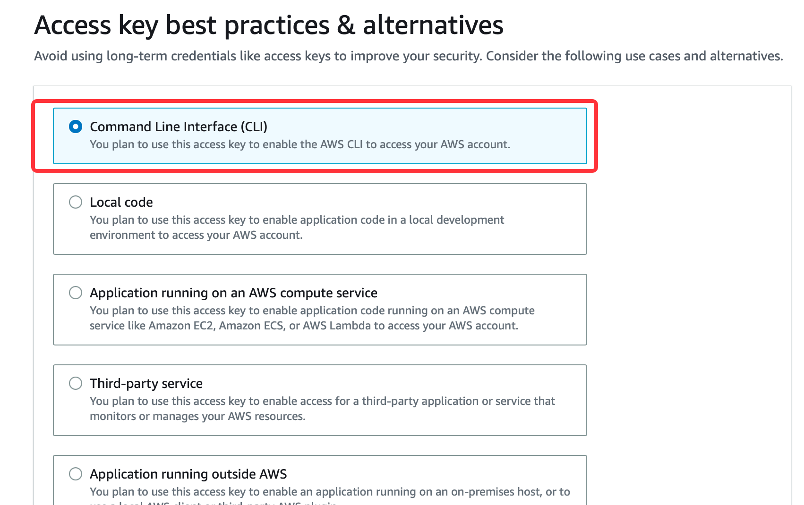
4. Click **Create sccess key**.
   
5. Save your `Access key` and `Secret key` safely.
   

### Step 3: Config your connection

To obtain S3 Bucket events using the S3 source connector in Vanus Cloud, follow these steps:

1. Write a connection name without any spaces.
   
2. Enter your `Access Key` and `Secret Key` in Vanus Cloud.
   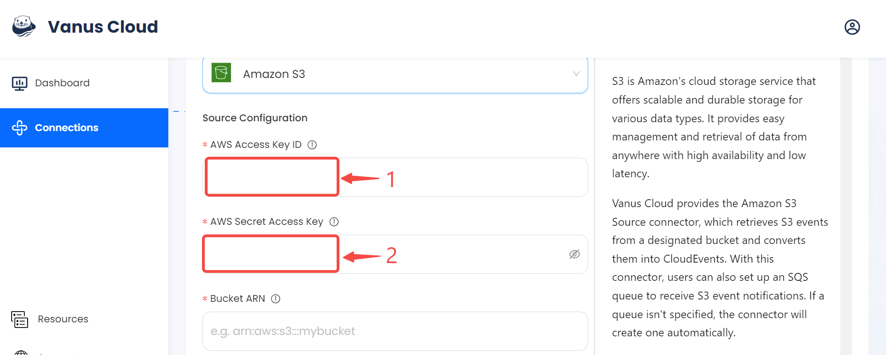
3. Now let go back to AWS under the [Amazon S3 service](https://s3.console.aws.amazon.com/s3/buckets).
   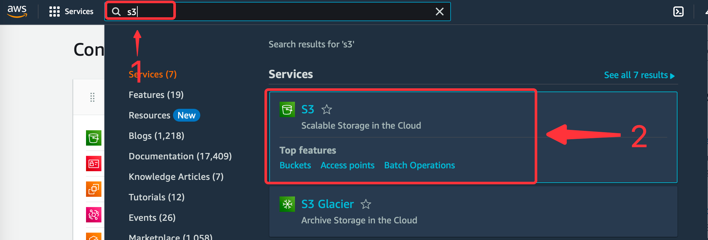
4. At this point you can either **Create a new bucket** or **select a existent bucket**.
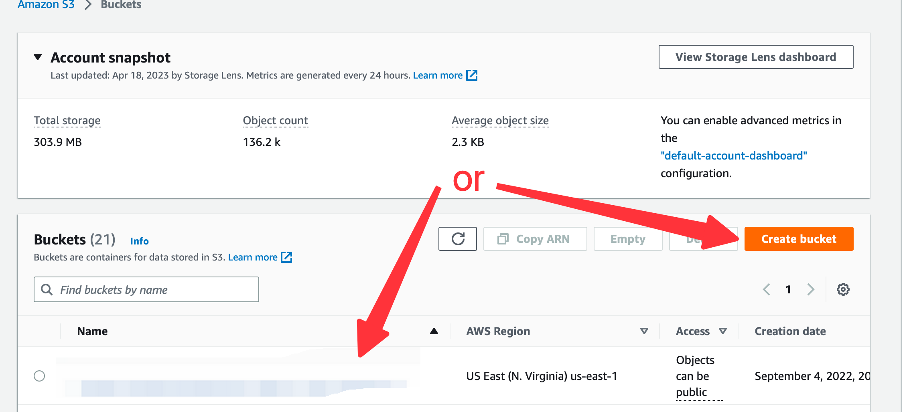
5. Once selected or created go to your bucket property and copy and paste the **ARN** to Vanus Cloud.
   
6. Specify the kind of event you want to receive from the list
   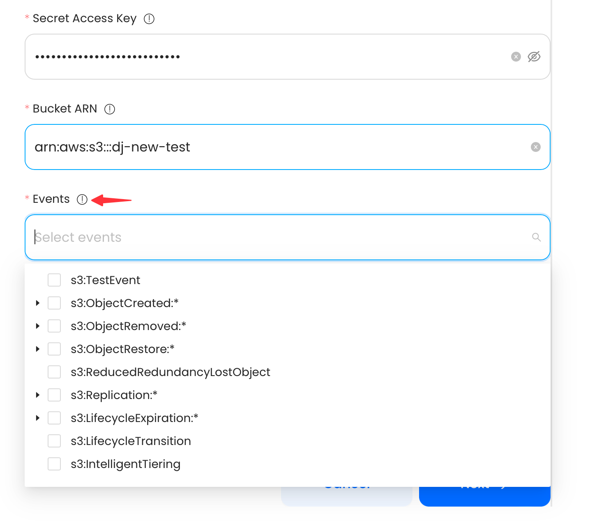
7. Under SQS config you can choose to create a new SQS by selecting Region or if you already have a SQS provide the ARN.
   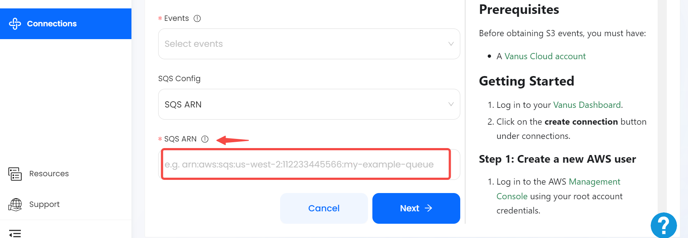
8. Click **Next** to continue.

Learn more about Vanus and Vanus Cloud in our [documentation](https://docs.vanus.ai).
