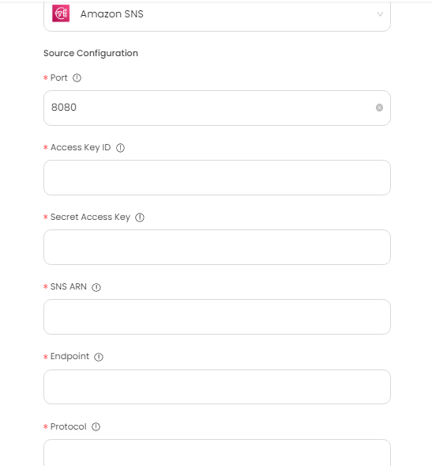
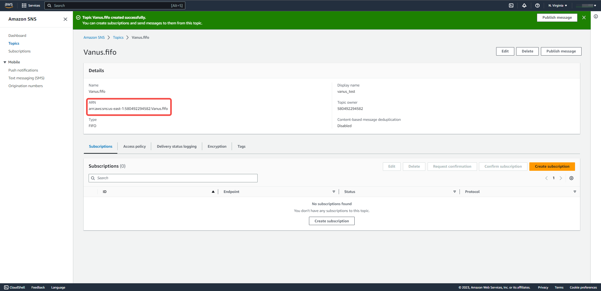
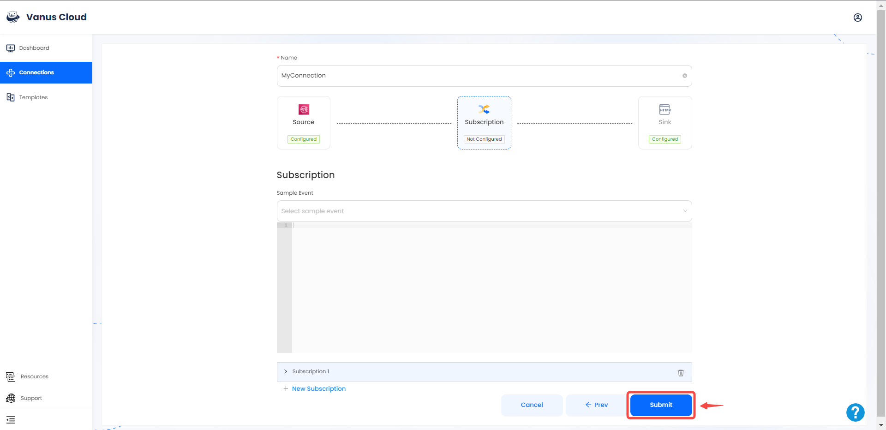
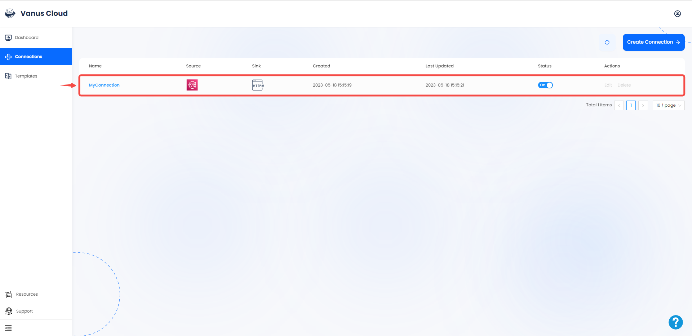

# Amazon SNS

This guide contains information to set up a SNS Source in Vanus Cloud.

## Introduction

Amazon Simple Notification Service (Amazon SNS) is a fully-managed messaging service provided by Amazon Web Services (AWS).

It enables you to send and receive messages between distributed systems or microservices, mobile devices, and other AWS services.

Vanus Cloud provides the Amazon SNS Source connector, which retrieves SNS events and converts them into CloudEvents.

---

## Prerequisites

Before obtaining SNS events, you must have:

- A  Vanus cloud account
- Have an AWS SNS Topic.
- AWS IAM Access Key.
- AWS permissions for the IAM user:
  - sns:Subscribe
  - sns:ConfirmSubscription
  - sns:Unsubscribe

---

## Getting Started

### Step 1: Create a New AWS User

1. Log in to the AWS [Management Console](https://aws.amazon.com) using your root account credentials.

2. Navigate to the [IAM](https://console.aws.amazon.com/iam/) service by clicking on the Services menu and selecting IAM.

3. Click on the **Users tab** in the left navigation menu, and then click the **Add user** button.

4. Write the name for your user and click **next**. 

5. Select **attach policy directly**, and **Create policy**.

6. Select the Service `Cost Explore Service` and search for the following policy.
    - "PutObject",
    - "GetObject",
    - "GetObjectVersion",
    - "DeleteObject",
    - "DeleteObjectVersion"
   
7. Press **next** and proceed to the next page, name your policy and click **create policy**.

8. Return back to your previous `TAB`.

9. Search for your custom policy and add it to your account, and press **next**.

10. Review and press **create user**.

---

### Step 2: Create an Access Key

1. Now click on the user you just created.

2. Under **Security and credential** scroll down the page to `Access Key`, and Click **Create access key**.

3. Select Command line interface CLI, and press **next**.

4. Save your access key and secret key safely.

---

### Step 3: Continue your set up in Vanus cloud 

1. Log in to your [Vanus](https://cloud.vanus.ai) account and click on **connections**  
  

2. Click on **Create Connections**  
  

3. Write a connection name without any spaces.
   

4. Enter the following credentials:

- Port
- Access Key ID
- Secret Access Key
- SNS ARN
- Endpoint
- Protocol

5. To get **SNS ARN**, **Endpoint** and **Protocol**, let's go back to our Amazon Web Services Account. 

6. To obtain the **SNS ARN**, Search for **SNS** and Click on it to open the SNS Console. 
 

7. Click on **topics** 

8. Click on the **Create Topic** Button. 

9. Select the type as **FIFO** and name the Topic. Scroll down and click the **Create topic** button to create a Topic. 

10. Copy the **SNS ARN** and paste on the field in Vanus Cloud and click **Next** to continue.  

11. Click **Next**.  

12. Choose your sink and click **Next** 
 

13. Click on submit to finish the configuration. 
  

14. You've successfully created your Vanus aws-sns source connection.  
 

Learn more about Vanus and Vanus Cloud in our [documentation](https://docs.vanus.ai).
