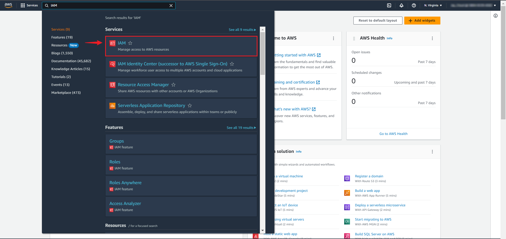
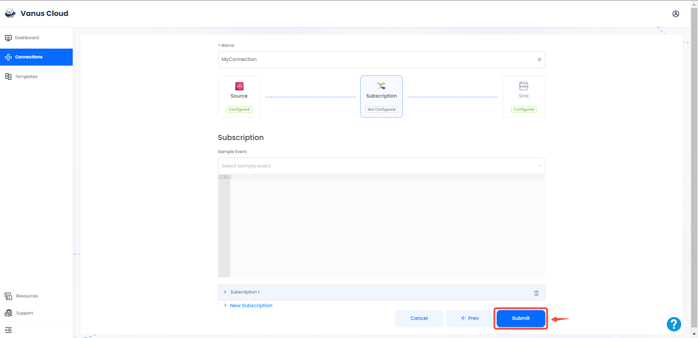
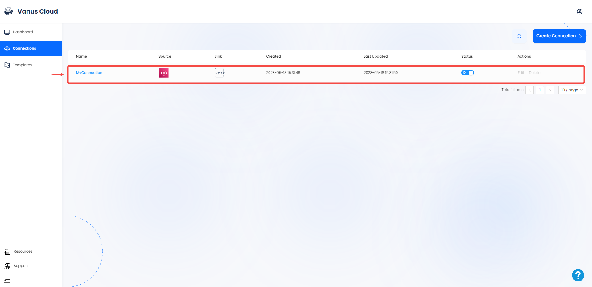

# Amazon SQS

This guide contains information to set up a SQS Source in Vanus Cloud.

## Introduction

Amazon Simple Queue Service (Amazon SQS) is a fully-managed message queuing service provided by Amazon Web Services (AWS).

It is designed to help developers build distributed systems and applications that need to communicate asynchronously by reliably sending, storing, and receiving messages between software components.

Vanus Cloud provides the Amazon SNS Source connector, which retrieves SNS events and converts them into CloudEvents.

---

## Prerequisites

Before obtaining SQS events, you must have:

- A [Vanus Cloud account](https://cloud.vanus.ai)
- Have an AWS SQS Queue.
- AWS IAM Access Key.
- AWS permissions for the IAM user:
  - sqs:GetQueueUrl
  - sqs:ReceiveMessage
  - sqs:DeleteMessage

---

## Getting Started

### Step 1: Create a new AWS user

Create a new user and set the proper IAM policy.

1. Log in to the AWS Management Console using your root account credentials.

2. Navigate to the IAM service by clicking on the Services menu and selecting IAM.

3. Click on the Users tab in the left navigation menu, and then click the Add user button.

4. Write the name for your user and click next. 

5. Select attach policy directly, and Create policy.

6. Search for the Service `sqs`, select `AmazonSQSFullAccess` and press **next** 

8. Review and press create user. 

9. Now click on the user you just created.  
  

10. Go to `Security Credentials` and click **Create access key**.

11. Select Command line interface CLI, and press next.  

12. Save your access key and secret key safely.

---

### Step 2: Continue your connection set up in Vanus cloud 

To obtain Amazon SQS events using the SQS source connector in Vanus Cloud, follow these steps:

1. Log in to your [Vanus](https://cloud.vanus.ai) account and click on **connections**  
  

2. Click on **Create Connections**  
  

3. Write a connection name without any spaces and choose your source   

4. Enter your Access Key and Secret Key in Vanus Cloud.  

5. Click next to continue.  

6. Choose your sink and click **Next** 
 

7. Click on submit to finish the configuration. 
  

8. You've successfully created your Vanus aws-sqs source connection.  
 

Learn more about Vanus and Vanus Cloud in our [documentation](https://docs.vanus.ai).
