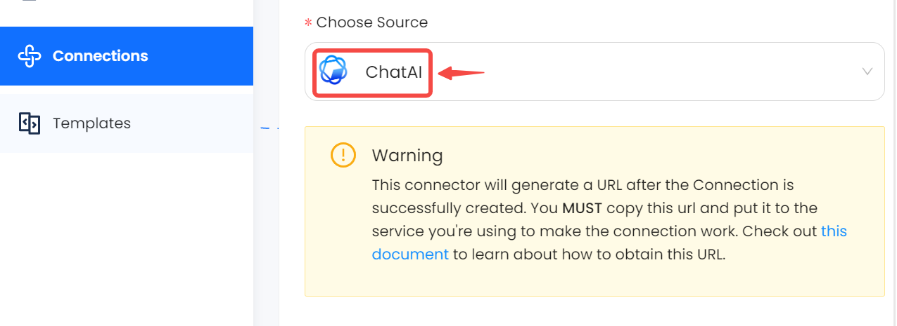

# ChatAI

This guide contains information to set up a ChatAI Source in Vanus Cloud.

## Introduction

ChatAI uses OpenAI's language model, ChatGPT, to generate responses to your messages in real-time

ChatAI Source is a Vanus-hosted ChatAI service which works as an HTTP server to generate human-like responses to textual content from incoming HTTP requests, and deliver responses to endpoints in the CloudEvents HTTP format.

## Prerequisites

Before obtaining ChatAI events, you must have:

- A [Vanus Cloud account](https://cloud.vanus.ai)

## Getting Started

### Create a Connection

1. Write a name for your connection.

2. From the list of sources, choose ChatAI.
   
3. Fill in the various required configurations
    - Chat Mode: Select Chat Mode, Default is ChatGPT
    - Context: If context is required, please enable it before use. Enabling it will incur additional charges.
    - Unique Identifier: The unique identifier of an identity, which is used to differentiate among multiple individuals using the same Connection.
    - Basic Auth Username: A method for an HTTP user agent to provide a user name when making a request.
    - Basic Auth Password: A method for an HTTP user agent to provide a password when making a request.
4. After you finish creating the connection their will be more steps please click this document to open a new tab with the following instruction.
   
4. Click **`Next`** to save the ChatAI Source.

Learn more about Vanus and Vanus Cloud in our [documentation](https://docs.vanus.ai).
