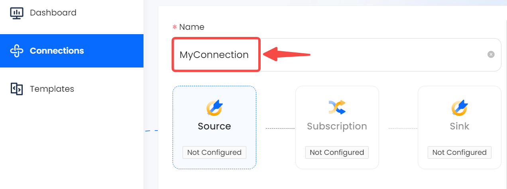
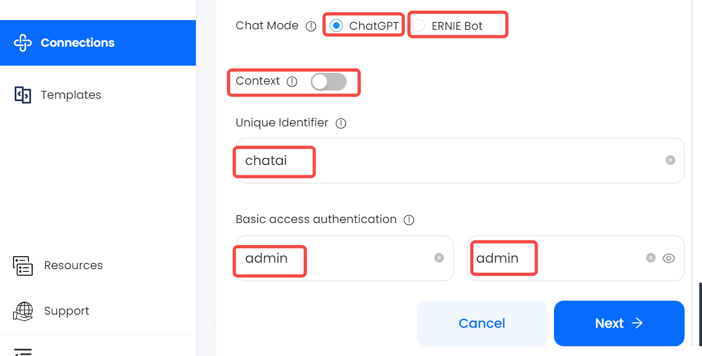
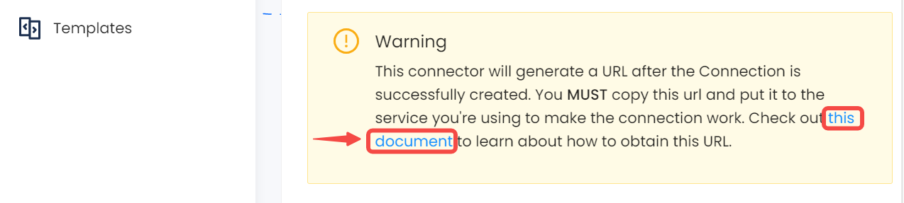

# ChatAI

This guide contains information to set up a ChatAI Source in Vanus Cloud.

## Introduction

ChatAI uses OpenAI's language model, ChatGPT, to generate responses to your messages in real-time

ChatAI Source is a Vanus-hosted ChatAI service which works as an HTTP server to generate human-like responses to textual content from incoming HTTP requests, and deliver responses to endpoints in the CloudEvents HTTP format.

## Prerequisites

Before obtaining ChatAI events, you must have:

- A [Vanus Cloud account](https://cloud.vanus.ai)

## Getting Started

### Set up your connection in Vanus Cloud

1. Write a name for your connection.
    
2. Fill in the various required configurations
    - Chat Mode: Select Chat Mode (ChatGPT or Ernie Bot), Default is ChatGPT
    - Context (optional): Select Context as on if you want the AI to remember previous conversations
    - Unique Identifier (optional): The unique identifier differentiates among multiple conversations using the same Connection. Example identifier:convo1 identifier:convo2...
    - Basic Auth Username (optional): A method for an HTTP user agent to provide a username when making a request.
    - Basic Auth Password (optional): A method for an HTTP user agent to provide a password when making a request.
    
3. After you finish creating the connection, there will be more steps. Please click the link to open a new tab with the following instruction.
   
4. Click **`Next`** to save the ChatAI Source.

Learn more about Vanus and Vanus Cloud in our [documentation](https://docs.vanus.ai).
