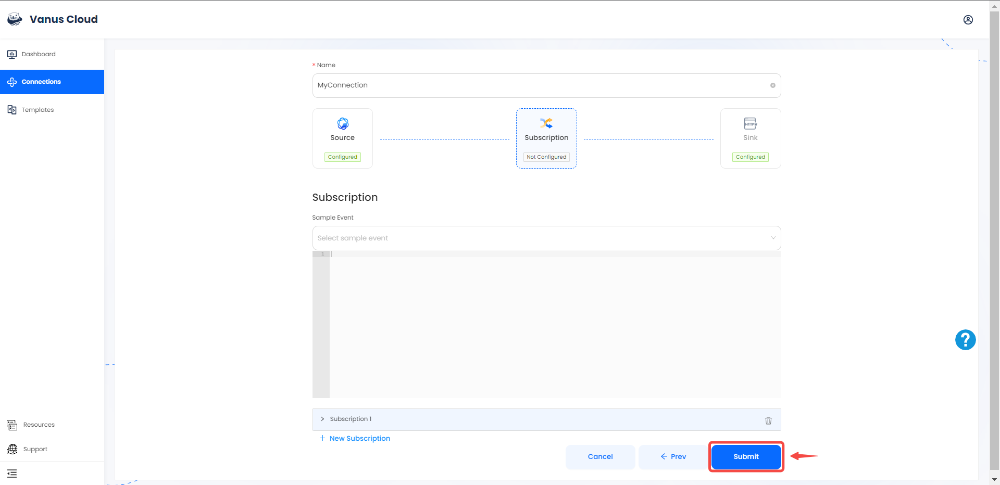
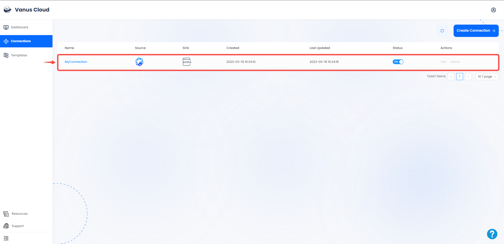

# ChatAI

This guide contains information to set up a ChatAI Source in Vanus Cloud.

## Introduction

ChatAI uses OpenAI's language model, ChatGPT, to generate responses to your messages in real-time

ChatAI Source is a Vanus-hosted ChatAI service which works as an HTTP server to generate human-like responses to textual content from incoming HTTP requests, and deliver responses to endpoints in the CloudEvents HTTP format.

---
## Prerequisites

Before obtaining ChatAI events, you must have:

- A [Vanus Cloud account](https://cloud.vanus.ai)

---

## Getting Started

### Set up your connection in Vanus Cloud

1. Log in to your [Vanus](https://cloud.vanus.ai) account and click on **connections**  
  

2. Click on **Create Connections**  
  

3. Write a name for your connection and choose your source. 
 

4. . Fill in the various required configurations

- Chat Mode: Select Chat Mode (ChatGPT or Ernie Bot), Default is ChatGPT
- Context (optional): Select Context as on if you want the AI to remember previous conversations
- Unique Identifier (optional): The unique identifier differentiates among multiple conversations using the same Connection. Example identifier:convo1 identifier:convo2...
- Basic Auth Username (optional): A method for an HTTP user agent to provide a username when making a request.
- Basic Auth Password (optional): A method for an HTTP user agent to provide a password when making a request.
 

5. Click the **copy** icon to copy the webhook url. 

6. Choose your sink and click **Next** 
 

7. Click on submit to finish the configuration. 
  

8. You've successfully created your Vanus chatai source connection.  
 
---

### **How to Use the Webhook URL to Send Message to ChatAI**

Ask a question to ChatAI by sending a POST Request to the Webhook URL. Below I will share with you how to send a simple curl Post Request to the address.

Here is a Example of a curl Post Request of a CloudEvent.
```shell
curl \
-H "unique_identifier:value"  \
-H "Authorization: Basic base64(yourusername:yourpassword)"
-XPOST 'https://YourWebbookURL' \
-D'What is CloudEvents?'
```

Learn more about [CloudEvents](https://cloudevents.io). 

Learn more about Vanus and Vanus Cloud in our [documentation](https://docs.vanus.ai).
