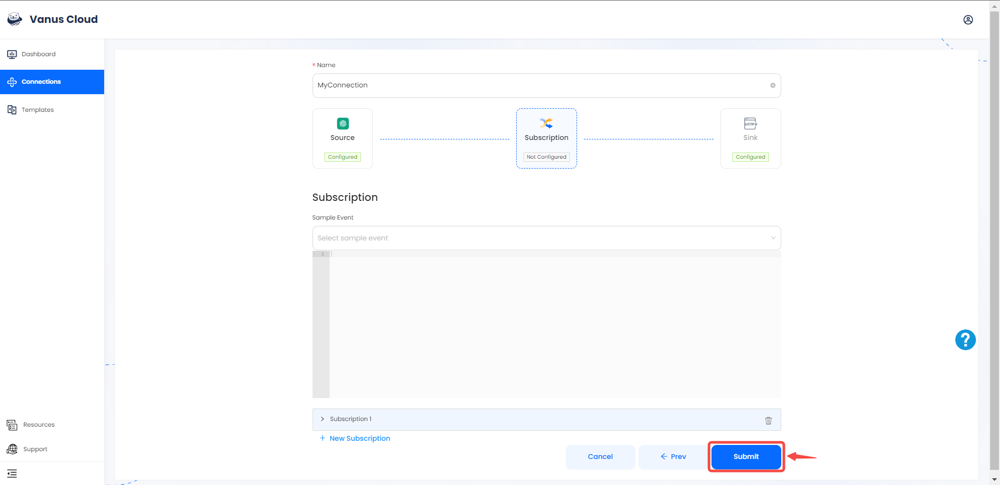
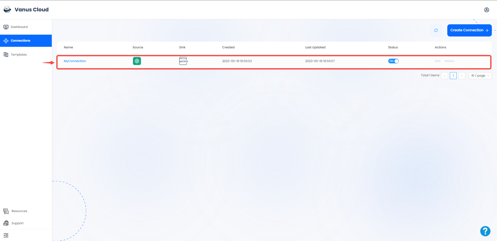

# ChatGPT

This guide contains information to set up a ChatGPT Source in Vanus Cloud.

## Introduction

ChatGPT is a large language model developed by OpenAI, based on the GPT-3.5 architecture.

ChatGPT Source is a Vanus-hosted ChatGPT service which works as an HTTP server to generate human-like responses to textual content from incoming HTTP requests,
and deliver responses to endpoints in the CloudEvents HTTP format.

---
## Prerequisites

Before obtaining ChatGPT events, you must have:

- A [Vanus Cloud account](https://cloud.vanus.ai)

---

## Getting Started

### Create a Connection

1. Log in to your [Vanus](https://cloud.vanus.ai) account and click on **connections**  
  

2. Click on **Create Connections**  
  

3. Write a name for your connection and choose your source. 
 

4. Click the copy icon to copy the webhook url. 

5. Choose your sink and click **Next** 
 

6. Click on submit to finish the configuration. 
  

7. You've successfully created your Vanus chatgpt source connection.  
 

---

### How to setup ChatGPT in Feishu 

1. Return into Feishu and search for `flow` or `飞书捷径` and click on it.

2. Press **create**.

3. Select the Trigger and choose **Message**.

4. Select `New message that mentioned BOT in the group chat`.

5. In group select **specific groups** Search for the group you've previously created, select your ChatGPT bot under bot and press **confirm**.

6. Select the action and choose webhook as the action.

7. Select Custom Request.

8. Select the method `POST`, set the URL using the URL from step 1, Select the Data `Message: Message content without the @ part`, and press **Confirm**.

9. press **Create**.

10. Name your flow and Confirm.

11. Now send a message in the group tagging the bot.

Learn more about Vanus and Vanus Cloud in our [documentation](https://docs.vanus.ai).
