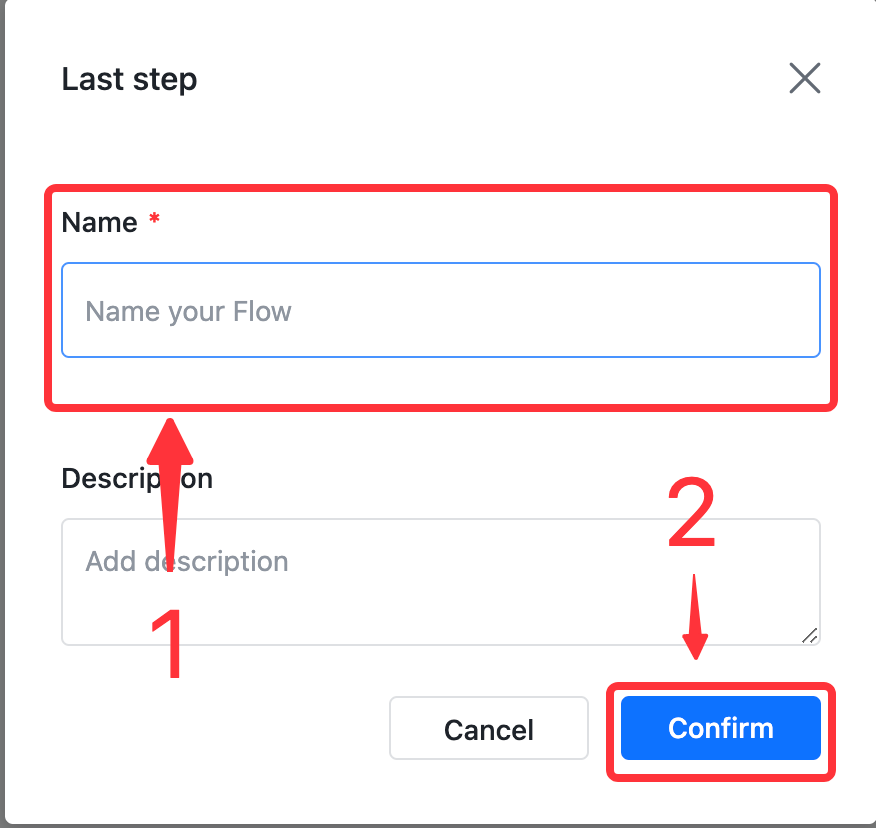

# ChatGPT

This guide contains information to set up a ChatGPT Source in Vanus Cloud.

## Introduction

ChatGPT is a large language model developed by OpenAI, based on the GPT-3.5 architecture.

ChatGPT Source is a Vanus-hosted ChatGPT service which works as an HTTP server to generate human-like responses to textual content from incoming HTTP requests,
and deliver responses to endpoints in the CloudEvents HTTP format.

## Prerequisites

Before obtaining ChatGPT events, you must have:

- A [Vanus Cloud account](https://cloud.vanus.ai)

## Getting Started

### Create a Connection

1. Log in to your [Vanus Dashboard](https://cloud.vanus.ai/dashboard).
2. Click on the **create connection** button under connections.
3. From the list of sources, choose **ChatGPT**.

4. Click **`Next`** to save the ChatGPT Source.

### How to use the webhook URL
**How to setup ChatGPT in Feishu**

1. Click the copy icon to copy the webhook url.

2. Return into Feishu and search for `flow` or `飞书捷径` and click on it.

3. Press **create**.

4. Select the Trigger and choose **Message**.

5. Select `New message that mentioned BOT in the group chat`.

6. In group select **specific groups** Search for the group you've previously created, select your ChatGPT bot under bot and press **confirm**.

7. Select the action and choose webhook as the action.

8. Select Custom Request.

9. Select the method `POST`, set the URL using the URL from step 1, Select the Data `Message: Message content without the @ part`, and press **Confirm**.

10. press **Create**.

11. Name your flow and Confirm.

12. Now send a message in the group tagging the bot.

   

Learn more about Vanus and Vanus Cloud in our [documentation](https://docs.vanus.ai).
