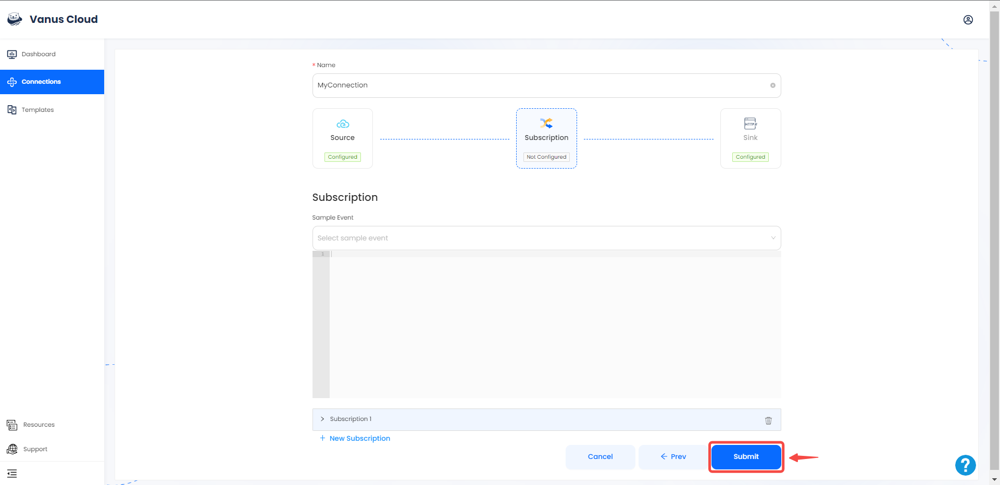
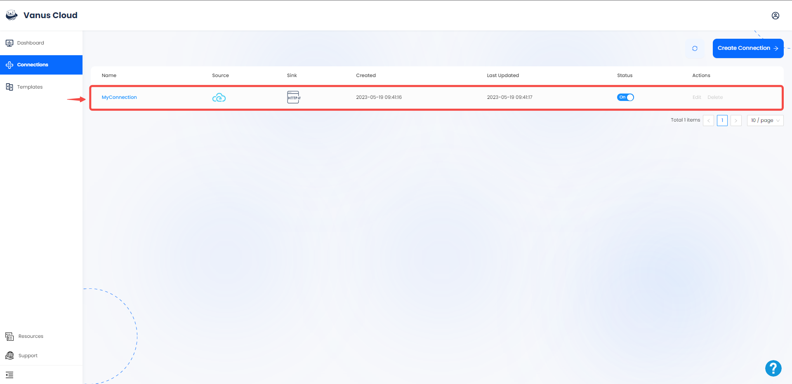

# CloudEvents

This guide contains information to set up a CloudEvents Source in Vanus Cloud.

## Introduction

CloudEvents is a vendor-neutral specification for describing event data in a common way, allowing for interoperability between different cloud platforms and event-driven systems.

The CloudEvent Source allows receiving CloudEvents via a payload URL.

---

## Prerequisites

Before obtaining Payload URL to receive events, you must have:

- A [Vanus Cloud account](https://cloud.vanus.ai)

---

## Getting Started

### Create your connection in Vanus Cloud

To set up CloudEvents in Vanus Cloud, follow these steps: 

1. Log in to your [Vanus](https://cloud.vanus.ai) account and click on **connections**  
  

2. Click on **Create Connections**  
  

3.  Write a name for your connection and choose your source. 
 

4. Click the **copy icon** to copy the webhook url.

5. Click **Next** 

6. Choose your sink and click **Next** 
 

7. Click on submit to finish the configuration. 
  

8. You've successfully created your Vanus cloudevents source connection.  
 

---

### Step2: Send CloudEvents 

You can use your Webhook URL to send CloudEvents.

Here is an Example of a Curl Post Request of a CloudEvent.
```shell
curl --location --request POST 'https://YourWebHookURL.com' \
--header 'Content-Type: application/cloudevents+json' \
--data-raw '{
"id": "53d1c340-551a-11ed-96c7-8b504d95037c",
"source": "quickstart",
"specversion": "1.0",
"type": "quickstart",
"datacontenttype": "application/json",
"time": "2022-10-26T10:38:29.345Z",
"data": {
"myData": "simulation event data"
}
}'
```

Learn more about [CloudEvents](https://cloudevents.io).

Learn more about Vanus and Vanus Cloud in our [documentation](https://docs.vanus.ai).
