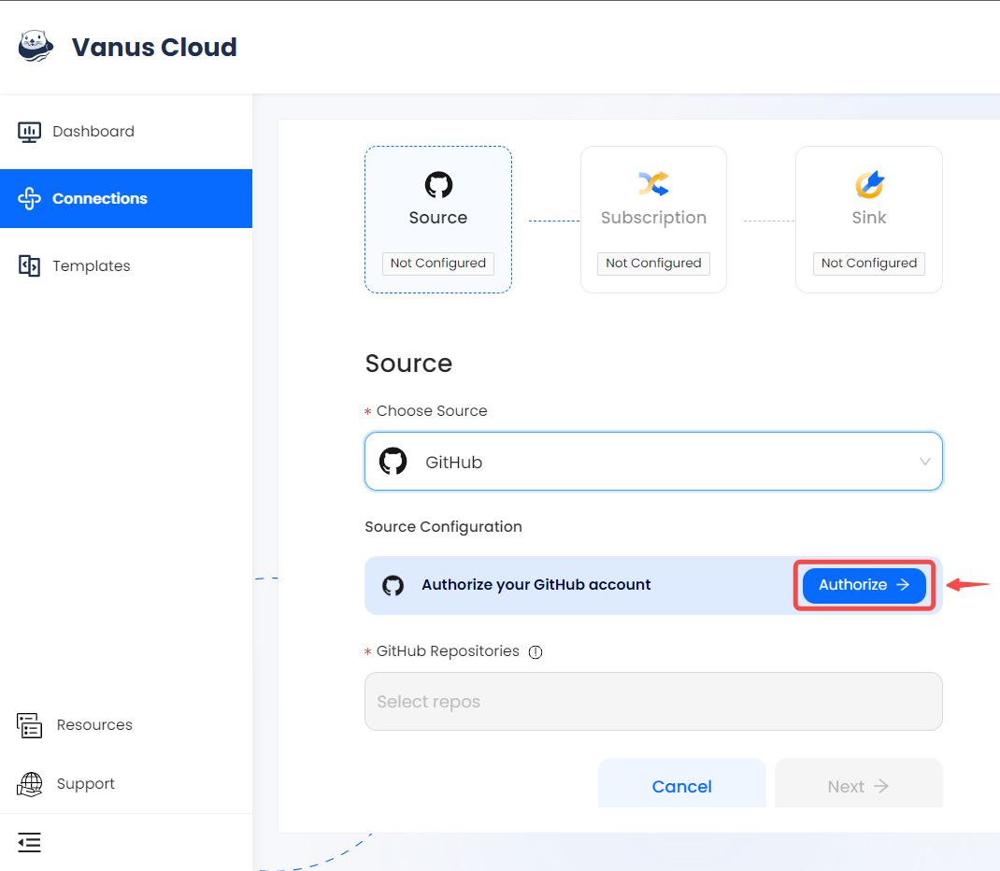
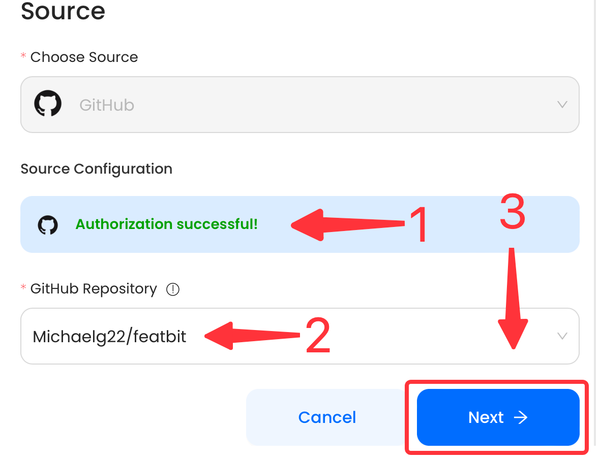
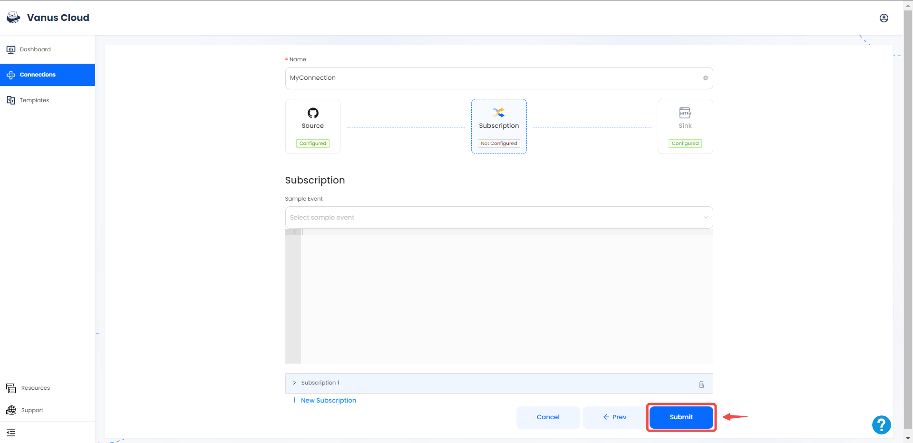
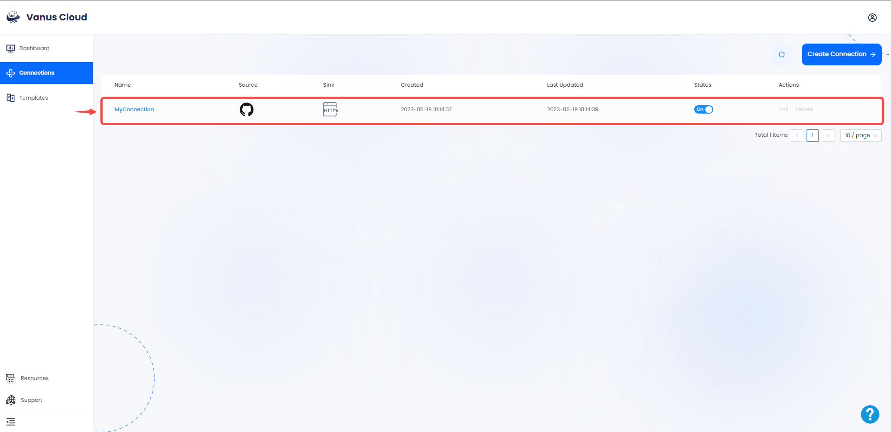

# GitHub

This guide contains information to set up a GitHub Source in Vanus Cloud.

## Introduction

GitHub is the largest web-based platform that provides developers with a place to host and manage their software projects.

The GitHub Source enables you to get specific CloudEvents when particular events take place on your repositories.

---

## Prerequisites

- GitHub Account with proper permissions(`Admin` or `Owner`) to your repository
- GitHub Repositories

---
## Getting Started 

1. Log in to your [Vanus](https://cloud.vanus.ai) account and click on **connections**  
  

2. Click on **Create Connections**  
  

3. Write a connection name without any spaces.
  

4. Choose your source and click `Authorize` to authorize to your GitHub account.
  

5. **Install and Authorize** Vanus to read repos and create webhooks.
  

6. Select a repository to connect and click **`Next`** to save the GitHub Source.
  

7. Choose your sink and click **Next** 
 

8. Click on submit to finish the configuration. 
  

9. You've successfully created your Vanus github source connection.  
 

Learn more about Vanus and Vanus Cloud in our [documentation](https://docs.vanus.ai).
