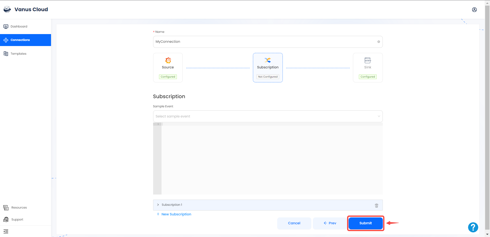
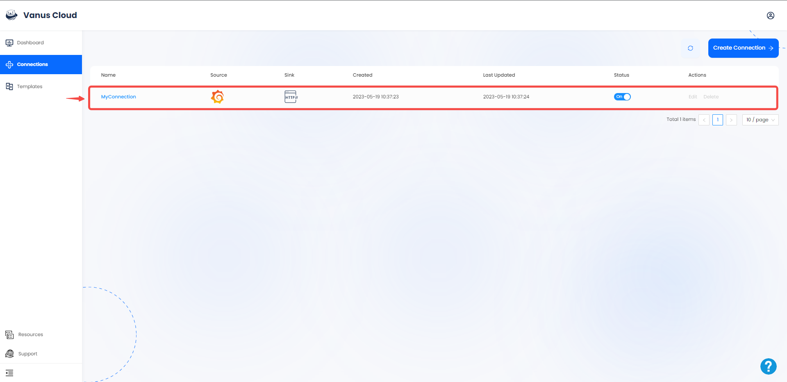

# Grafana

This guide contains information to set up a Grafana Source in Vanus Cloud.

## Introduction

Grafana is an open-source platform for data visualization and analytics. It enables users to create and share dashboards, charts, and alerts across multiple data sources.

The Grafana Source is a webhook server that enables you to establish an endpoint for receiving events from Grafana. To achieve this, it is necessary to establish a connection within Grafana.

---

## Prerequisites

- A [Vanus Cloud account](https://cloud.vanus.ai)
- A Grafana instance or an account in Grafana cloud

---

## Getting Started

To obtain all Grafana events using Vanus Cloud, follow these steps:

### Step1: Create a Connection on Vanus cloud 

1. Log in to your [Vanus](https://cloud.vanus.ai) account and click on **connections**  
  

2. Click on **Create Connections**  
  

3.  Write a name for your connection.

4. From the list of sources, choose **Grafana**.

5. Click the copy icon to copy the Webhook URL. 

---

### Step2: **Configuring Grafana to send Events**

1. Log in to your [Grafana](https://grafana.com) account.

2. Navigate to the **Alert & IRM** menu in the **Menu** Tab, and click on **Alerting**.

3. Click on the **Contact Points**, and click on **Add contact point**.

4. Name your contact point, click on integration, select webhook, provide the payload URL from Vanus Cloud, and **Save contact point**.

---

### Step3: Continue your connection setup on Vanus cloud 

1. Choose your sink and click **Next** 
 

2. Click on submit to finish the configuration. 
  

3. You've successfully created your Vanus grafana source connection.  
 

Learn more about Vanus and Vanus Cloud in our [documentation](https://docs.vanus.ai).
