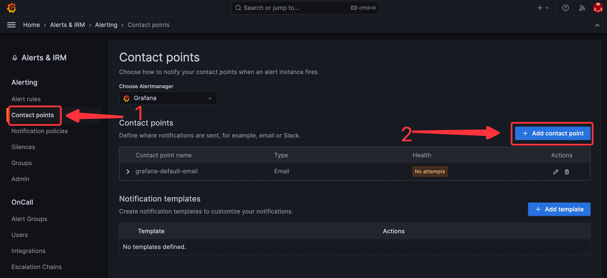
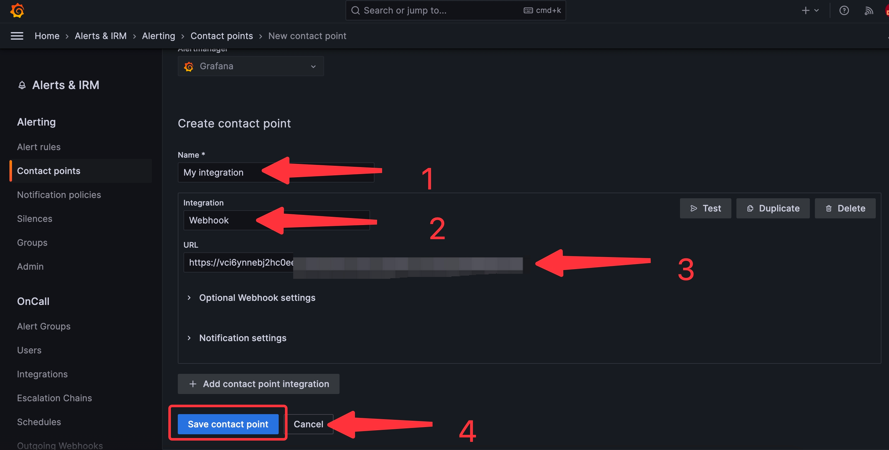

# **Configuring Grafana to send Events**

1. Click the copy icon to copy the Webhook URL.
   
2. Log in to your [Grafana](https://grafana.com) account.
3. Navigate to the **Alert & IRM** menu in the **Menu** Tab, and click on **Alerting**.

4. Click on the **Contact Points**, and click on **Add contact point**.

5. Name your contact point, click on integration, select webhook, provide the payload URL from Vanus Cloud, and **Save contact point**.
