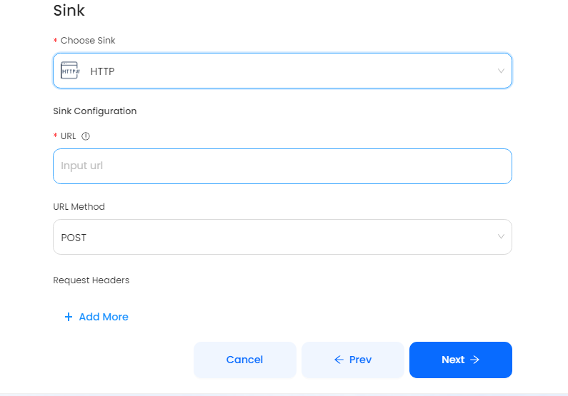

# HTTP

This guide contains information to set up a HTTP Sink in Vanus Cloud.

## Introduction

The HTTP Sink can send real-time Cloud Events to the expected targets using Webhook. It extracts the data part of the original event and deliver to the target URL.

## Prerequisites

Before sending HTTP events to its target URL, you must have:

- A [Vanus Cloud account](https://cloud.vanus.ai)
- A target URL such as (Slack Webhook, Discord Webhook)

## Getting Started

To send Cloud Events to an HTTP server which send the events to it's target URL in Vanus Cloud, follow these steps:

1. Log in to your [Vanus Dashboard](https://cloud.vanus.ai/dashboard).
2. Click on the **create connection** button under connections.
3. From the list of sources, choose **GitHub**, authenticate and choose select a repositry that will send Cloud events. You can select any other source of your choice.
   
4. Click next
5. In the Sink, select **HTTP** and add the target URL. Click Next, and finish the configurations.
   

## Supported Events

The HTTP Sink can retrieve any kind of Cloud Events from a Source connector, extract the `data` part of the original event and send it to the target URL.

Examples of supported events for the Source Connectors include:

- [GitHub Source Connector](https://docs.vanus.ai/user-guides/connector-guides/source/github/setup)
- [Auth0 Source Connector](https://docs.vanus.ai/user-guides/connector-guides/source/auth0/setup)

Examples of Sink Connectors that receive events from Source Connectors include:

- Slack
- Discord
- Feishu
