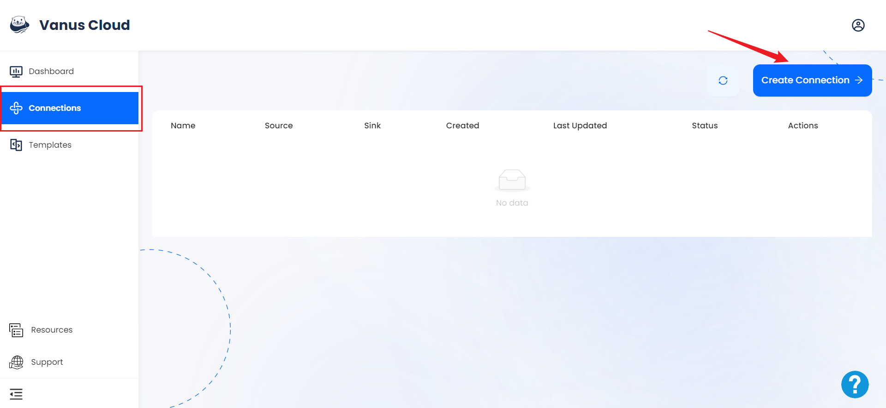
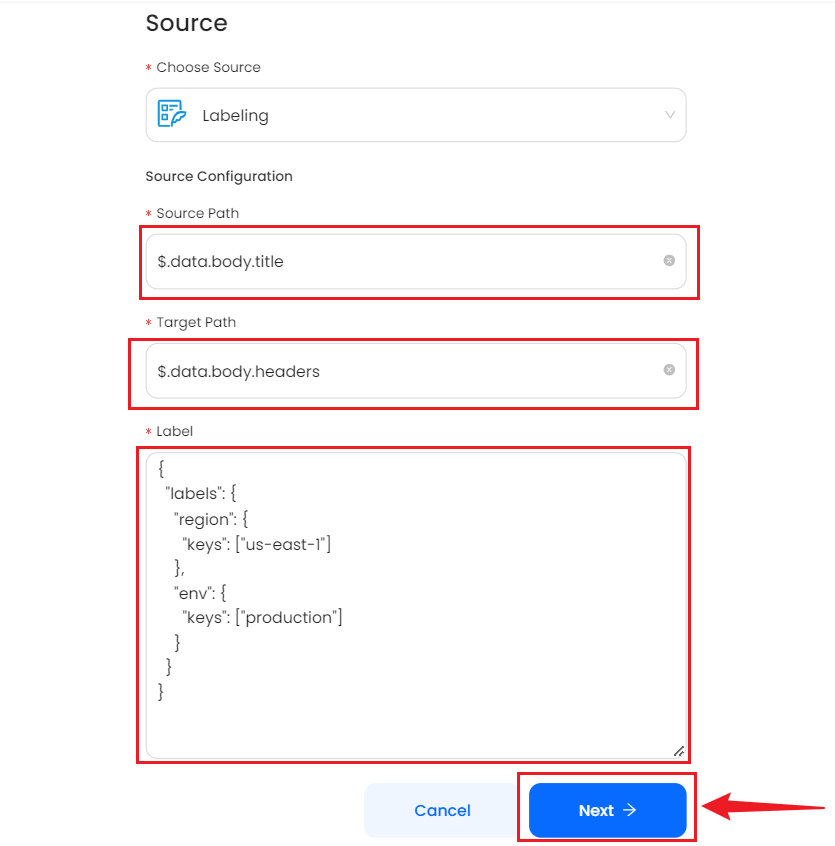

# Labeling

This guide contains information to set up a Labeling Source in Vanus Cloud.

## Introduction

Labeling (also known as tagging) is a method used to organize and categorize resources in a cloud environment. Labeling is done by attaching metadata (key-value pairs) to cloud resources such as virtual machines, storage buckets, or database instances. Labeling cloud events is an essential part of managing cloud-based applications and services efficiently. Labels can be used to categorize and organize cloud events, making it easier to monitor performance, troubleshoot issues, easier automation, increased efficiency and identify trends. 

The Labeling Source is a webhook, it receives http requests with json data as the body, then does labeling, and puts events to eventbus.

## Prerequisites

- A [Vanus Cloud account](https://cloud.vanus.ai)

## Getting Started

1. Log in to your [Vanus Dashboard](https://cloud.vanus.ai/dashboard).
2. Click on the **create connection** button under connections.

    

### Create your connection in Vanus Cloud

To set up labeling in Vanus Cloud, follow these steps:

1. Write a name for your connection.

    
2. From the list of sources, choose **Labeling**.

    

    

3. Insert the following:
    - Source Path: A Source path refers to a field in body to label.
    - Target Path: A Target path refers to a field in body where the output is placed. The output is a list of labels.
    
### Example of a Path

A JSON path would be structure in this format; `$.data.body.title`

In this example, the JSON path specifies the location of the title attribute within the body object of a CloudEvent's data attribute. The path consists of several components, separated by the dot (.) operator:

- `$`: The root object of the JSON document.
- `data`: The key of a property within the root object.
- `body`: The key of a property within the data object.
- `title`: The key of a property within the body object.
By following this path, you can access the value of the title attribute within the body object of a CloudEvent's data attribute.

    - Label: The config of label, an example as below:
    ```
    {
        "label1": {
            "keys": ["key1", key2"]
        },
        "label2": {
            "keys": ["key3", "key4", "key5"]
        }
    }
    ```
    If "key1" or "key2" is present in the field of `Source Path`, the `Target Path` will have "label1".
    If "key3" or "key4" or "key5" is present in the field of `Source Path`, the `Target Path` will have "label2".
    
    

4. Click **Next** and finish the configurations.

Learn more about Vanus and Vanus Cloud in our [documentation](https://docs.vanus.ai).
