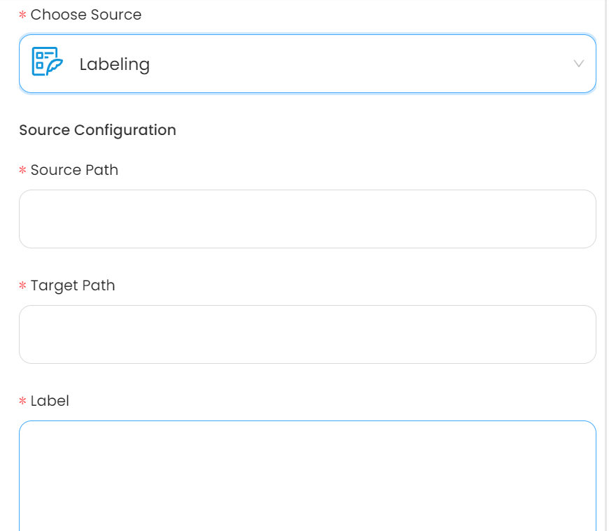

# Labelling

This guide contains information to set up a Amazon Eventbridge Source in Vanus Cloud.

## Introduction

Labelling is a process of assigning descriptive or identifying information to an object.

The Labelling Source assigns a label to a target using the data from the source.

## Prerequisites

- A [Vanus Cloud account](https://cloud.vanus.ai)
- A Source Path
- A Target Path

## Getting Started

1. Log in to your [Vanus Dashboard](https://cloud.vanus.ai/dashboard).
2. Click on the **create connection** button under connections.

### Create your connection in Vanus Cloud

To set up labelling in Vanus Cloud, follow these steps:

1. Write a name for your connection.
   
2. From the list of sources, choose **Labelling**.
3. Insert the following:
    - Source Path: Specific location or source from where the data is being retrieved.
    - Target Path: Specific location or target where the data is being sent.
    - Label: The data being sent in JSON format.

3. Click **Next** and finish the configurations.

Learn more about Vanus and Vanus Cloud in our [documentation](https://docs.vanus.ai).
