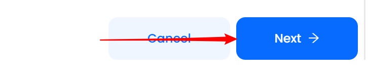

# Labeling

This guide contains information to set up a Labeling Source in Vanus Cloud.

## Introduction

Labeling is used to create additional information to a CloudEvent and that event can be filtered with the attached label.   

The Labeling Source is a webhook, it receives http requests with json data as the body, then does labeling, and puts events to eventbus.

## Prerequisites

- A [Vanus Cloud account](https://cloud.vanus.ai)

## Getting Started

1. Log in to your [Vanus Dashboard](https://cloud.vanus.ai/dashboard).
2. Click on the **create connection** button under connections.

### Create your connection in Vanus Cloud

To set up labeling in Vanus Cloud, follow these steps:

1. Write a name for your connection.
   
2. From the list of sources, choose **Labeling**.
3. Insert the following:
    - Source Path: A Source path refers to a field in body to label.
    - Target Path: A Target path refers to a field in body where the output is placed. The output is a list of labels.
    - Label: The config of label, an example as below:
    ```
    {
        "label1": {
            "keys": ["key1", key2"]
        },
        "label2": {
            "keys": ["key3", "key4", "key5"]
        }
    }
    ```
    If "key1" or "key2" show in the field of `Source Path`, the `Target Path` will have "label1".
    If "key3" or "key4" or "key5" show in the field of `Source Path`, the `Target Path` will have "label2".
    

3. Click **Next** and finish the configurations.


Learn more about Vanus and Vanus Cloud in our [documentation](https://docs.vanus.ai).
