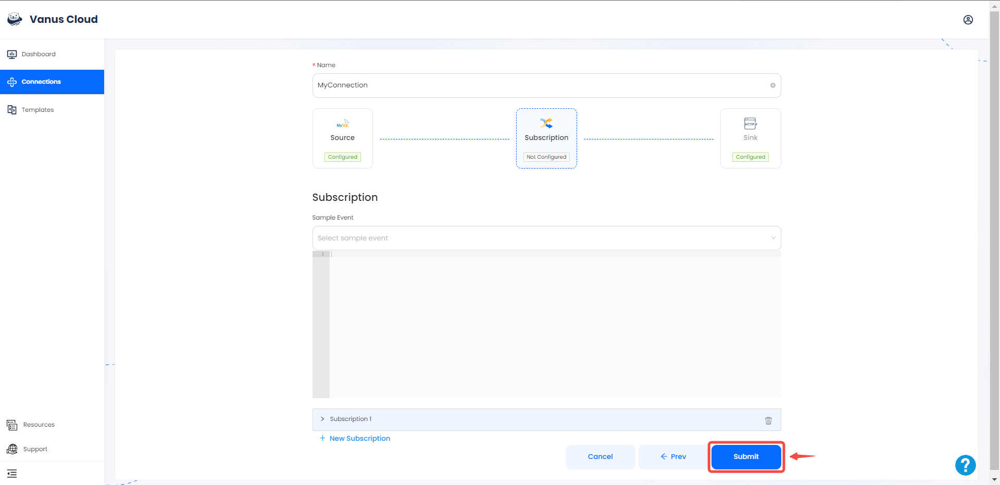
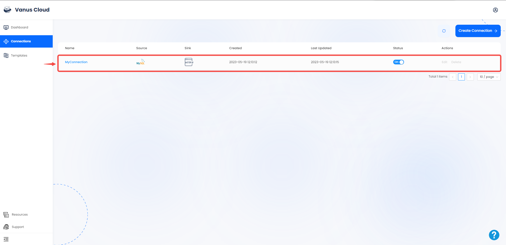

# MySQL

This guide contains information required in setting up an MySQL Source in Vanus Cloud.  

## Introduction  

MySQL is a popular open-source relational database management system used to store, organize, and retrieve data for websites, applications, and other software.

Vanus Cloud's MySQL Source connector simplifies the process of receiving events from a MySQL server and send it to a target.

---

## Prerequisites
Before forwarding events to MySQL, you must have:

- A [Vanus Cloud account](https://cloud.vanus.ai)
- Have a running MySQL server.
- Have a Database and Table created.

---

### Setup your connection in Vanus Cloud

1. Log in to your [Vanus](https://cloud.vanus.ai) account and click on **connections**  
  

2. Click on **Create Connections**  
  

3. Enter all the following information in Vanus Cloud and click **Next**  


- **Host:** The IP address of your MySQL Server.
- **Port:** The Port of your MySQL Server default: 3306.
- **Username:** A Username with the following permissions RELOAD, SHOW DATABASES, REPLICATION SLAVE, REPLICATION CLIENT.
- **Password:** The user password.
- **Database:** The database name.
- **Table:** The table name.

4. Choose your sink and click **Next** 
 

5. Click on submit to finish the configuration. 
  

6. You've successfully created your Vanus MySQL source connection.  
 

## Custom Connection

The event data must be in JSON format and created following the structure of your database, here's an example:

```json
{
  "title": "value",
  "date": "value",
  "ect...": "value"
}
```
