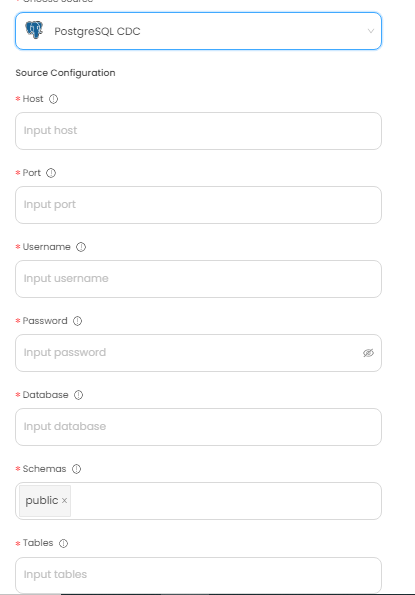

# PostgreSQL CDC

This guide contains information to set up a PostgreSQL Source in Vanus Cloud.

## Introduction

PostgreSQL, often referred to as Postgres, is an open-source relational database management system (RDBMS) that is designed to handle complex SQL (Structured Query Language) queries and manage data stored in tables.

PostgreSQL is known for its scalability, flexibility, and advanced features such as support for transactions, subselects, and user-defined types.

Vanus Cloud provides PostgresSQL Source connector, which retrieves records events from a designated database and converts them into CloudEvents.

## Prerequisites

Before obtaining PostgresSQL events, you must have:

- A [Vanus Cloud account](https://cloud.vanus.ai)
- Have a PostgreSQL database

## Getting Started

### Step1: Setting Up Postgres

1. Enable logical replication. configure the following parameters in the [postgresql.conf](https://www.postgresql.org/docs/current/config-setting.html) file

```
    wal_level = logical             # type of coding used within the Postgres write-ahead log.minimal, archive, hot_standby, or logical (change requires restart)
    max_wal_senders = 1             # the maximum number of processes used for handling WAL changes (change requires restart)
    max_replication_slots = 1       # the maximum number of replication slots that are allowed to stream WAL changes (change requires restart)
```

2. Select a replication plugin. We recommend using a pgoutput plugin (the standard logical decoding plugin in Postgres). The PostgreSQl Source support logical decoding plugins from Debezium:
   - [protobuf](https://github.com/debezium/postgres-decoderbufs/blob/main/README.md): To encode changes in Protobuf format
   - [wal2json](https://github.com/eulerto/wal2json/blob/master/README.md): To encode changes in JSON format

### Step 2: Config your connection

To obtain PostgresSQL events using the PostgresSQL source connector in Vanus Cloud, follow these steps:

1. Log in to your [Vanus Dashboard](https://cloud.vanus.ai/dashboard).
2. Click on the **create connection** button under connections.
3. From the list of sources, choose **PostgresSQL**
4. Enter the following credentials:

   - Host: IP address or host name of database.
   - Port: Integer port number of database.
   - Username: Username of database.
   - Password: Password of database.
   - Database: Name of database which need to be captured changes.
   - Schemas: Names of schema which need to be captured changes
   - Tables: Names of table which need to be captured changes.

     

5. Click next to continue.

## Supported Events

This Vanus Cloud Source connector offers support for various events. Below is a list of the supported events:

Database Events:

- Insert Row
- Update Row
- Delete Row

Learn more about Vanus and Vanus Cloud in our [documentation](https://docs.vanus.ai).
