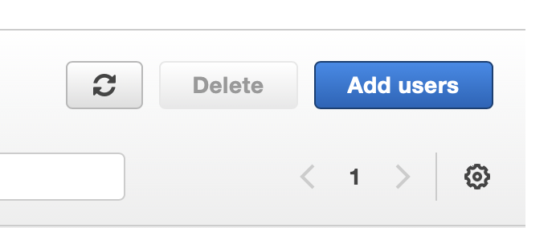
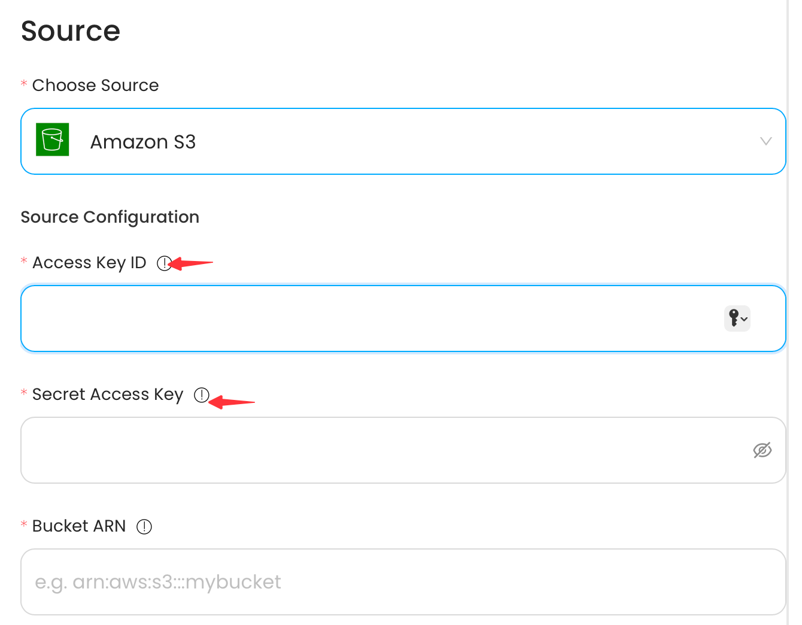
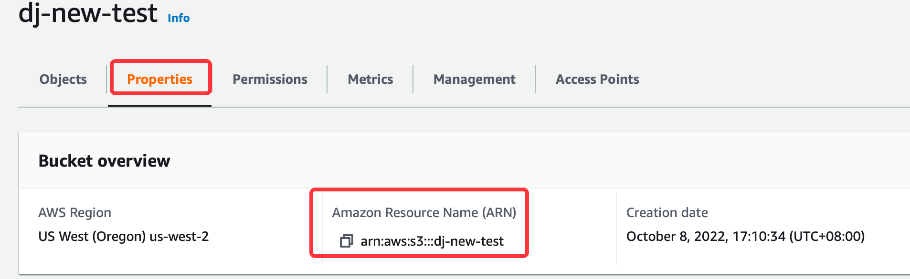

# Amazon S3

This guide contains information to set up a S3 Source in Vanus Cloud.

## Introduction

S3 is Amazon's cloud storage service that offers scalable and durable storage for various data types. It provides easy management and retrieval of data from anywhere with high availability and low latency.

Vanus Cloud provides the Amazon S3 Source connector, which retrieves S3 events from a designated bucket and converts them into CloudEvents. With this connector, users can also set up an SQS queue to receive S3 event notifications. If a queue isn't specified, the connector will create one automatically.

## Prerequisites

Before obtaining S3 events, you must have:

- A [Vanus Cloud account](https://cloud.vanus.ai)
- Have an AWS S3 bucket.
- AWS IAM Access Key.
- AWS permissions for the IAM user:
  - s3:PutBucketNotification
  - sqs:ListQueues
  - sqs:GetQueueUrl
  - sqs:ReceiveMessage
  - sqs:GetQueueAttributes
  - sqs:CreateQueue
  - sqs:SetQueueAttributes
  - sqs:DeleteMessage

## Getting Started

### Create a new AWS user

Create a new user and set the proper IAM policy.
1. Log in to the AWS Management Console using your root account credentials.
2. Navigate to the IAM service by clicking on the Services menu and selecting IAM.

3. Click on the Users tab in the left navigation menu, and then click the Add user button.

4. Write the name for your user and click next.
5. select attach policy directly, and Create policy.

6. select the Service `s3` and give it the following policy
   - "s3:PutObject",
   - "s3:GetObject",
   - "s3:GetObjectVersion",
   - "s3:DeleteObject",
   - "s3:DeleteObjectVersion"
7. press next and review.
8. Name your policy and click create policy.
9. search for your custom policy and add it to your account, and press next.
10. Review and press create user.
11. Now click on the user you just created.
12. Go to `Access Key` Click Create access key.
    
13. Select Command line interface CLI, and press next.
14. Save your access key and secret key safely.
    
### Config your connection
To obtain S3 Bucket events using the S3 source connector in Vanus Cloud, follow these steps:

1. Log in to your [Vanus Dashboard](https://cloud.vanus.ai/dashboard).
2. Click on the **create connection** button under connections.
3. From the list of sources, choose **Amazon S3**.
4. Enter your Access Key and Secret Key in Vanus Cloud.

5. Now let go back to Amazon Web Services under the Amazon S3 service.

6. At this point you can either create a new bucket or select a existent bucket.
7. Once selected or created go to your bucket property and copy and paste the ARN to Vanus Cloud.

8. Specify the kind of event you want to receive from the list

9. Under SQS config you can choose to create a new SQS by selecting Region or if you already have a SQS provide the ARN.
10. Click next to continue.

## Supported Events

This Vanus Cloud Source connector offers support for various events. Below is a list of the supported events:

S3:ObjectCreated:

- S3:ObjectCreated:Put
- S3:ObjectCreated:Post
- S3:ObjectCreated:Copy
- S3:ObjectCreated:CompleteMultipartUpload

S3:ObjectRemoved:

- S3:ObjectRemoved:Delete
- S3:ObjectRemoved:DeleteMarkerCreated

S3:ObjectRestore:

- S3:ObjectRestore:Post
- S3:ObjectRestore:Complete
- S3:ObjectRestore:Delete

Learn more about Vanus and Vanus Cloud in our [documentation](https://docs.vanus.ai).