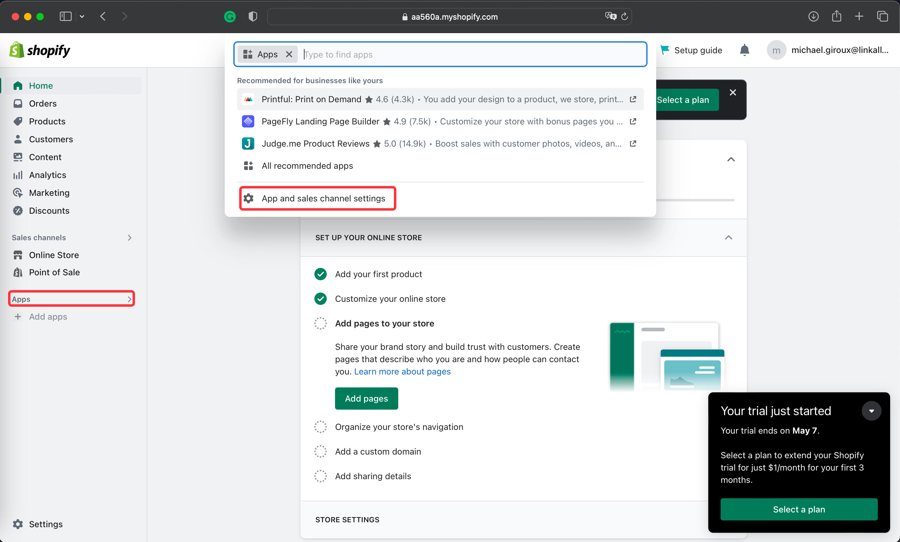
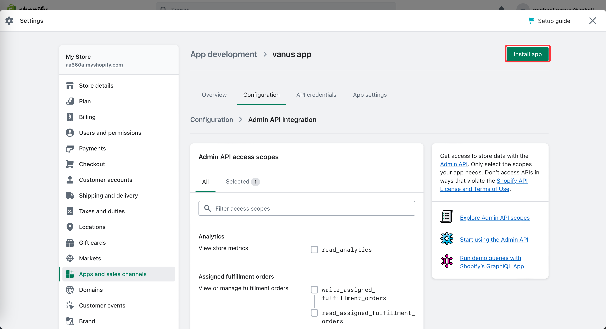
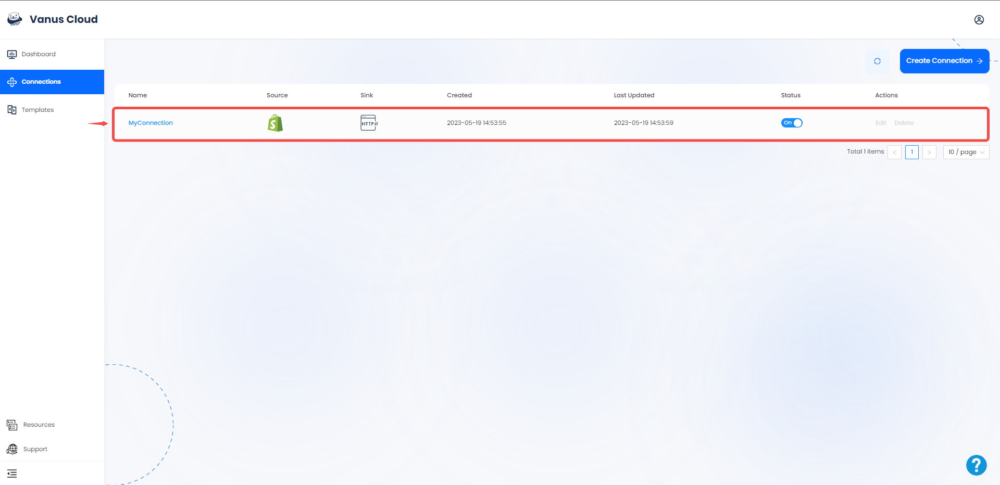

# Shopify App

This guide contains information to set up a Shopify App Source in Vanus Cloud.

## Introduction

Shopify is a popular e-commerce platform that allows businesses to sell their products online. 

With the Shopify App source connector in Vanus Cloud, you can create an Shopify App to obtain real-time updates on all customer and order activity in your Shopify store.

---
## Prerequisites

Before obtaining Shopify events, you must have:

- A Shopify shop with administrative privileges
- A [Vanus Cloud account](https://cloud.vanus.ai)

---
## Getting Started

### Step 1: Create an App

1. Go to [shopify](https://shopify.com) and sign in to your account to access the shopify dashboard.

2. Once log in go to `Apps  >` from the side menu a list will appear on top of the page and click **App and sales channel settings**.

3. To create a new app we will need to select **Develop apps** first.

4. Now click **Allow custom app development**.

5. Again click **Allow custom app development**.

6. Let's now create a new app by clicking **Create an app**.

7. Write a name for your app and press **Create app**.

8. Now we need to click Configure Admin API scopes.

9. Select the type of event you would like to receive **read_orders、read_products** and press *Save*.

10. Press **Install app**.

11. And **Install**.

12. Reveal the **Admin API access token** and copy the token.

---

### Step 2: Finish the connection in Vanus Cloud 

1. Log in to your [Vanus](https://cloud.vanus.ai) account and click on **connections**  
  

2. Click on **Create Connections**  
  

3. Give your connection a name and choose your source. 
  

4. Paste the **Admin API access token** into Vanus Cloud.

5. Go to your store home page and copy the name of your store.

6. Paste your shop name into Vanus Cloud.

7. Choose from what moment you would like to start receiving the events, select how often you want to receive updates and press **Next**. 

8. Choose your sink and click **Next** 
 

9. Click on submit to finish the configuration. 
  

10. You've successfully created your Vanus shopify-app source connection.  
 

Learn more about Vanus and Vanus Cloud in our [documentation](https://docs.vanus.ai).