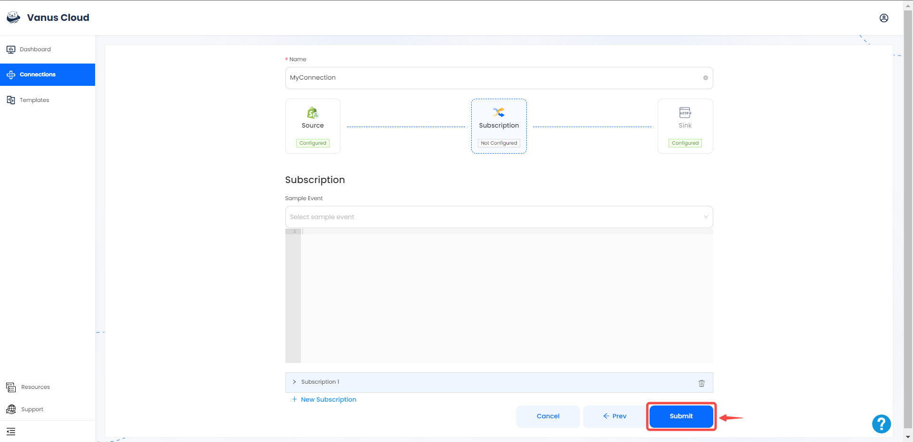
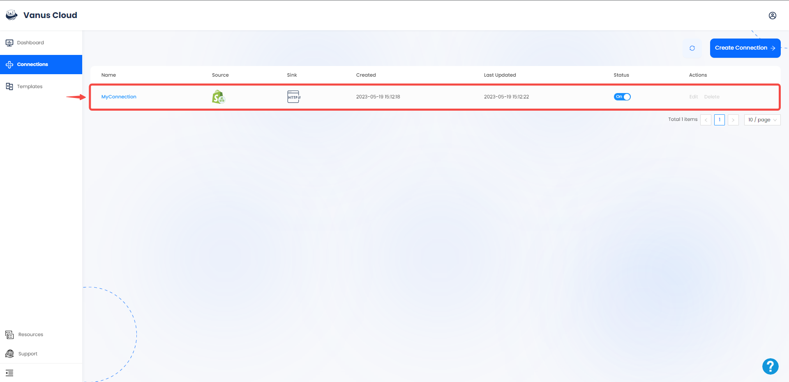

# Stripe

This guide contains information to set up a Stripe Source in Vanus Cloud.

## Introduction

Shopify is a popular e-commerce platform that allows businesses to sell their products online.

The Shopify webhook Source is a webhook server that enables you to establish an endpoint for receiving events from Shopify. To achieve this, it is necessary to establish a connection within Shopify.

---
## Prerequisites

- A [Vanus Cloud account](https://cloud.vanus.ai)
- A Stripe Account

---

## Getting Started

### Step1: Create a Connection

1. Log in to your [Vanus](https://cloud.vanus.ai) account and click on **connections**  
  

2. Click on **Create Connections**  
  

3. Give your connection a name and choose your source. 
 

4.  Click the copy icon to copy the webhook url.

---

### Step2: Configuring Shopify to Send Webhook Events 

1. go to the [Shopify](https://shopify.com) website, sign in to your shop dashboard, and click **settings**. 

2. From the side menu click on **Notifications**.

3. Now scroll down to the very bottom of the page and click on **Create webhook**.

4. Paste the Webhook URL from Vanus Cloud that we copied at the beginning. 

5. Select the **event** you'd like to send to Vanus Cloud and set the format to `JSON`.

6. Finally select the **Latest** version of the webhook API and press **Save**.

Note: If you'd like to receive multiple events you can create more webhooks using the same URL.

---

### Step3: Continue your configuration in Vanus cloud 

1. Choose your sink and click **Next** 
 

2. Click on submit to finish the configuration. 
  

3. You've successfully created your Vanus shopify-webhook source connection.  
 

Learn more about Vanus and Vanus Cloud in our [documentation](https://docs.vanus.ai).
