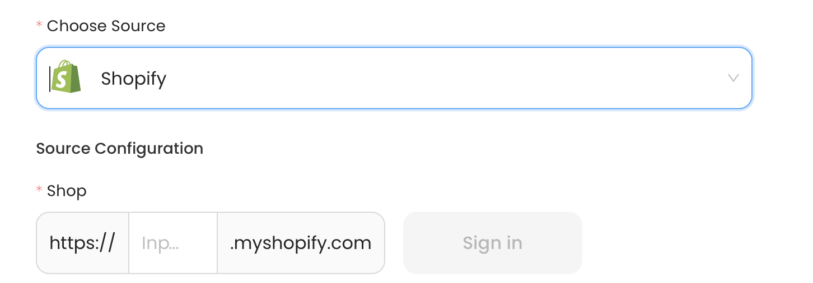

# Shopify

This guide contains information to set up a Shopify Source in Vanus Cloud.

## Introduction

Shopify is a popular e-commerce platform that allows businesses to sell their products online. 

With the Shopify source connector in Vanus Cloud, you can obtain real-time updates on all customer and order activity in your Shopify store.

## Prerequisites

Before obtaining Shopify events, you must have:

- A Shopify shop with administrative privileges
- A [Vanus Cloud account](https://cloud.vanus.ai)

## Getting Started

To obtain Shopify events using the Shopify source connector in Vanus Cloud, follow these steps:

1. Log in to your [Vanus Dashboard](https://cloud.vanus.ai/dashboard).
2. Click on the **create connection** button under connections.
3. From the list of sources, choose **Shopify**.
4. Provide the name of your shop.
   
5. Click next and finish the configurations.

## Supported Events
This Vanus Cloud Source connector offers support for various events. Below is a list of the supported events:

Customers: 
- [Customer creation](events.md#customer-creation)
- Customer update 
- Customer deletion

Orders: 
- Order creation 
- Order update 
- Order cancellation 
- Order fulfillment
- Order payment 
- Order refund
Products:
- Product creation 
- Product update 
- Product deletion
Carts:
- Cart creation 
- Cart update

Learn more about Vanus and Vanus Cloud in our [documentation](https://docs.vanus.ai).