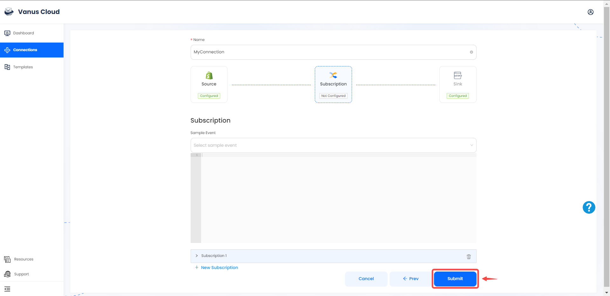

# Shopify

This guide contains information to set up a Shopify Source in Vanus Cloud.

## Introduction

Shopify is a popular e-commerce platform that allows businesses to sell their products online. 

With the Shopify source connector in Vanus Cloud, you can obtain real-time updates on all customer and order activity in your Shopify store.

---

## Prerequisites

Before obtaining Shopify events, you must have:

- A Shopify shop with administrative privileges
- A [Vanus Cloud account](https://cloud.vanus.ai)

---

## Getting Started

To obtain Shopify events using the Shopify source connector in Vanus Cloud, follow these steps: 

1. Log in to your [Vanus](https://cloud.vanus.ai) account and click on **connections**  
  

2. Click on **Create Connections**  
  

3. Write a connection name without any spaces, and choose your source. 

4. Provide the name of your shop and click on **sign in**.  

5. After a successful authentication, click **next** 

6. Choose your sink and click **Next** 
 

7. Click on submit to finish the configuration. 
  

8. You've successfully created your Vanus shopify source connection.  
 

Learn more about Vanus and Vanus Cloud in our [documentation](https://docs.vanus.ai).