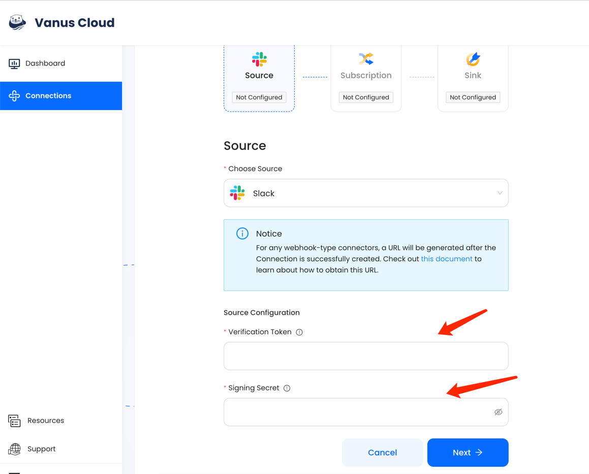

# Slack

This guide contains information to set up a Slack Source in Vanus Cloud.

## Introduction

Slack is a cloud-based team collaboration platform that allows users to communicate, share files, and integrate with other tools and services.

Our Slack Source connector, lets you receive events when users join, message, react etc... 

## Prerequisites

Before obtaining Slack events, you must have:
- Have a [Slack account](https://slack.com).
- A [Vanus Cloud account](https://cloud.vanus.ai).

## Getting Started

### Step 1: Create and Install an App in Slack

1. Go to [Slack API](https://api.slack.com/apps), and click **Create New App**.
   
2. Select From Scratch.

3. Set the app name and Workspace.

### Step 2: Get App Credentials

1. Go to **Basic Information**.

2. Scroll down to **App Credentials** and copy the two following credentials.
 - Verification Token
 - Signing Secret

3. Don't close this page but continue in Vanus Cloud

### Step 3: Connection in Vanus Cloud

1. Write a name for your connection.
 
2. Paste two credentials from Slack as configurations.
   
3. After you finish creating the connection, there will be more steps. Please click the link to open a new tab with the following instruction.   
4. Click **`Next`** to save the Slack Source.
   
