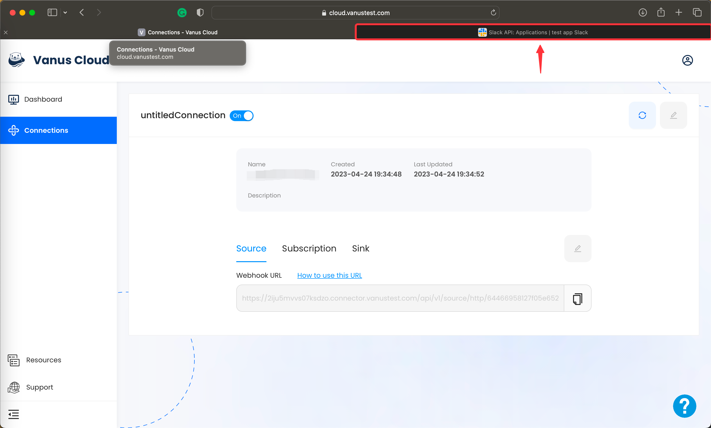
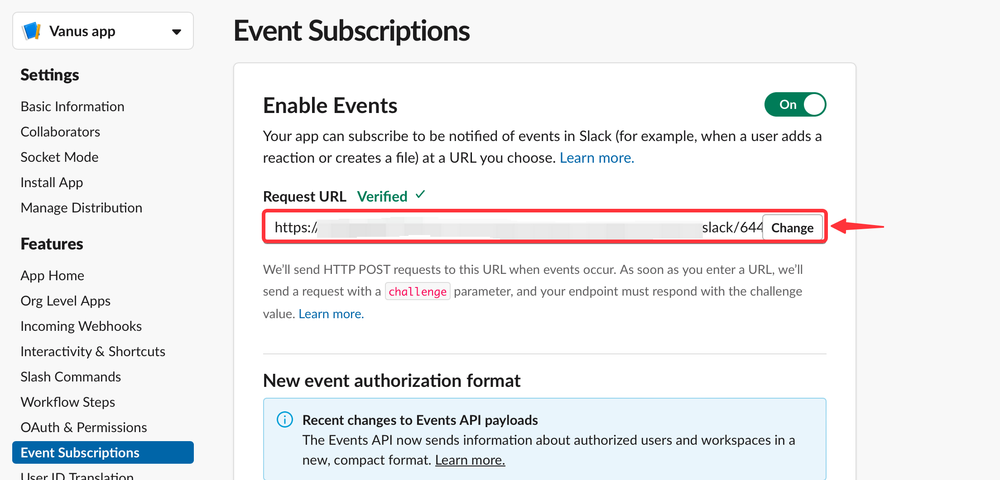

# **Configuring Slack Event Subscriptions**

1. Click the **copy icon** to copy the webhook url.

2. Go back to **Slack API**.

3. Now click on **Event Subscriptions** in the side menu.

4. **Enable Events** by turning on the switch.

5. Use the URL we've previously **copy and paste** it in **Request URL**.

6. Scroll down, click **Subscribe to bot events** and after you will be able to click **Add Bot User Event**.

7. Select the events you would like to receive, for example you can select team_join to receive events whenever a new member joins your Slack Workspace.

8. Finally you can **Save Changes** to complete your connection.

