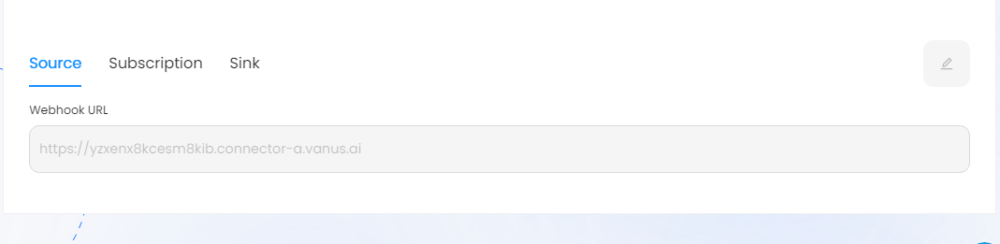

# Stripe

This guide contains information to set up a Stripe Source in Vanus Cloud.

## Introduction

Stripe is a technology company that provides a suite of APIs (Application Programming Interfaces) and tools that enable businesses to process online payments and manage their financial transactions.

The Stripe Source is a webhook server that enables you to establish an endpoint for receiving events from Stripe. To achieve this, it is necessary to establish a connection within Stripe.

## Prerequisites

- A [Vanus Cloud account](https://cloud.vanus.ai)
- A Stripe Account

## Getting Started

To obtain all Stripe events in Vanus Cloud, follow these steps:

1. Log in to your [Vanus Dashboard](https://cloud.vanus.ai/dashboard).
2. Click on the **create connection** button under connections.
3. From the list of sources, choose **Stripe**.
4. Click next and finish the configurations.
5. After creating your connection, select your connection and get the payload from the Stripe information.
   

### Configuring Stripe to Send Webhook Events

1. Log in to your Stripe account and navigate to the **Developer** section.

2. Click on **Webhooks** in the left-hand menu.
3. Click on the **Add endpoint** button to create a new webhook.

4. Enter the URL you previously saved for your webhook endpoint from Vanus Cloud.
5. Select the events you want to receive notifications for. Stripe offers a wide range of events, such as `charge.succeeded`, `invoice.paid`, and `customer.subscription.updated`.

6. Click on the **Create endpoint** button to save your webhook.

## Supported Events
This Vanus Cloud Source connector offers support for various events. Below is a list of the supported events:

- [Charge Succeded](events.md#charge-succeded)

- [Invoice Paid](events.md#invoice-paid)

Learn more about Vanus and Vanus Cloud in our [documentation](https://docs.vanus.ai).