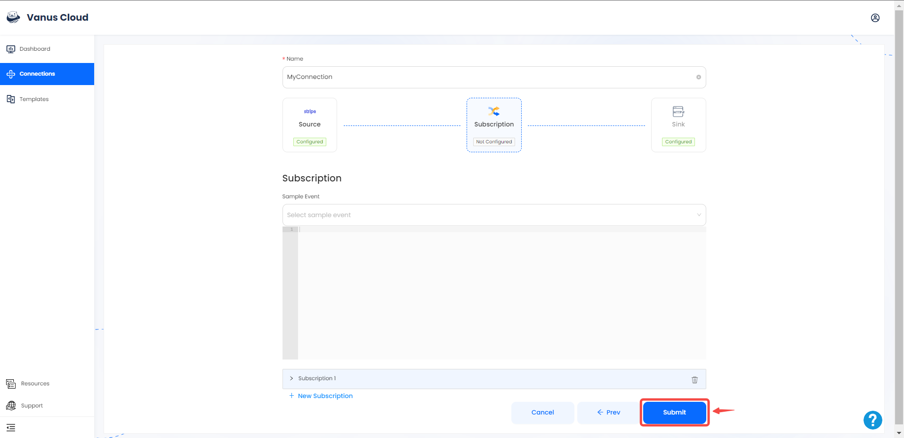
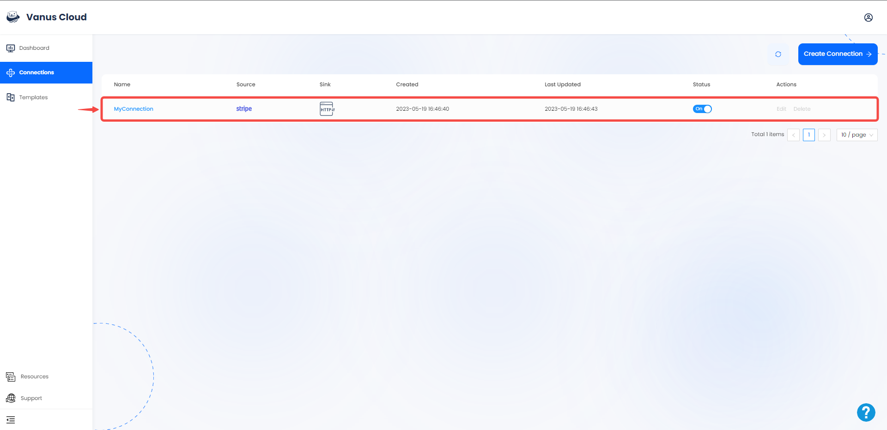

# Stripe

This guide contains information to set up a Stripe Source in Vanus Cloud.

## Introduction

Stripe is a technology company that provides a suite of APIs (Application Programming Interfaces) and tools that enable businesses to process online payments and manage their financial transactions.

The Stripe Source is a webhook server that enables you to establish an endpoint for receiving events from Stripe. To achieve this, it is necessary to establish a connection within Stripe.

---

## Prerequisites

- A [Vanus Cloud account](https://cloud.vanus.ai)
- A Stripe Account

---

## Getting Started

### Create a Connection on Vanus cloud 

1. Log in to your [Vanus](https://cloud.vanus.ai) account and click on **connections**  
  

2. Click on **Create Connections**  
  

3. Write a name for your connection and choose your source. 

4. Click the copy icon to copy the webhook url. 

---

### **Configuring Stripe to Send Webhook Events**

1. Log in to your Stripe account and navigate to the **Developer** section.

2. Click on **Webhooks** in the left-hand menu, and click on the **Add endpoint** button to create a new webhook.

3. Enter the URL you previously saved for your webhook endpoint from Vanus Cloud and select the events you want to receive notifications for. Stripe offers a wide range of events, such as `charge.succeeded`, `invoice.paid`, and `customer.subscription.updated`.

4. Click on the **Create endpoint** button to save your webhook. 

---

### Step3: Continue your connection on Vanus cloud  

1. Choose your sink and click **Next** 
 

2. Click on submit to finish the configuration. 
  

3. You've successfully created your Vanus source connection.  
 

Learn more about Vanus and Vanus Cloud in our [documentation](https://docs.vanus.ai).
