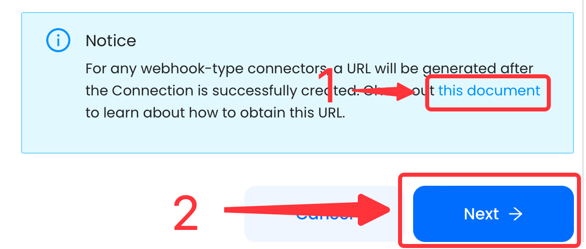

# Stripe

This guide contains information to set up a Stripe Source in Vanus Cloud.

## Introduction

Stripe is a technology company that provides a suite of APIs (Application Programming Interfaces) and tools that enable businesses to process online payments and manage their financial transactions.

The Stripe Source is a webhook server that enables you to establish an endpoint for receiving events from Stripe. To achieve this, it is necessary to establish a connection within Stripe.

## Prerequisites

- A [Vanus Cloud account](https://cloud.vanus.ai)
- A Stripe Account

## Getting Started

To obtain all Stripe events in Vanus Cloud, follow these steps:

1. Log in to your [Vanus Dashboard](https://cloud.vanus.ai/dashboard).
2. Click on the **create connection** button under connections.
3. Write a connection name without any spaces.
   
4. From the list of sources, choose **Stripe**.

5. After you finish creating the connection their will be more steps please click this document to open a new tab with the following instruction.
   
6. Click **next** and finish the configurations.

Learn more about Vanus and Vanus Cloud in our [documentation](https://docs.vanus.ai).
