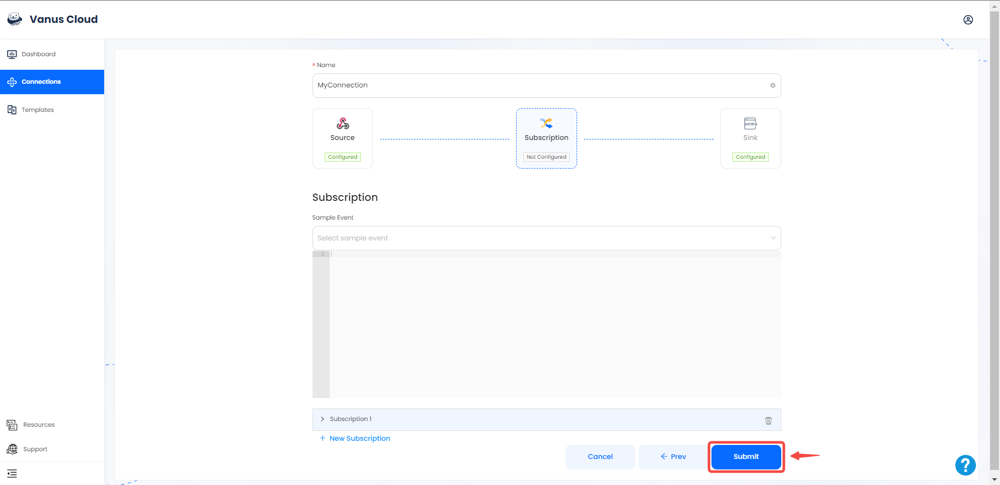
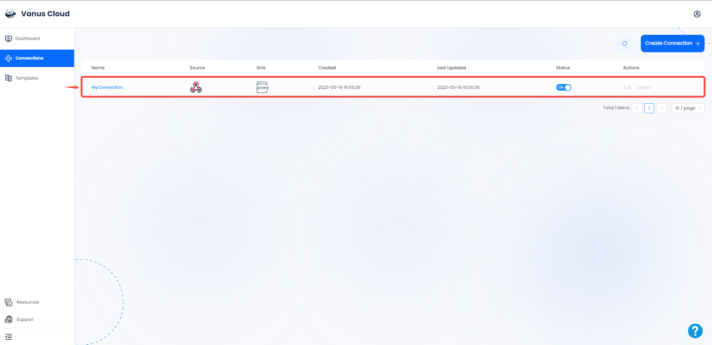

# Webhook

This guide contains information to set up a Webhook Source in Vanus Cloud.

## Introduction

Webhooks are a method for web applications to automatically notify other systems about specific events or updates. They work by sending an HTTP POST request to a specified URL when a particular trigger occurs, enabling real-time data exchange and integration between applications.

The Webhook Source is a webhook server that enables you to establish an endpoint for receiving events HTTP requests or any application able to send HTTP request. 

## Prerequisites

Before obtaining Webhook server to receive events, you must have:

- A [Vanus Cloud account](https://cloud.vanus.ai)

## Getting Started

To obtain a unique Webhook URL in Vanus Cloud, follow these steps:

### Create a Connection

1. Log in to your [Vanus](https://cloud.vanus.ai) account and click on **connections**  
  

2. Click on **Create Connections**  
  

3. Write a name for your connection and choose your source 

4. Click the copy icon to copy the webhook url. 

5.  Choose your sink and click **Next** 
 

6. Click on submit to finish the configuration. 
  

7. You've successfully created your Vanus source connection.  
 

---

# Webhook server
When a webhook is triggered, the webhook server receives an HTTP request with a payload of data related to the event. 

## 3rd Party Services
A list of application that can send HTTP request to our webhook server.
- Zapier
- IFTTT (If This Then That)
- GitHub
- Bitbucket
- GitLab
- Stripe
- Mailchimp
- Shopify
- Salesforce
- Trello
- more

Vanus Cloud webhook can receive any kind of HTTP request.

Learn more about Vanus and Vanus Cloud in our [documentation](https://docs.vanus.ai).