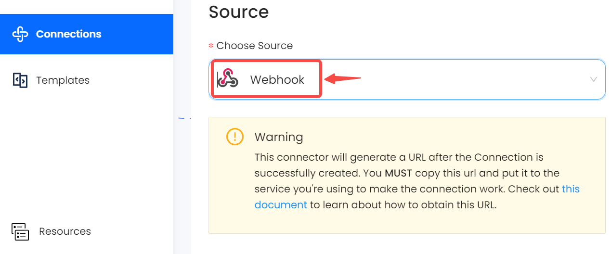

# Webhook

This guide contains information to set up a Webhook Source in Vanus Cloud.

## Introduction

Webhooks are the ways of communicating between two apps by sending notifications or alerts when something happens. With Webhook connector, you can obtain real-time events on all user activity.

## Prerequisites

Before obtaining Webhook events, you must have:

- A [Vanus Cloud account](https://cloud.vanus.ai)

## Getting Started

To obtain a unique Webhook URL in Vanus Cloud, follow these steps:

1. Log in to your [Vanus Dashboard](https://cloud.vanus.ai/dashboard).
2. Click on the **create connection** button under connections.
3. From the list of sources, choose **Webhook**.
4. Click next and finish the configurations.
5. Select your connection and get the payload from the Webhook information.
   

### How to use Webhook Source

To test the Webhook source, we can use [Auth0](https://auth0.com/) Cloud Events streams. To do this,

1. Log in to Auth0 account if you already have one or create one if you do not have an Auth0 account.
2. Navigate to the **Streams** menu under **Monitoring**.
3. Click on the **Create Stream** button.
4. Name your stream and select the **Webhook** option.
   
5. Provide the payload URL of your Webhook source connector in Vanus Cloud.
6. Select json line under **Content Format**.
7. Select the event you want to receive notifications for.
8. and Save your settings.

## Supported Events

### Authentication event filters for Webook (Auth0) Source

Login:

- [Login - Failure](events.md#login_failure)
- Login - Notification
- Login - Success

Logout:

- Logout - Failure
- Logout - Success

Signup:

- Signup - Failure
- Signup - Success

Silent Authentication:

- Silent Authentication - Failure
- Silent Authentication - Success

Token Exchange:

- Token Exchange - Failure
- Token Exchange - Success
