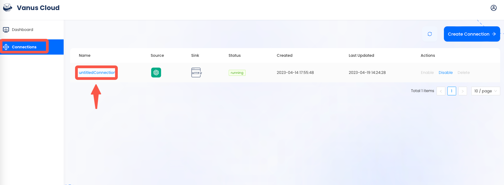
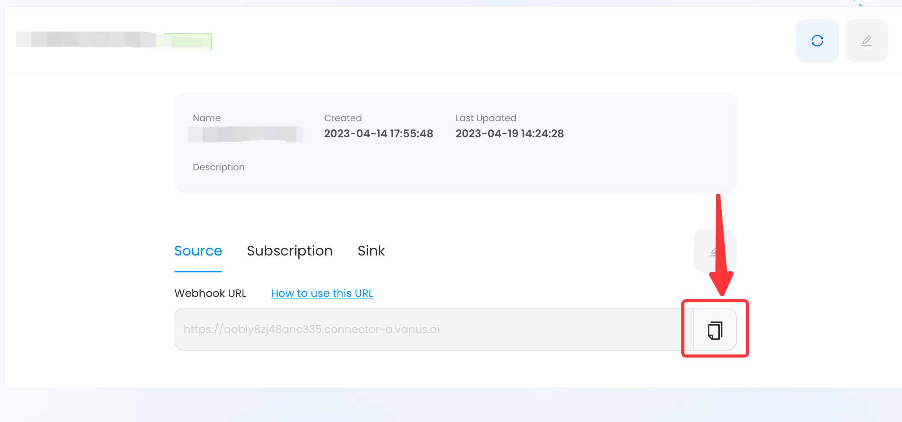
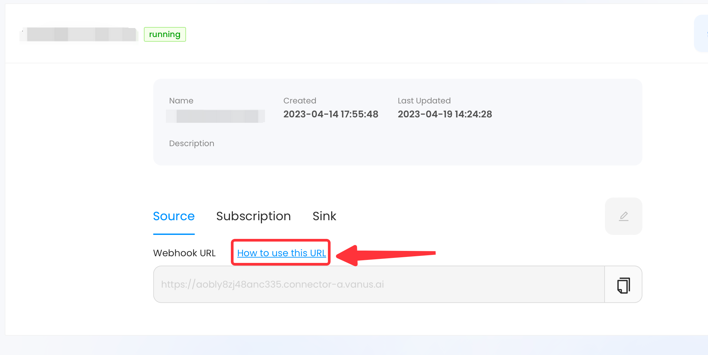

# How to get a webhook URL

This documents is a short tutorial to teach you how to get a Webhook URL after creating a connection in Vanus Cloud.

1. In the **connection TAB** click your connection.

2. Click the copy icon to copy the webhook url.

3. Follow the link for further steps. 

