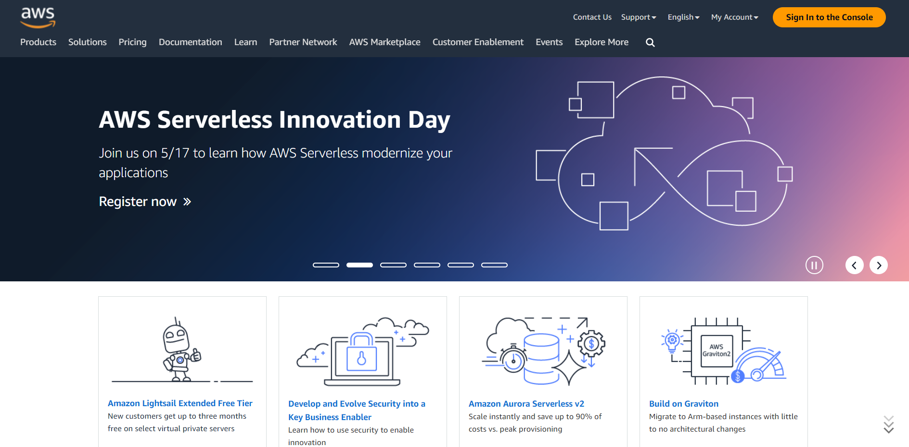
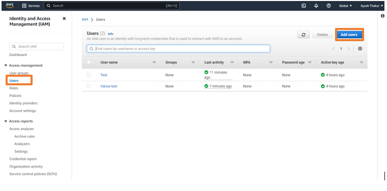
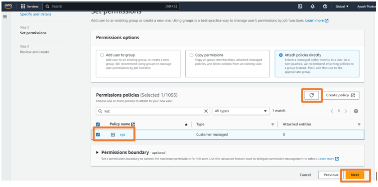
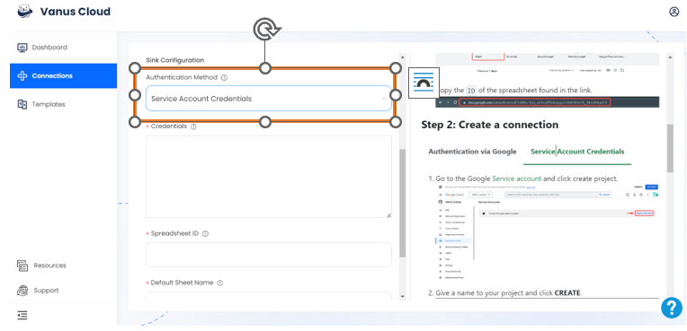
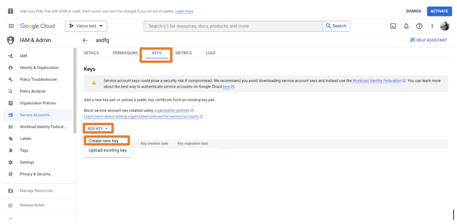
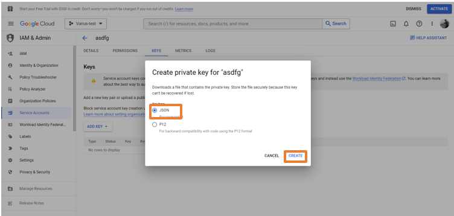

# Send AWS billing to Google Sheets

AWS is the one of the largest cloud service platform that provides developers with a place to host and manage their software projects and much more

You can receive notifications on Google Sheets when Billing on AWS happens with the help of Vanus Cloud.

This guide will help you get a record of AWS billings directly on Google Sheets.

<iframe
  width="800"
  height="450"
  src="https://www.youtube.com/watch?v=KVqCJHHnzs8"
  title="YouTube video player"
  frameBorder="0"
  allowFullScreen={true}
  allow="accelerometer; autoplay; clipboard-write; encrypted-media; gyroscope; picture-in-picture; web-share"
></iframe>

## Get Started

### Step 1: Configure the Source

- Log in to [Vanus Cloud](https://cloud.vanus.ai/) and choose the **Send AWS billing to Google Sheets** template.

- Open AWS Management Console on browser and login with your root userid

### Step 2: Configure Sink - Set the AWS account configurations

- Search for IAM services and open it

- Go to Users tab in left sidebar and click on Add user button

- Add a name for the user and click on Next

- Select Attach policy directly, and Create policy

- Search for Cost Explore Service option, open it

- Now search for GetCostAndUsage option, select it and click on next

- Add a name for the policy and click on Create Policy

- Go back to the previous tab and search for the policy we have just created

- Add that policy and click on Create User

### Step 3: Create an Access Key and Secret Key

- Click on the user we have created and go to the Security and Credential tab

- Scroll down the page. In the Acccess key section, click on Create access key
  

- Select Command line interface CLI, and press Next
  

- Click Create access key and download the .csv file

### Step 3: Connection Configuration

- Go back to Vanus Cloud website and add a name for your connection

- Copy and paste the Access key ID and Secret Access key and set the desired fetching time in the Source configuration

- Click on Next

### Step 4: Sink Configuration

- Select the Service Account Credentials in the Authencation Method

  

- Now go to Google Service Account and add a Project

  

- Click on '+ CREATE SERVICE ACCOUNT'

- Add a Service Account Name and Service Account ID and click on Create and Continue and then click on Done

  

- Now click on newly created Service Account, go to Keys tab

- Click on Add Key and select the Create new key option

- Choose JSON format and click on Create. A JSON file will be downloaded on your device

  

- Open that file and copy the credientals mentioned in it

- Go back to Setup and paste the copied credentials in the Credentials section

- For the spreadsheet Id we will create a go to Google Sheets and create a new sheet

- Copy the sheet id from the URL and paste it in the spreadhseet ID section

  

- Add the sheet name and click on Submit

- Your connection has been succesfully setup

- Now all your AWS billings will get recorded in the Google Sheet automatically
