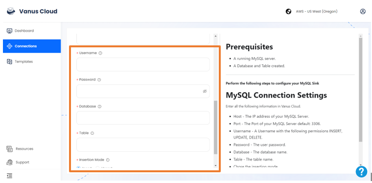

# Github Issue create comment event triggers a new row on MySQL

GitHub is the largest web-based platform that provides developers with a place to host and manage their software projects.

You can receive notifications when specific events occur in a repository by adding a GitHub Source on Vanus Cloud.

This guide will help you get a new row on MySQL everytime a new comment on an issue is created your Github repository.

<iframe width="800" height="450" src="https://www.youtube.com/embed/lCZN5akAi6k" title="YouTube video player" frameBorder="0" allowFullScreen={true} allow="accelerometer; autoplay; clipboard-write; encrypted-media; gyroscope; picture-in-picture; web-share"></iframe>

## Get Started

### Step 1: Configure the Source - Authorize GitHub and select a GitHub repo

- Log in to [Vanus Cloud](https://cloud.vanus.ai/) and choose the **Github Issue create comment event triggers a new row on MySQL** template.

- Find the **Sign in with GitHub** button and authorize GitHub. Then, select the repo you want to configure.

### Step 2: Configure Sink

- Fill all the necessary information - Host, Port, Username, Password, Database, and Table

- Click Submit. Your connection is now succesfully created

- After submission, the status will show as **running**. Now everytime users Star your repository, you will instantly get a new row on MySQL
