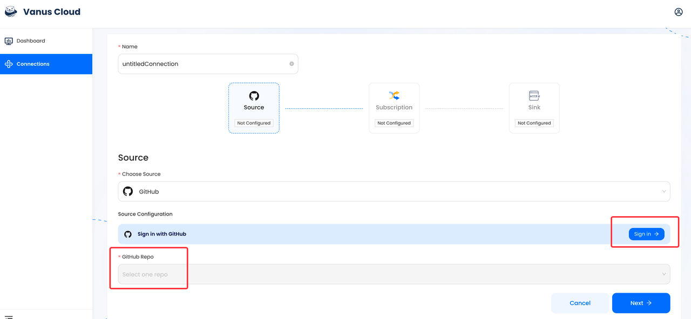
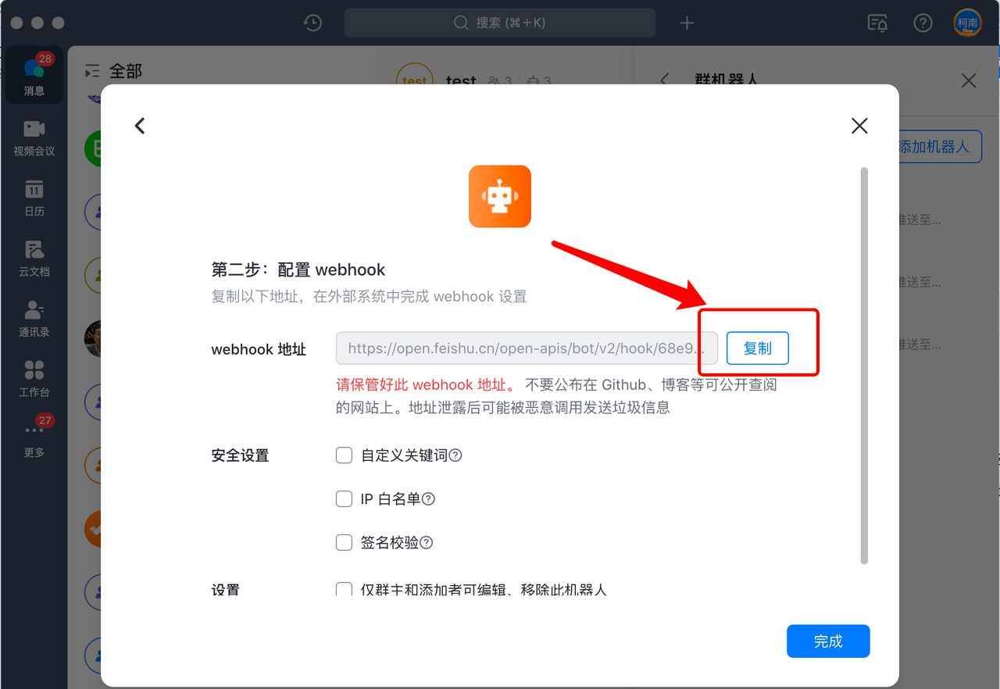
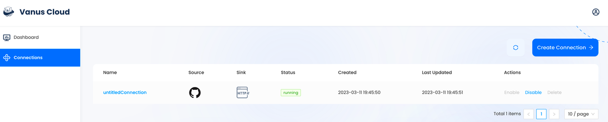

# GitHub issue event triggers a Feishu message

GitHub is the largest web-based platform that provides developers with a place to host and manage their software projects.

You can receive notifications when specific events occur in a repository by adding a GitHub Source on Vanus Cloud.

This guide will help you get a FeiShu notification whenever an issue is opened in your repository.

<iframe width="800" height="450" src="https://www.youtube.com/embed/6ALWxpZohQI" title="YouTube video player" frameBorder="0" allowFullScreen={true} allow="accelerometer; autoplay; clipboard-write; encrypted-media; gyroscope; picture-in-picture; web-share"></iframe>

## Get Started

### Step 1: Configure the Source - Authorize GitHub and select a GitHub repo

- Log in to  [Vanus Cloud](https://cloud.vanus.ai/)  and choose the **GitHub issue event triggers a Feishu message** template.
- Find the **Sign in with GitHub** button and authorize GitHub. Then, select the repo you want to configure.

### Step 2: Configure Sink - Get the Feishu Webhook URL

- Add a bot to the specified group in Feishu settings and copy the Webhook URL to paste into the Sink configuration.

Tip: For detailed steps on how to obtain the Feishu Webhook URL, refer to the blog [Retrieve Feishu Webhook URL - A Streamlined Guide](https://www.vanus.ai/blog/retrieve-feishu-webhook-url/).

### Step 3: Configure Subscription: Create a Connection Using the Default Template

- Use the pre-configured Issue Template and simply click "Submit" to create the Connection.

Note: You can customize the display format and content of the notifications by configuring the **Subscription**.

- After submission, the status will show as **running**. Now you can create a new issue in the repo you selected to test the notification system you just set up.

### Result Display

- When a new issue is created, you will receive a real-time GitHub Issue Notify in Feishu.

The blue and bolded text in the notification received on Feishu are hyperlinks that can be clicked to directly view the GitHub profile of the developer who created the issue and the issue title.
