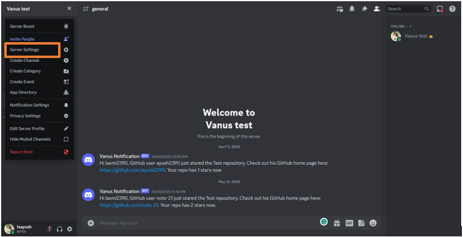

# Stripe Charge Success event triggers a Disord message

Stripe's payments platform lets you accept credit cards, debit cards, and popular payment methods around the world

You can connect other platforms with your Stripe account to get notification messsages

This guide will help you to connect Discord server with Stripe account to get customized notification message on Slack when a Charge success happens

<iframe width="800" height="450" src="https://www.youtube.com/embed/J0-wAoEB-F0" title="YouTube video player" frameBorder="0" allowFullScreen={true} allow="accelerometer; autoplay; clipboard-write; encrypted-media; gyroscope; picture-in-picture; web-share"></iframe>

## Get Started

### Step 1: Configure the Source

- Log in to [Vanus Cloud](https://cloud.vanus.ai/) and choose the **Stripe Charge Success event triggers a Discord message** template.

### Step 2: Configure the Source

- Just scroll down and click Next

### Step 3: Configure Sink - Get the Discord Webhook URL

- Open Discord in your browser and go to your desired Discord Server

- Go to the Server settings and click on Integrations

- Click on New Webhook. Open the newly created Webhook and Copy the Webhook URL

### Step 4: Setup the endpoint

- Go to [Stripe](https://stripe.com/en-in) and login with your account

- Go to Developer and click on Webhooks

- Click on create an endpoint

- Paste the URL in the Endpoint URL and select your desired event

- Click Add endpoint. Your connection is now working perfectly

