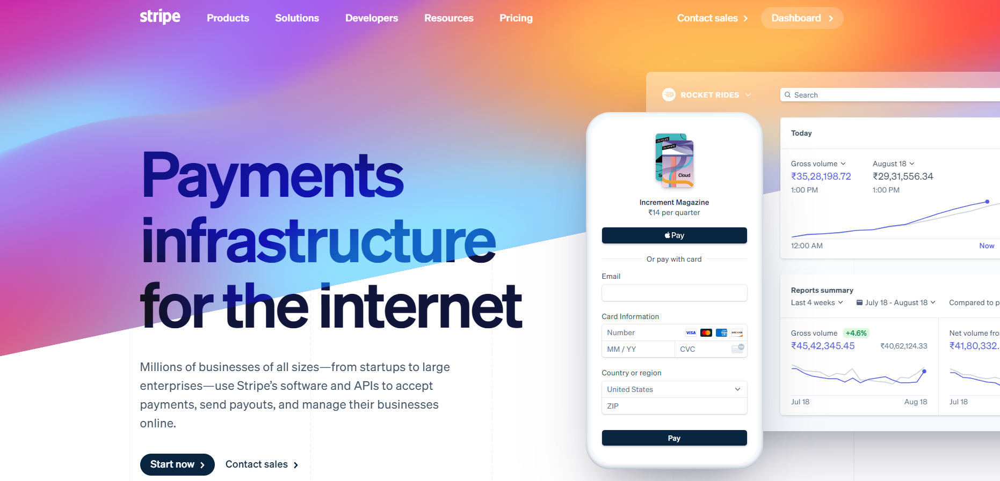
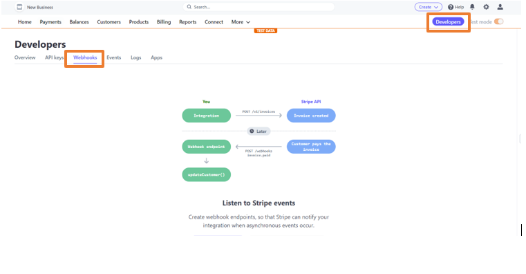
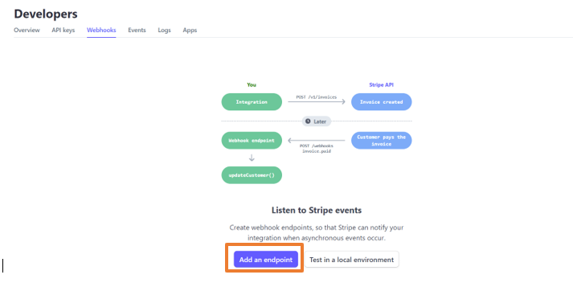
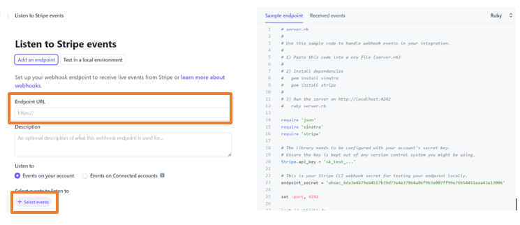
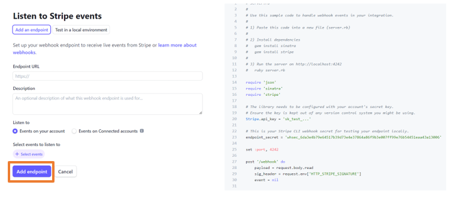

# Stripe Invoice Payment event triggers a Slack message

Stripe's payments platform lets you accept credit cards, debit cards, and popular payment methods around the world

You can connect other platforms with your Stripe account to get notification messsages

This guide will help you to connect Slack channel with Stripe account to get customized notification message on Slack when payment happens

<iframe width="800" height="450" src="https://www.youtube.com/embed/s6cJHM2-piw" title="YouTube video player" frameBorder="0" allowFullScreen={true} allow="accelerometer; autoplay; clipboard-write; encrypted-media; gyroscope; picture-in-picture; web-share"></iframe>

## Get Started

### Step 1: Configure the Source

- Log in to [Vanus Cloud](https://cloud.vanus.ai/) and choose the **Stripe Invoice Payment event triggers a Slack message** template.

### Step 2: Configure the Source

- Just scroll down and click Next

### Step 3: Configure the Sink - Get the Slack Webhook URL

- Open Slack API in your browser, create a Webhook URL and copy it

Tip: For detailed steps on how to obtain the Slack Webhook URL, refer to the blog [Get Your Slack Webhook URL - A Quick Integration Guide](https://www.vanus.ai/blog/get-your-slack-webhook-url/).

- Paste the copied URL in the Webhool URL in the Sink Configuration and click Submit

- Your connection has been succesfully created

### Step 4: Setup the endpoint

- Go to [Strip](https://stripe.com/en-in) and login with your account

- Go to Developer and click on Webhooks

- Click on create an endpoint

- Paste the URL in the Endpoint URL and select your desired event

- Click Add endpoint. Your connection is now working perfectly

