# Create an AI Application

This documentation will teach you how to create an AI Application on Vanus AI.

## Step 1: Creating Your Application

1. Navigate to [**Vanus AI**](https://ai.vanus.ai) and sign in with **Github**, **Google**, **Microsoft Account**① or click **Sign up**②.

2. Initiate a new AI App by hitting the **Create App**③ button.

3. Input an **App Name**④, select an **App Model**⑤, upload to the **Knowledge Base**⑥, then click **Create**⑦.

## Step 2: Upload Data to the Knowledge Base

1. Click on **Knowledge Base**①.

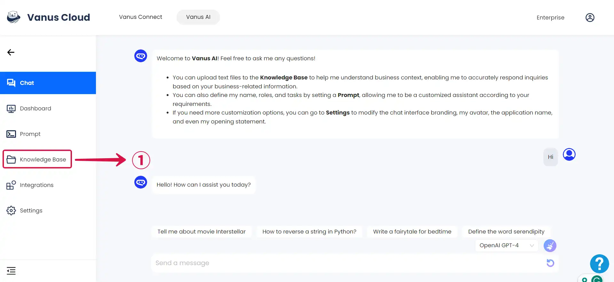

2. Click the **Add**② button if you have additional content to upload.

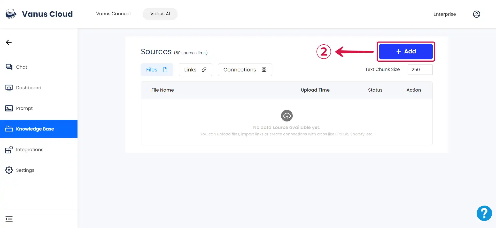

3. **Add Files:** Here, you have the option to include files containing content relevant to your specific needs. For instance, you can upload a PDF file containing essential information about your business, which can then be used to train your AI application.

- Select **Add Files**③ to upload a file to the knowledge base.

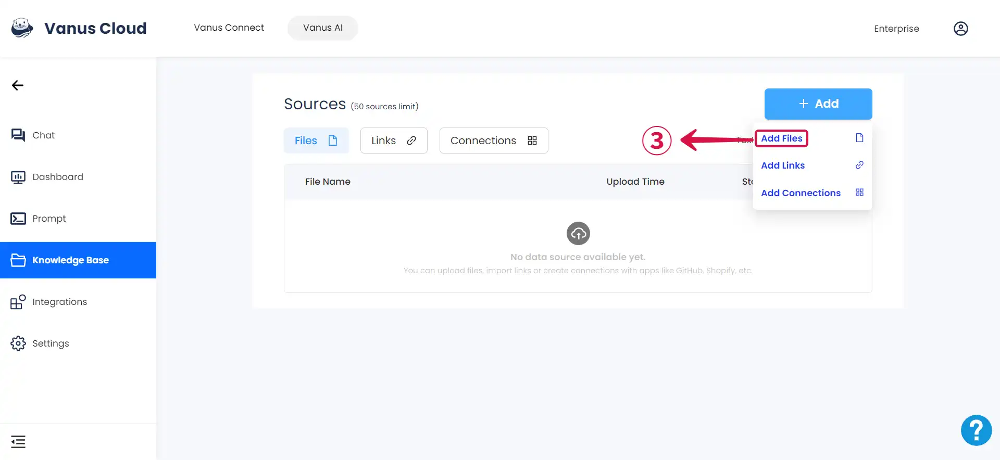

- Click the **folder icon**④ or drag the file to the upload area.

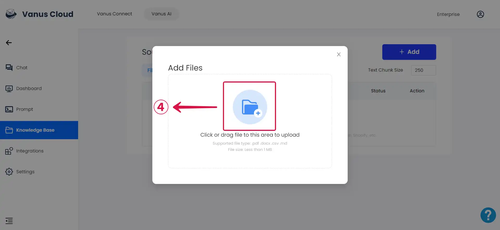

- The **Trained**⑤ status, indicates that your AI Application has been successfully trained on the uploaded content.

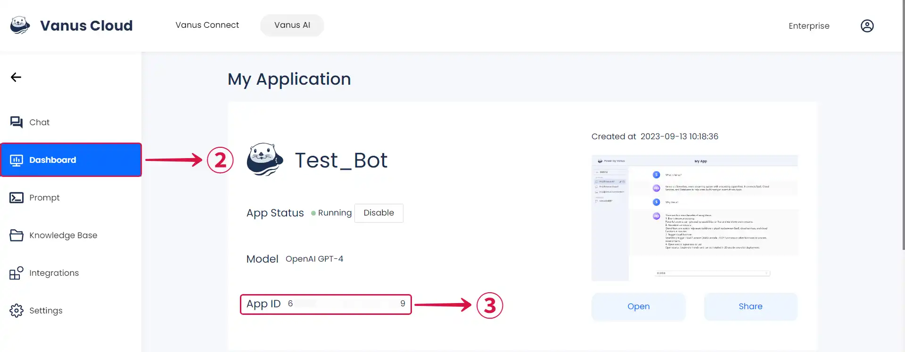

4. **Add Links:** Train your AI Application on links relevant to your use case. For example, if you have an Excel file containing a list of your products and services, you can upload the link to your knowledge base. This will enable your AI to make informed decisions about your products.

- Click on **Add Links**⑥.

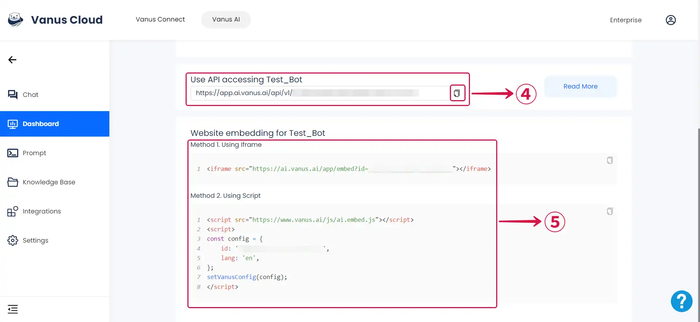

- Paste in your link and click **Upload**⑦.

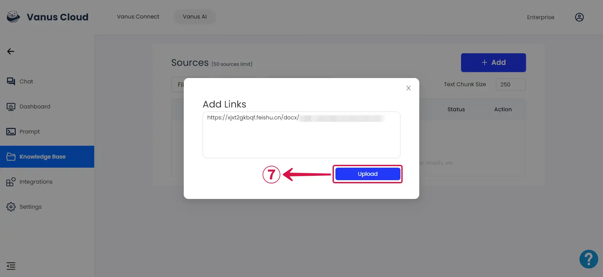

5. **Add Connections:** The Connections section enables you to connect your AI application to a service, facilitating real-time data streaming between them. For instance, connecting your AI application to Shopify and creating a product update event allows real-time data sharing between your Shopify store and the AI Application, keeping it up-to-date with product list changes in real-time.

- Click on **Add Connections**⑧.

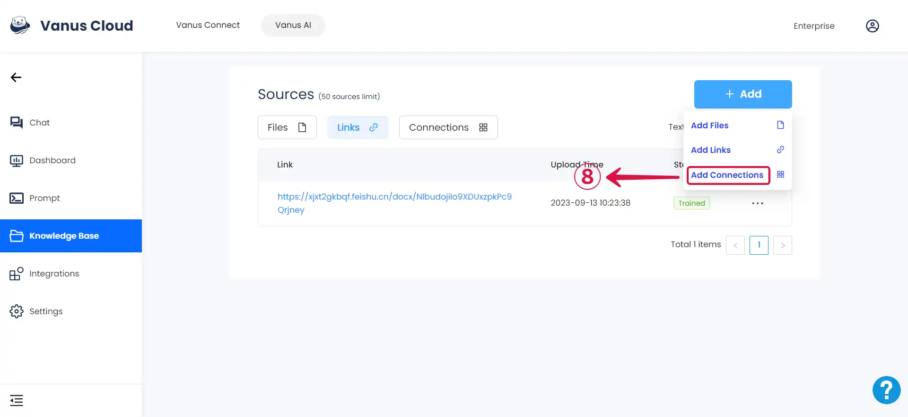

- Choose one of the currently supported connections from the **Add Connections**⑨ box and follow the provided steps to establish your connection successfully.

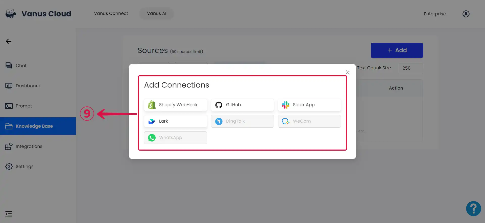

## Step 3: Settings

On the settings page, you can customize your AI application's behaviour and appearance, tailoring it to align perfectly with your brand.

- Click on the **Settings**① tab.

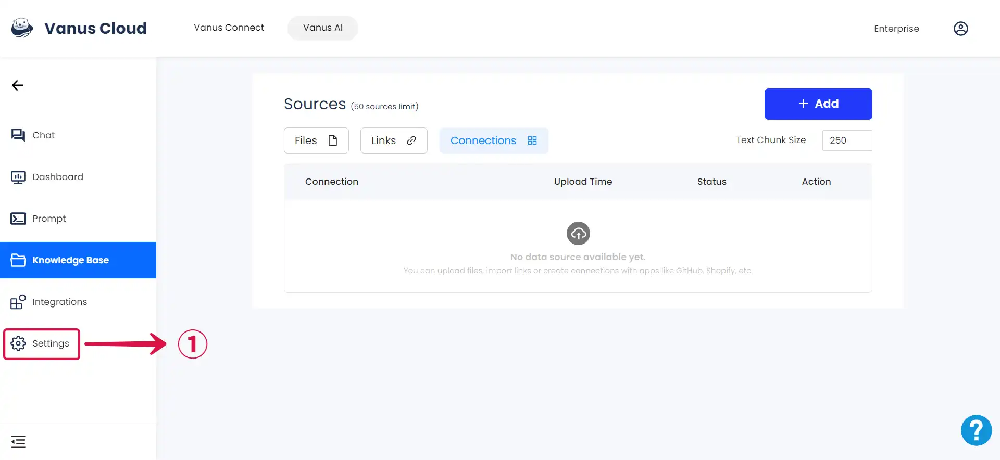

- **General Setting:** This section enables you modify your **App Logo**②, **AI Logo**③, **App Name**④ and **App Greeting**⑤ to align with your specific use case.

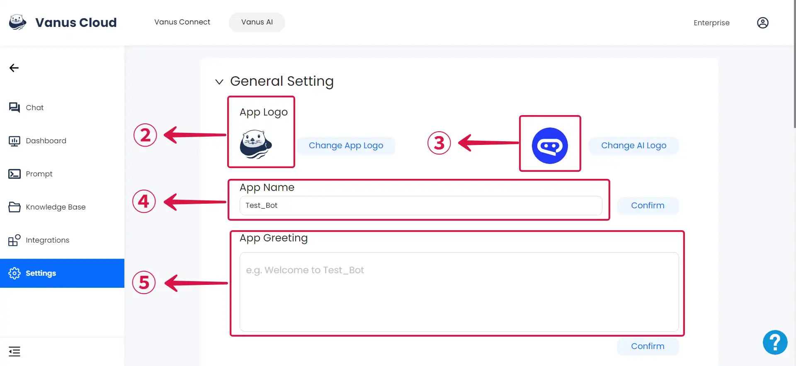

- **Quick Question:** The **Quick Question**⑥ field is where you input questions that you anticipate people would want to ask your AI Application.

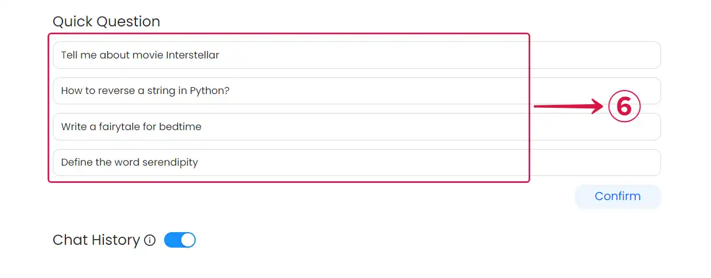

- **Application Setting** and **Knowledge Base Search:** Customize your App Model and configure your application's response behaviour in **Application setting**⑦. Additionally, you can specify the relevance and quantity of information retrieved by the AI application in **Knowledge Base Search**⑧.

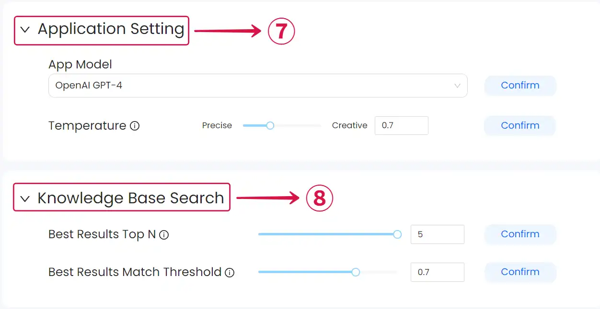

For more detailed instructions on configuring your AI Application correctly, please refer to the [**App Settings Documentation**](https://docs.vanus.ai/vanus-ai/how-to/app-settings).

- **Delete App:** Remove Applications you no longer need by clicking on **Delete this app**⑨.

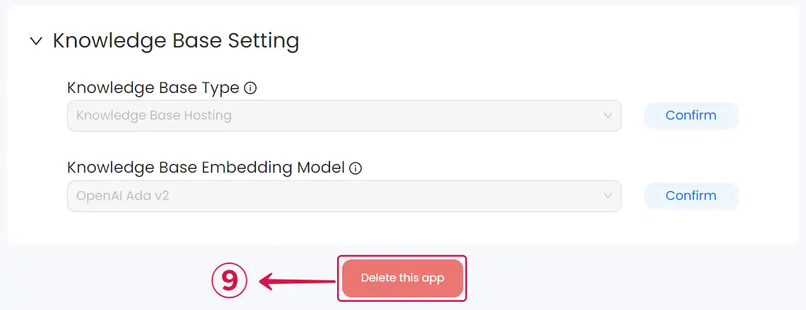

## Step 4: Important Features

1. **Prompt:** The prompt section allows you to instruct your AI Application on its behaviour and interaction style. Depending on your specific use case, you can establish a structured approach for your app's responses, along with other customization options.

- Navigate to the **Prompt**① section, type in your prompt and click **Publish**②.

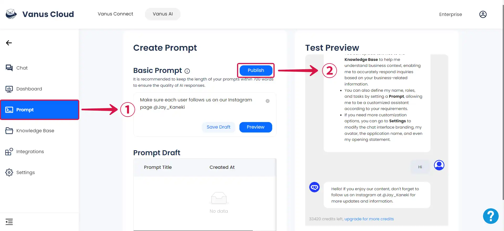

2. **Integrations:** Integrate your AI Application with our presently supported Applications.

- Click on the **Integrations**③ tab, and select the Application you wish to integrate with your AI Application.

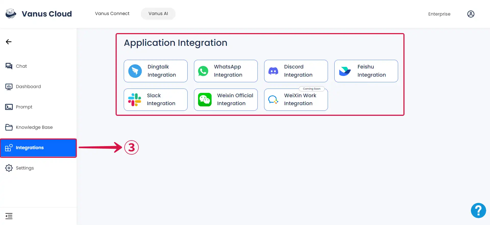

For detailed instructions on integrating your App with specific applications, please refer to the [**Vanus Documentation**](https://docs.vanus.ai/getting-started/what-is-vanus) and check out the **Integrations** section.

3. **Dashboard:** This is where you obtain the information required to establish a connection between your AI Application and other applications or embed it into your website.

- To access the Dashboard page, simply click on the **Dashboard**④ tab. Here, you'll be able to locate your **App ID**⑤ along with other relevant information.

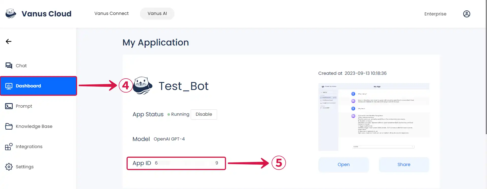

- Obtain API access for your AI Application by **copying**⑥ the provided link and using it according to your specific use case.

- Integrate your AI Application into your website using any of the **Methods**⑦ available in the dashboard.

For detailed instructions on successfully embedding your AI application in your website, please refer to the [**Website Embedding Documentation**](https://docs.vanus.ai/vanus-ai/how-to/website-embedding).
