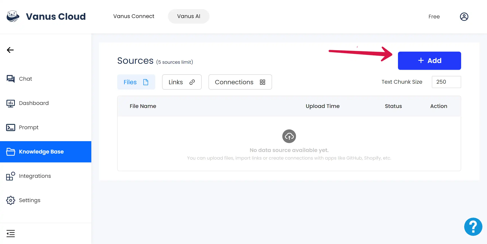
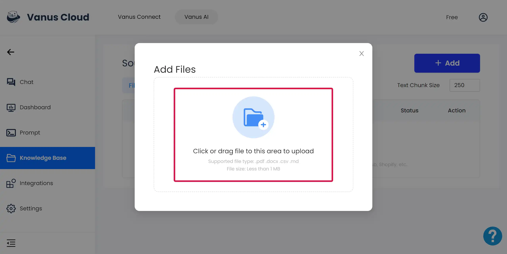
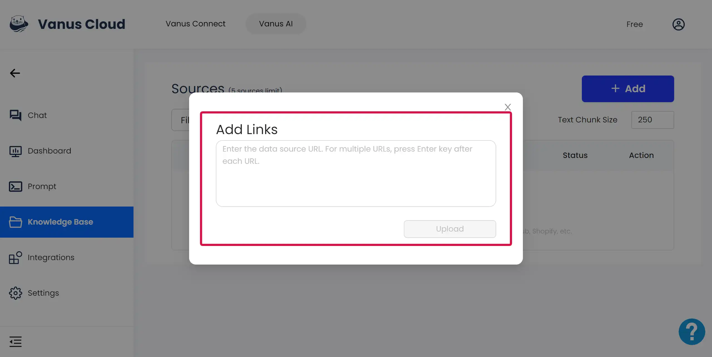
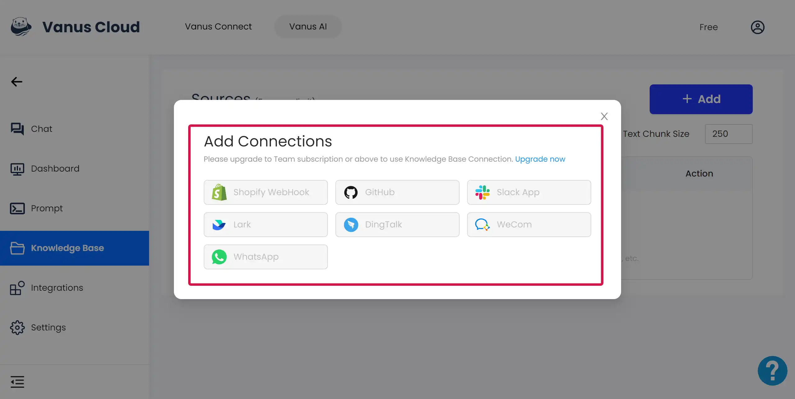
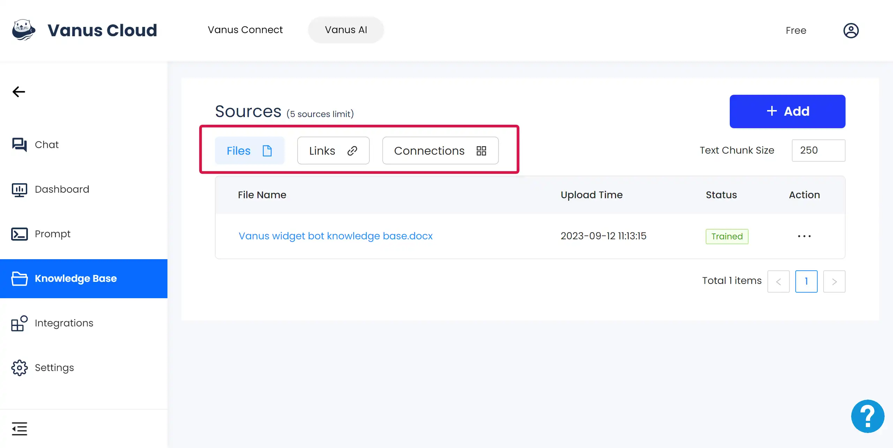
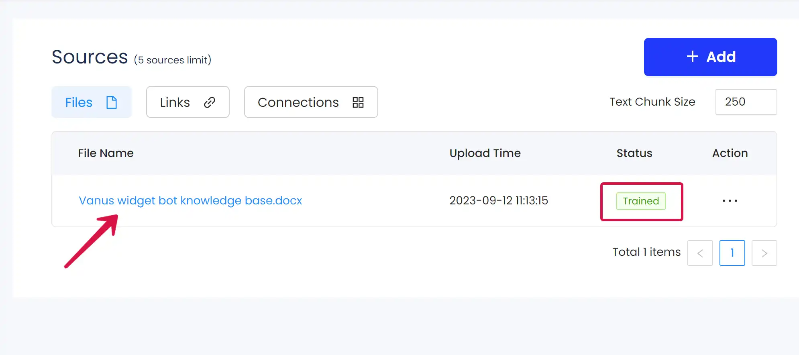
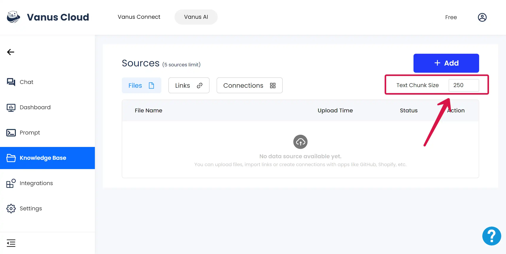

# Knowledge Base

## In Vanus AI, what does Knowledge Base refer to?
In Vanus AI, the knowledge base provided to each AI application refers to the data fed to the model for learning in various forms. Vanus AI supports each user to use customized data to provide as background reference for the model. 

## Why is it better to add a knowledge base when creating AI applications? 
Adding Knowledge Base can improve the response effect of AI applications. The main reasons are as follows:

**1. Enhanced Understanding:** The information provided by the knowledge base can help AI better understand user questions, thereby providing more accurate answers.

**2. Expanded Knowledge Scope:** By integrating a knowledge base, AI can acquire a large amount of knowledge and information, expanding its knowledge scope, enabling it to answer more questions.

**3. Improved Answer Accuracy:** The information in the knowledge base can serve as a reference, helping AI answer questions more accurately.

**4. Provided Contextual Information:** When needed, the knowledge base can provide contextual information about the question, helping AI better understand the background of the question.

**5. Dynamic Updating and Learning:** The knowledge base can continuously update and learn new information, enhancing the capabilities of AI.

## What forms of Knowledge Base does Vanus AI support for uploading?
Currently, Vanus AI supports users uploading **files, links, and connections** to Knowledge Base. Among these, files are a fixed, static source of data, while links and connections can update in real time according to the internet, supporting AI applications to acquire **dynamic data sources** as background knowledge for learning. 

Click on the Knowledge Base in the left sidebar, then find the **"+Add" BUTTON** at the top right corner of the page to start uploading files.  

### Uploading Files as Knowledge Base
**1. Background note:**
Vanus AI supports users uploading four types of files: **.csv, .docx, .md, .pdf**. The uploaded file size needs to be **less than 1 MB**.

**2. How to use:**
Step 1: Click on the **"+Add"** button
Step 2: Click on the **"Add Files"**
Step 3: Click the"Add Files" window and upload your file  

### Uploading Links as Knowledge Base
**1. Background note:**
Vanus AI allows users to directly upload links as data sources. Vanus AI will automatically learn the data in the links as background information. 

The uploaded link address needs to be complete and correct. The webpage content should ideally be **clean and tidy**, without too many sections, to facilitate the identification of the text content within the website.

**2. How to use:**
Step 1: Click on the **"+Add"** button
Step 2: Click on the **"Add Links"**
Step 3: Input your data source URL. For multiple links, remember to **press Enter key** after each URLs.  

### Uploading Connections as Knowledge Base
**1. Background note:**
Vanus Connect is a cloud-based service that allows users to create event-driven applications without the hassle of setting up and managing their own Vanus server. With Vanus Connect, you can quickly and easily build connections between SaaS, cloud services, and databases, allowing you to easily automate, notify, and streamline your processes. For more information, please visit [Vanus Connect](https://docs.vanus.ai/getting-started/vanus-connect "Vanus Connect") 

Currently, Vanus AI supports users in configuring applications such as **Shopify WebHook, GitHub, Slack APP, and Feishu** as dynamic knowledge sources.

**2. How to use:**
Step 1: Click on the **"+Add"** button
Step 2: Click on the **"Add Connections"**
Step 3: Choose the platform where your connection is located
Step 4: Fill in the required information as instructed.  

Each platform has its **exclusive connection configuration requirements**. Please fill in according to the guidelines on the webpage. Meanwhile, you can refer to the related blogs already published on the Vanus official website, for example: [How to use Vanus AI Vanus Fashion Template](https://www.vanus.ai/blog/how-to-use-vanus-ai-vanus-fashion-template/) 

## How to view the data sources successfully uploaded to the knowledge base? 
### Find the Trained Sources
At the bottom of the Sources, there are three sections: **Files, Links, and Connections**. By clicking on each section button, you can see the files, links and connections that have been successfully trained below.  

### View the Text Segment
Click on the **light blue file name**, it will redirect to display the text segment of the trained file.  

### Edit the Text Chunk Size
If you are not satisfied with the current text segmentation, you can re-segment the files, links, and connections in the knowledge base by **modifying the chunk size**.  

### Close Useless Data
If you do not wish to use a specific part of the text as a knowledge base, you can click the button **in the upper right corner** of the text block to close it. After closing the button, this part of the text will not be learned by the model.  

