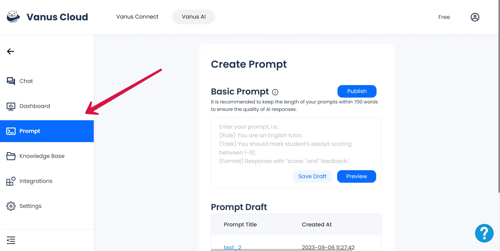
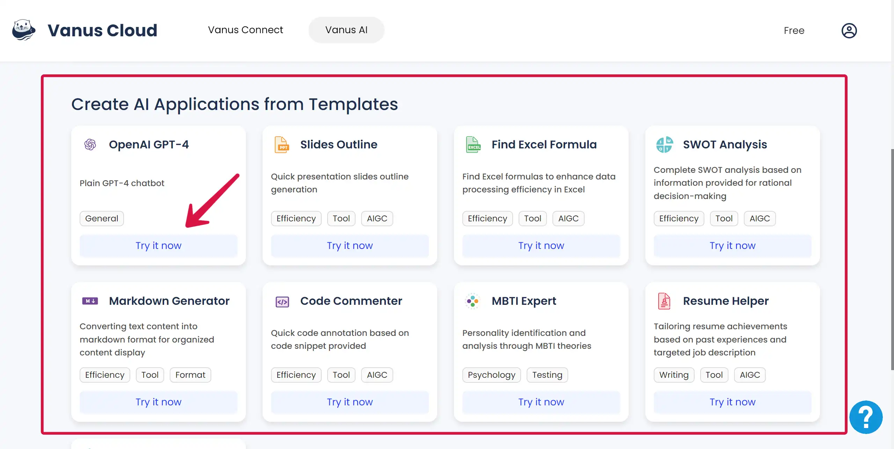
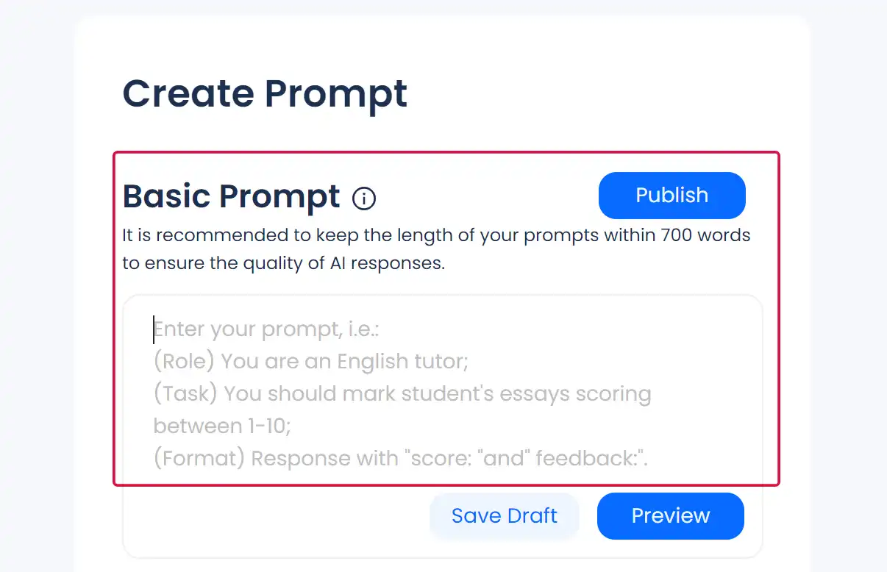
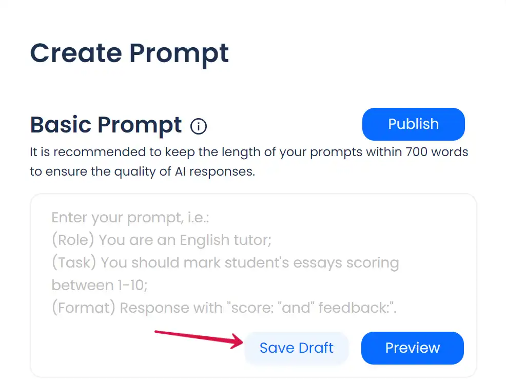
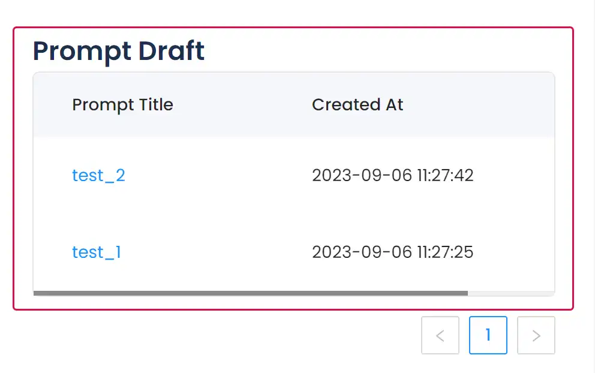
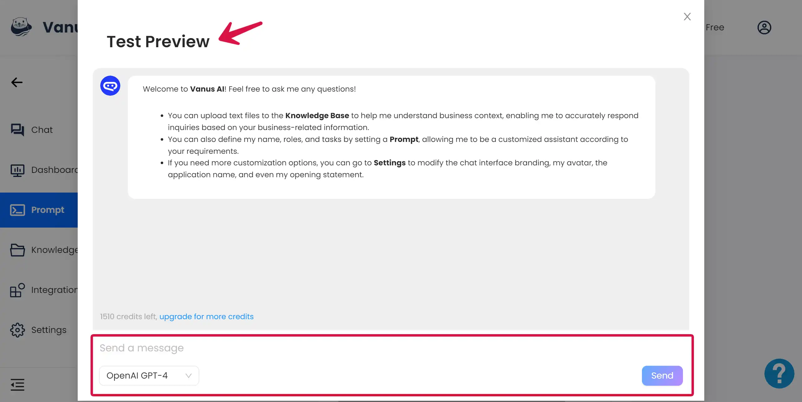
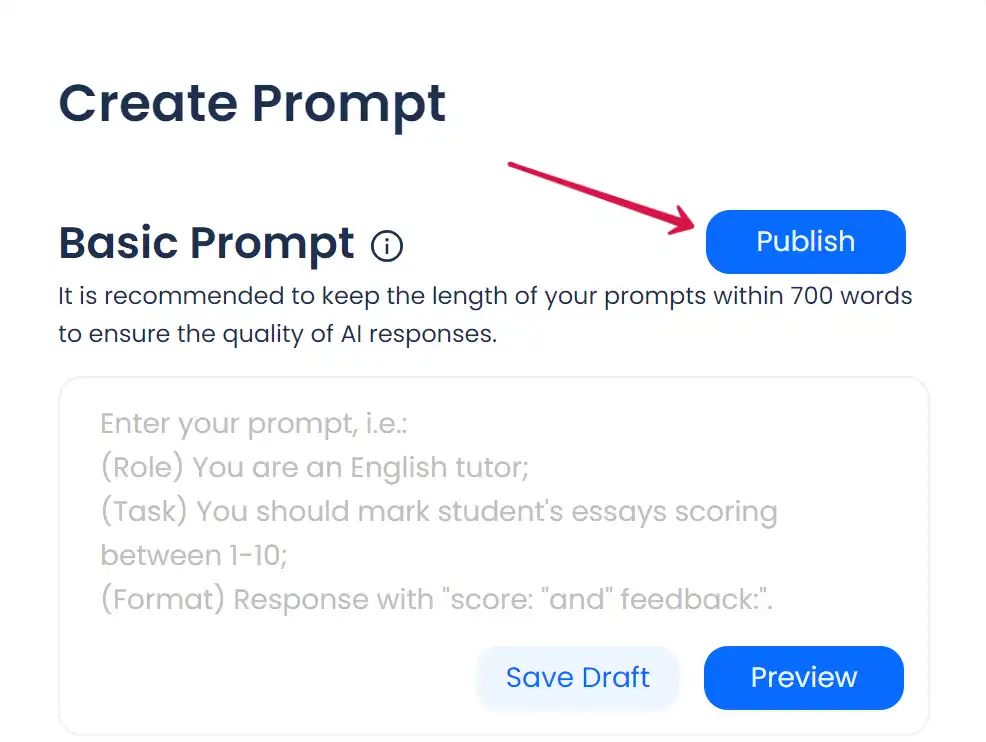

# Prompt Setting

## Step 1: Find Where to Set Prompt
You can find **Prompt** on the left sidebar and by clicking on it, you will arrive at the settings page for the prompt.  

## Step 2：Set the Basic Prompt
### Prompt References for Beginners
#### Qucik Template
If you have not yet completed the prompt engineering, you can refer to this ** qucik prompt template** to design prompts suitable for the application you are creating.

>(**Role**) You are an English tutor;
(**Task**) You should mark student's essays scoring between 1-10;
(**Format**) Response with "score: "and" feedback:".

#### Templates Provided by Vanus AI
If this is your first time creating prompts, Vanus AI provides you with some AI application templates for reference. 

First, visit the [**Vanus AI**](https://ai.vanus.ai) and find the **Create AI Applications** from Templates section; 

Second, select the scene you need and click the **Try it Now** button to complete the application creation.  

After entering the application template you have selected, please click **Prompt** in the left sidebar and find the prompt of this application template at the bottom of the basic prompt. We hope the **prompt setting of the template** can provide a reference for you to create your own application.

### Fill in the Basic Prompt
If you have already completed the prompt engineering, you can directly **fill in** the prompt in the box at the bottom of the **basic prompt**.  

## Step 3：Save Draft
When you complete the prompt settings, you can click the **Save Draft** button, please fill in the name of this version of the draft in the **pop-up window**, and **click save**.  

You can find all saved prompt drafts under **Prompt Draft**. By clicking the prompt title, the system will **automatically put** the prompt draft into the text box of the Basic Prompt without having to fill it out again.  

## Step 4：Preview the Prompt
When you have completed the basic prompt, you can click the **Preview** button to enter the **Test Preview**.  

In the **Test Preview**, you can directly initiate a conversation with the application and ask any questions you want to test. At this time, the application has been **configured with** the prompt you filled in the **Basic Prompt**.  

## Step 5：Publish the Prompt
If you find that the current prompt setting has **reached your expected effect** in the test preview, you can **close the Test Preview**, and **click the Publish button** on the right side of the Basic Prompt to **configure the current prompt into the application**.  

The **Success** tag will appear at the top of the page, indicating that the **current prompt has been successfully configured** into the application.