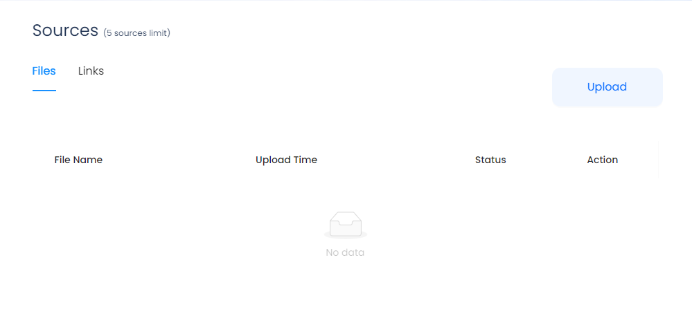
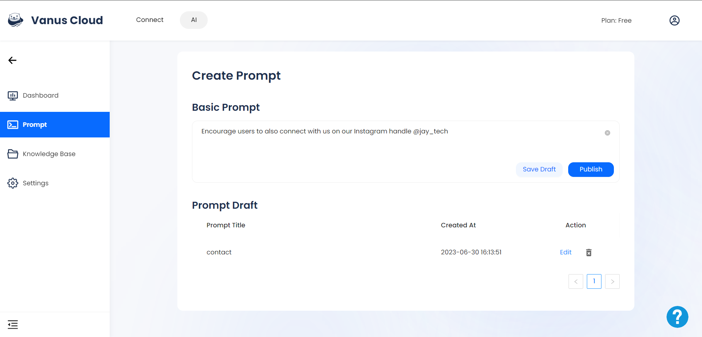
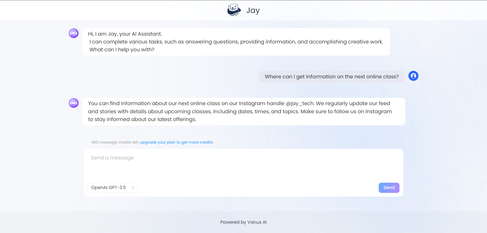

# Vanus AI Features

## Multi-Model Selection

Users can choose from various large models when building their AI application. Vanus AI currently provides users with models such as GPT-3.5, GPT 4.0 and ERNIE Bot. Other large models will be provided in the future.

## Knowledge Base

Vanus AI's knowledge base is a versatile and powerful repository that plays a vital role in training and enhancing the capabilities of your personal assistant, chatbot, or AI-powered application. It serves as a centralized hub, containing essential data and information to strengthen your AI system.
Users can upload a wide range of file types to the knowledge base, including PDF documents, CSV, traditional text-based files, images, videos, and website URLs and the application extracts relevant information from these files.

In addition to the initial training received upon uploading your valuable resource content, the knowledge base of Vanus AI maintains a continuous cycle of updates and self-training through interactions with customers and content from connected external platforms. By establishing connections between your AI application and relevant external platforms like databases or informative websites such as investment blogs, you can ensure a constant flow of updated knowledge. Through real-time streaming, your AI application receives timely updates and learns from its interactions with these external sources, resulting in a dynamic enhancement of its knowledge base.

## Real-time learning Data Streaming

The AI application seamlessly and continuously enhances its knowledge base by actively acquiring new information from its data source. This process occurs effortlessly whenever users interact with the application, along with third-party applications and services. Consequently, the AI application swiftly adapts and learns from the newly generated data, enabling it to stay updated and provide intelligent responses based on the latest information.

**Consider this scenario:** suppose your AI application is integrated with your trading website through a plugin or connected to your database. In such cases, whenever fresh data is added to the database, it synchronizes with the knowledge base and contributes to the training of the AI application. This synchronization ensures that the application stays up-to-date with real-time updates, gaining insights into all the activities taking place on your website. The AI application actively learns from various user interactions, including comments, reviews, customer engagements, and any available information on the connected site or platform. By continuously assimilating and analyzing this data, the AI application becomes more knowledgeable and capable, offering an improved user experience and better-informed responses. This dynamic learning capability ensures that the AI application evolves and improves its performance over time, delivering enhanced results and valuable insights to users and stakeholders alike.

## Multi-Cloud deployment

With Vanus AI, users have the freedom to select the ideal cloud service platform that aligns with their unique preferences. At present, Vanus AI provides seamless deployment support on two widely recognized and trusted cloud service platforms: Amazon Web Services (AWS) and Alibaba Cloud. However, the commitment to user satisfaction extends further as Vanus AI envisions expanding its support to encompass other popular cloud platforms in the near future, broadening the array of choices available.

The flexibility bestowed upon users extends beyond platform selection, as they also have the liberty to choose the specific region in which they wish to deploy their applications. This strategic decision can be based on the distinct requirements and objectives of their enterprise. By allowing users to pinpoint their desired deployment region, Vanus AI ensures that applications are optimally situated to serve their intended audience and operate with maximum efficiency.

Vanus AI goes above and beyond in catering to the diverse needs of users by offering two data management options. Those seeking convenience and expert management can entrust the Vanus AI team to handle the hosting and administration of their data. On the other hand, users who prioritize maintaining complete control over their valuable data can opt for self-hosting. This empowers them with full authority and oversight, guaranteeing that their data remains securely hosted on the chosen cloud service platform.

## Prompt

Users have the ability to incorporate predefined prompts into their AI application to align its services with their business needs. As an illustrative example, consider a user who saves a predefined prompt that states, "Encourage users to also connect with us on our Instagram handle @jay_tech." Now, when a customer raises a query related to contacting the business, the AI application springs into action and intelligently guides them towards the mentioned Instagram handle.

**Here's another scenario to illustrate the functionality of the prompt feature:**
Let's say you own an e-commerce store that sells a wide range of products. You want to guide your customers towards your special offers and promotions. With the prompt feature, you can save a specific instruction such as "Inform customers about our ongoing 20% discount on all electronics."

Now, when a customer asks a question related to discounts or electronics, your AI application will be ready to provide a prompt-driven response. For instance, if a customer asks, "Are there any current discounts on electronics?", the AI application will instantly retrieve the predefined prompt and direct the customer to the ongoing 20% discount on electronics.

By strategically incorporating tailored prompts, users can tailor the behaviour of their AI application to cater to their specific business objectives and customer engagement strategies. Thereby proactively promoting engagement and fostering connections between the business and its audience.

## Integration

Vanus AI allows users to effortlessly integrate their AI application with a wide array of third-party apps while also establishing connections with external services.

With the Vanus AI plugin, you gain the capability to establish seamless connections between your AI application and external services. This empowers you to link your application with various platforms such as WordPress, e-commerce websites, or any other preferred external systems that are essential to your business operations.

For instance, let's consider an investment and trading website. By connecting your AI applications to your website, you can enhance its functionality by transforming it into an intelligent investment research bot. As visitors interact with your website, the AI application learns and improves its capabilities by actively absorbing information from real-time events, user questions, comments, and interactions. This enables the AI application to provide visitors with relevant details and valuable insights related to investments.

Furthermore, leveraging the power of Vanus Connect, you can establish a connection between your AI application and your Slack trading group. This integration allows you to share important trade updates, ensuring that both your website and trading group are kept up to date with the necessary information. This seamless flow of real-time updates enhances communication and collaboration within your trading community, enabling members to make informed decisions based on the latest market trends and insights provided by the AI application.
