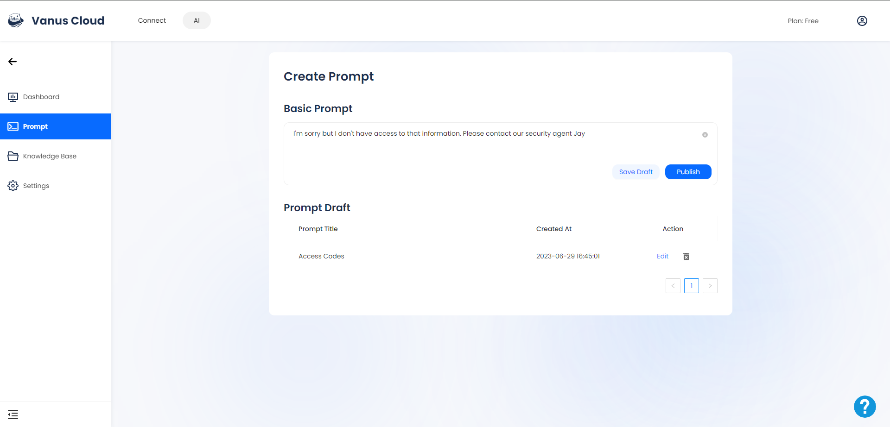

# Vanus AI Features
## Knowledge Base
Vanus AI's knowledge base is a versatile and powerful repository that plays a vital role in training and enhancing the capabilities of your personal assistant, chatbot, or AI-powered application. It serves as a centralized hub, containing essential data and information to strengthen your AI system.

One of the remarkable features of Vanus AI's knowledge base is its ability to accommodate a wide range of file types. Whether you have PDF documents, traditional text-based files, images, website URLs, or other relevant file formats, you can effortlessly upload them to the knowledge base.
 

 

This flexibility allows you to enrich the training process and enhance the overall capabilities of your AI system. It enables accurate answers, contextual responses, visual information processing, and access to reputable online sources. With diverse file types, your AI system becomes comprehensive, delivering intelligent recommendations, personalized assistance, and high-quality content. 

## Prompt

The prompt feature is a critical component that guides the application on how to respond when faced with an unfamiliar question. By saving a prompt as a draft under a specific title, the system associates it with relevant information. When a user poses a question containing that title, and the answer is not available in the knowledge base, the application references the prompt drafts to find a matching title. It then retrieves and presents the prompt saved within that specific draft to the user, ensuring a response is provided even in cases where the system lacks explicit knowledge on the subject.
 
