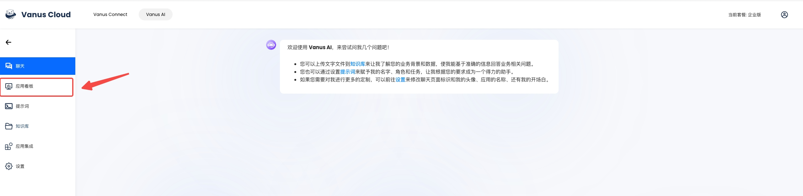

# Vanus AI 应用集成说明

## 准备工作
1. 拥有 Vanus AI 账号，并且拥有有效的付费套餐
2. 创建1 个 Vanus AI 应用

## 获取集成代码

1. 点击已创建的应用   


2. 点击左侧菜单栏-应用看板   


3. 复制集成代码，将代码集成至需要使用的网站代码里   

```html
<!-- index.html -->
<html>
    <head>
        <!-- 你的头文件 -->
        <script src="https://www.vanus.cn/js/ai.embed.js"></script>  

        <script>
            const config = {
                id: '<!-- 你的应用 ID -->',
                lang: 'cn',
            };
            setVanusConfig(config);
        </script>
    </head>

    <body>
        <!-- 你的代码 -->
    </body>
</html>
```

4. 最终效果如图 4 所示   
