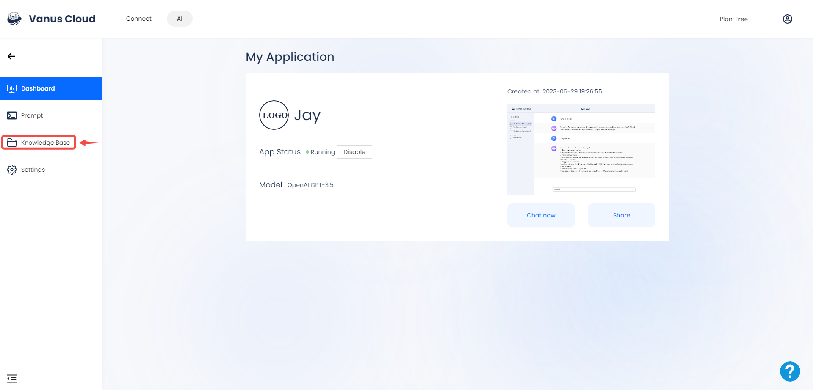
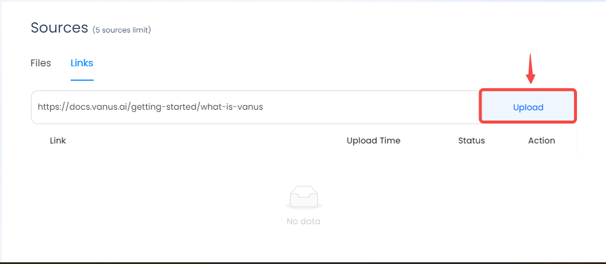
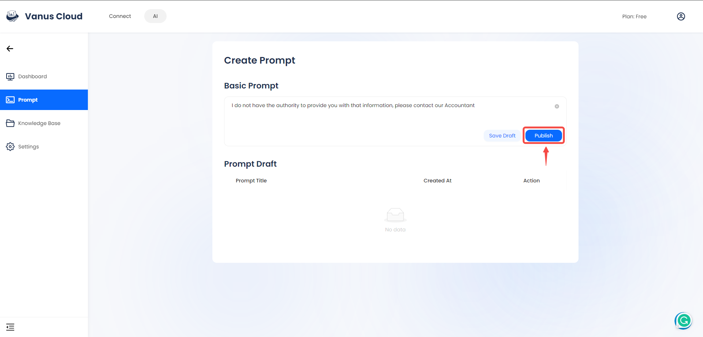
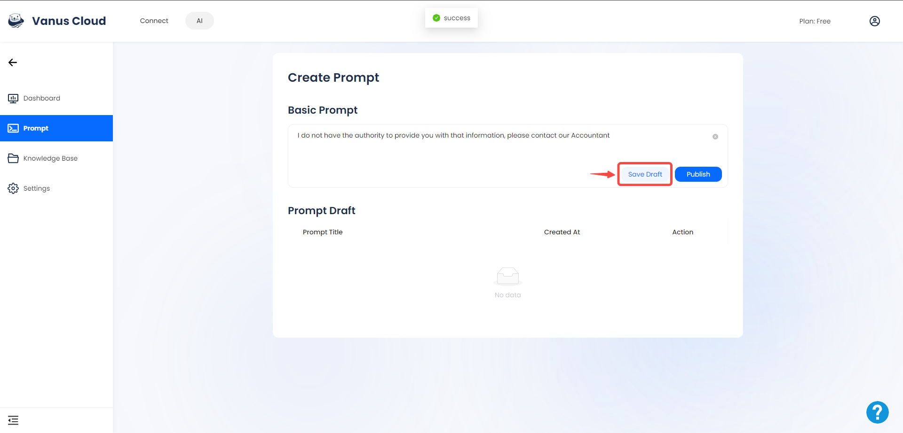
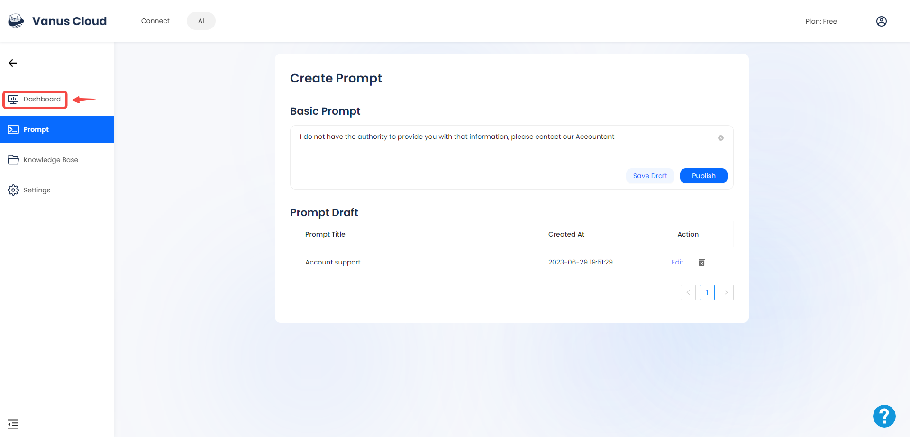

# Create an AI bot

Example document

## Step 1: Create an AI application

- Visit the [Vanus AI website](https://ai.vanus.ai/).

- Click on the **+** below **My AI Applications**.

- Provide a name for your application, then choose the **Conversation App** and **OpenAI GPT-3.5** as the desired options before clicking on the **Create** button.

## Step 2: Upload data to the knowledge base

- Click on **"Knowledge Base"**.

- Select your preferred source; Files or Links.

- Input the website URL and click on **Upload**.

## Step 3: Set Prompt

- Click on prompt

- Enter your prompt and click the **Publish** button.

- Click on **Save Draft**.

- Provide a title for your draft and select the **Save** button.

## Test Your App

- Return to the Dashboard page.
  

- Click on **Chat now**.

- Pose a question to your created assistant and receive an immediate response from it.

:::note
You have the flexibility to customize and personalize your AI Application specifically for your business. This includes the option to modify the app logo, the AI logo, and the app greeting.
:::

