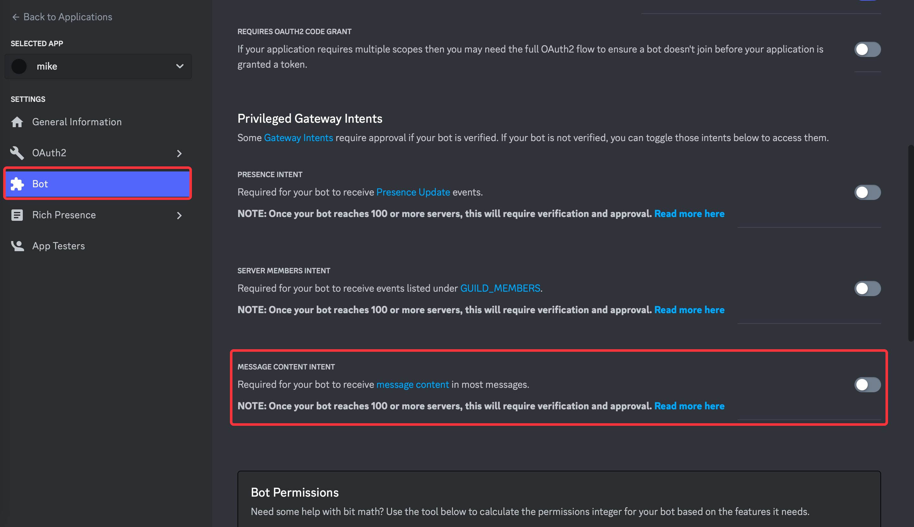
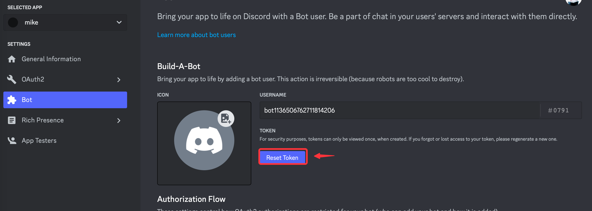
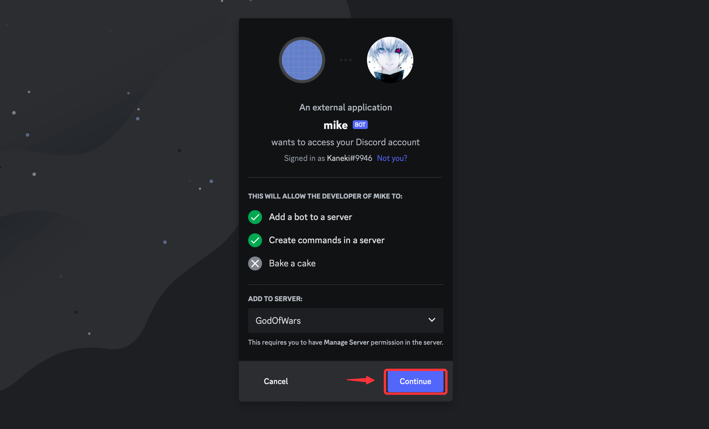

# Discord Integration
This documentation will teach you how to integrate an AI into Discord.
Integration is a paid user feature. Therefore, only users with subscriptions or 14 days trials can use this feature.

## How to Setup a Discord Integration

### Step 1: Create an AI Application
1. Go to [ai.vanus.ai](https://ai.vanus.ai) and sign in.
2. Create a new AI App by clicking **Create App** button.

3. Enter a name, the model, upload to the knowledge base, and click **Create**.

4. Go to the **Integration** tab and click on the Discord integration.

### Step 2: Create a Discord Channel
1. Go to the discord App or website at [discord](https://discord.com)
2. Once logged in you can click on the **`+`** button to create a new channel.

3. Click **Create my own** and complete the creation of your channel.

### Step 3: Create a Discord Application
1. Visit [Discord Developer Portal](https://discord.com/developers/applications)
2. Click **New Application**.

3. Give a name to your bot, accept the terms and conditions and click **Create**.

4. From the side menu go to **bot**, and in Privileged Gateway Intents enable **MESSAGE CONTENT INTENT**.

5. Click **Reset token** and **Copy**.

6. Go back to Vanus AI paste the Token, give the integration a name and press Create.

7. Lastly, to add an AI bot to a channel, go back to the application inside the developer portal.
8. Under the sidemenu 0Auth2 and URL Generator.

9. Select bot under scopes.

10. Under Bot Permission (ReadMessages/ViewChannel, Send Messages, Mention Everyone, Use External Emojis, Send TTS Messages, Send Messages In threads,Create public, threads Create private threads) or Administrator.

11. Copy the URL and visit it from another tab..

12. Select your Server and click **Continue**.

### Communicate with the AI.

To Send a message in a channel you need to mention the AI. 

To send a message privately you can click on the AI bot.

