# Vanus AI Website Embedding

This documentation will teach you how to integrate Vanus AI into your website.

The website embedding feature is a paid user feature. Therefore, only users with starter subscriptions and above can use this feature.

## Step 1: Create an AI application

1. Navigate to [**Vanus AI**](https://ai.vanus.ai) and sign in with **Github**, **Google**, **Microsoft Account**① or click **Sign up**②.

2. Initiate a new AI App by hitting the **Create App**③ button.

3. Input an **App Name**④, select an **App Model**⑤, upload to the **Knowledge Base**⑥, then click **Create**⑦.

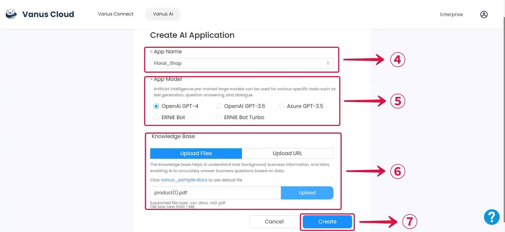

## Step 2: Website Embedding

1. Navigate to the Knowledge Base①.

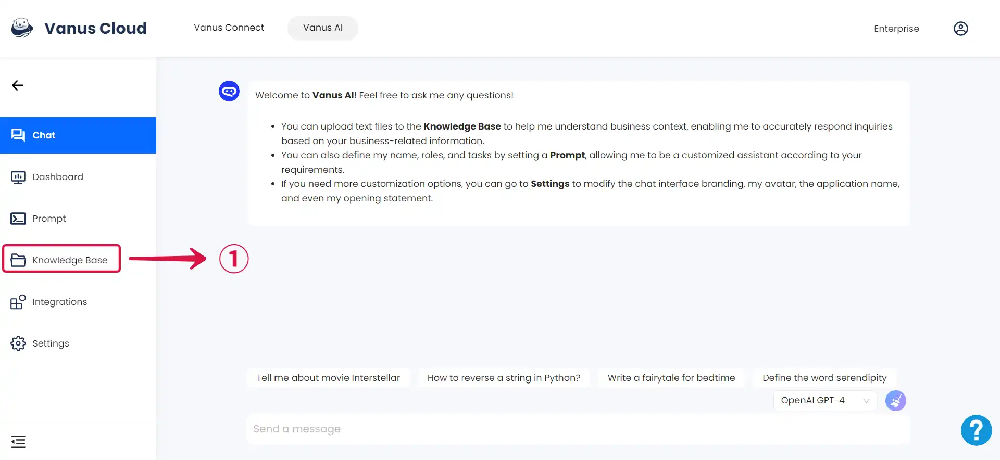

2. Click the **Add**② button if you have additional content to upload.

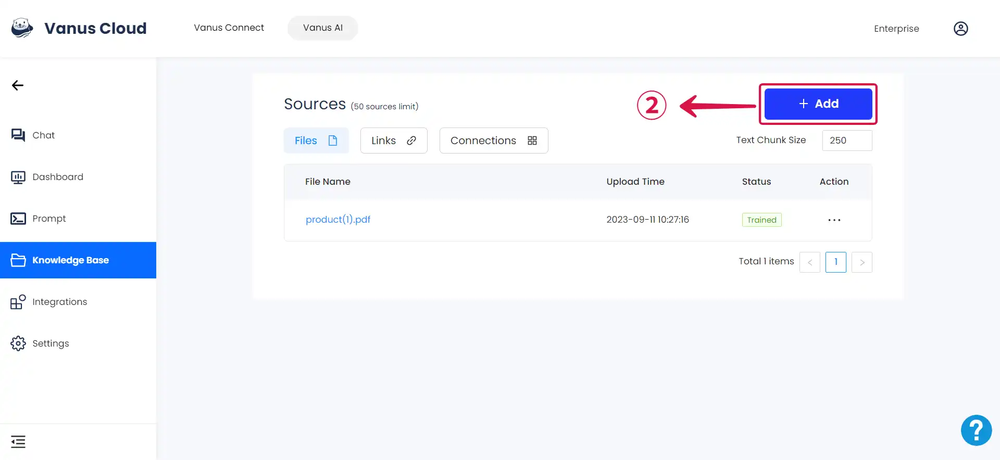

3. Select the option that matches the source you want to add, whether it's **files**, **links**, or **connections**③.

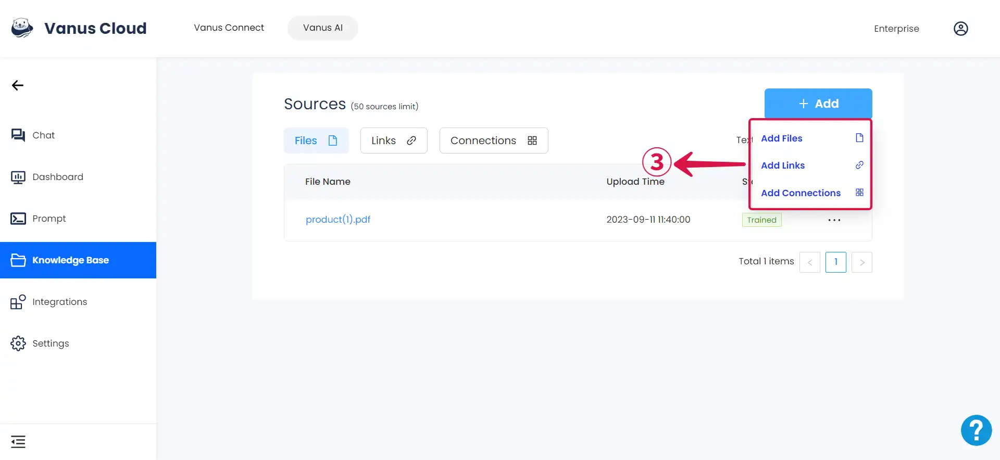

4. In the **Settings**④ tab, You can change your **App logo**⑤, **App Name**⑥, and **App Greeting**⑦.

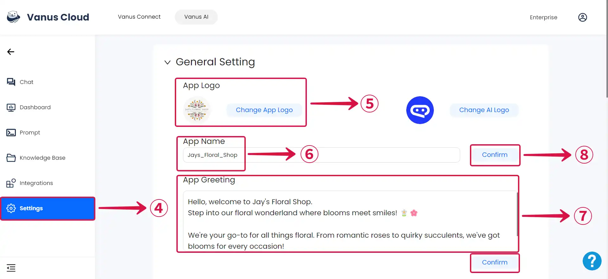

:::note
Remember to click **Confirm**⑧ after making any changes. If you don't, your settings won't be saved.
:::

5. Set your preferred **Quick Question**⑨, and then click **confirm**⑩.

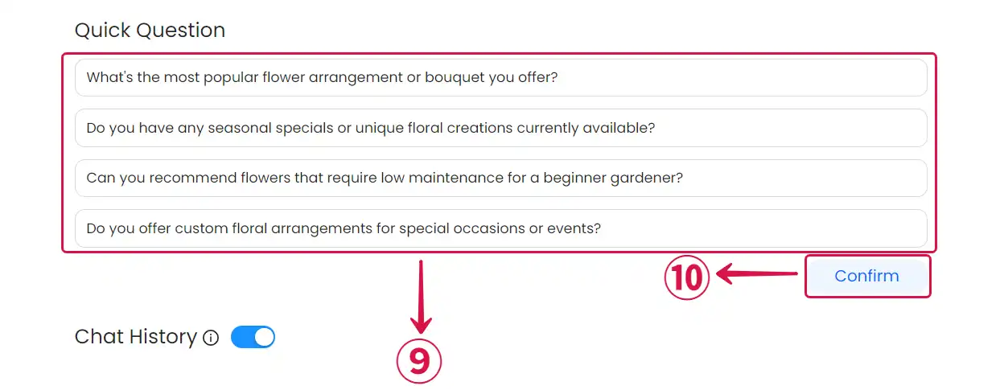

6. Go to the **Dashboard**⑪ page and copy the Code in **Method 2**⑫.

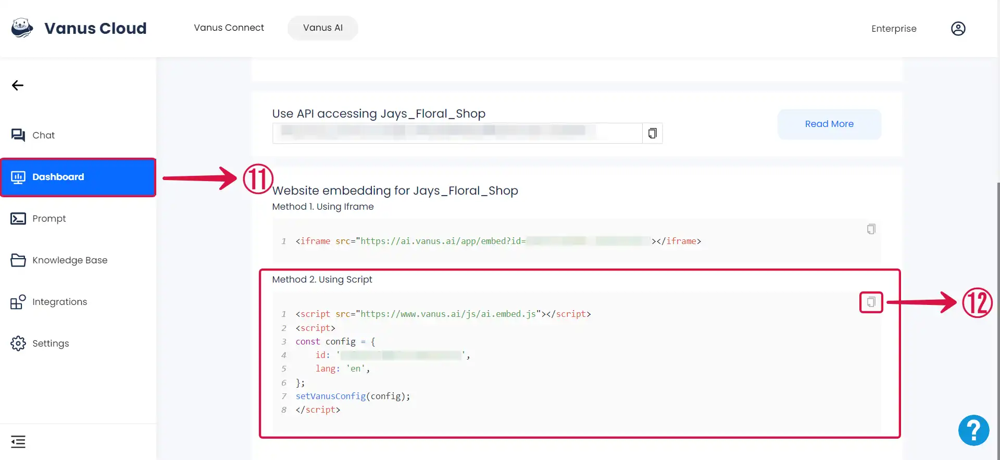

7. Insert the code within the <**head**>⑬ tag of your webpage.

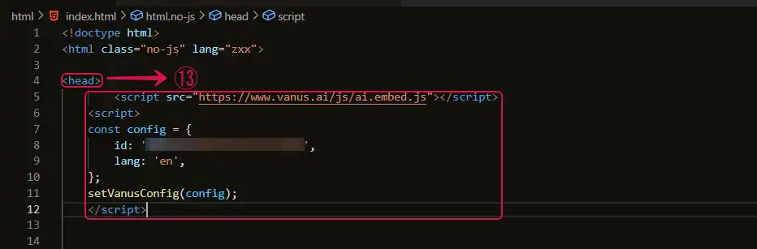

:::note
Feel free to place it on multiple pages where you want the AI visible.
:::

## Step 3: Using The AI on Your Website

Once you’ve inserted the code into the website’s head tag, you can observe the AI on the integrated page and start interacting with it.

- Click on the **help icon**①.

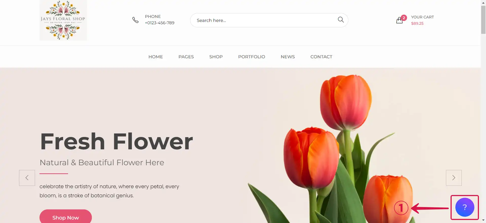

- Interact with the AI.

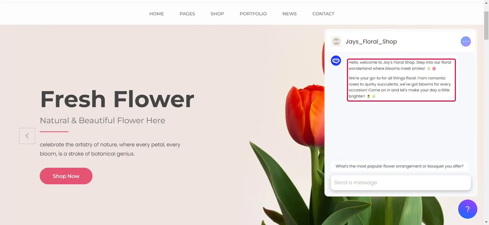

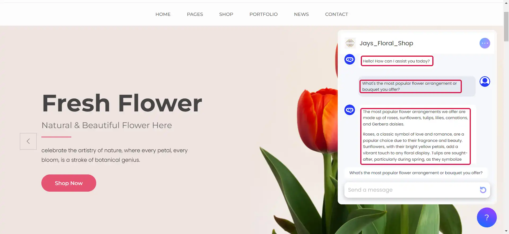
