# DingTalk

This documentation will teach you how to integrate your AI into DingTalk.

Integration is a paid user feature. Therefore, only users with professional subscriptions and above can use integrations.

## How to Integrate Vanus AI in DingTalk

**Prerequisites:**

- Have a [**DingTalk Account**](https://dingtalk.com).
- Have a [**Vanus AI account**](https://ai.vanus.ai).

### Step 1: Create an AI Application

1. Navigate to [**Vanus AI**](https://ai.vanus.ai) and Sign up with your **Github, Google, Microsoft Account**① or click **Sign up**②.  

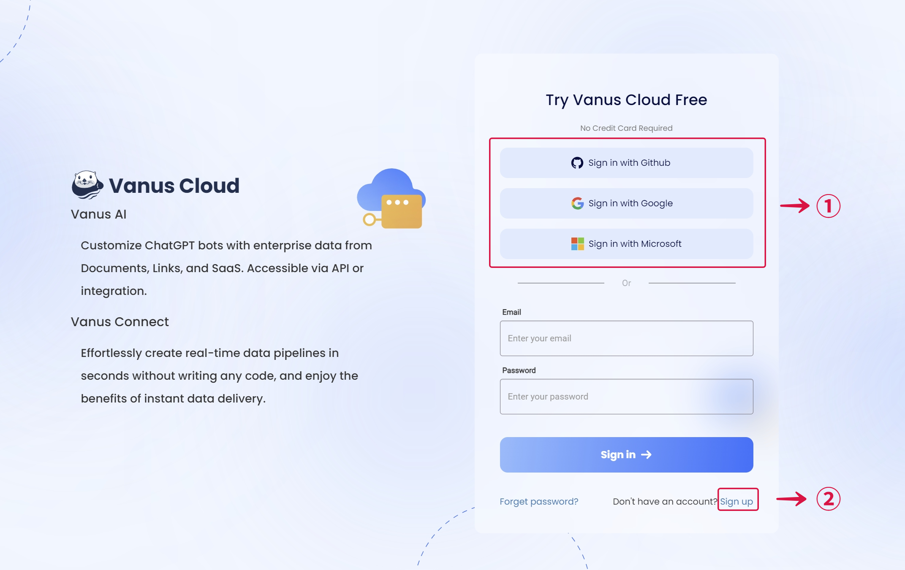  

2. Initiate a new AI App by hitting the **Create App**③ button.  

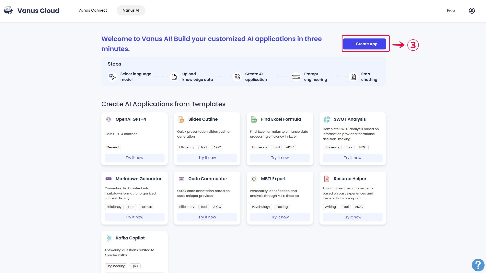  

3. Input an **App Name**④, select an **App Model**⑤, upload to the Knowledge Base⑥, then click **Create**⑦.

4. Select the **Integrations Tab**⑧ and select the **DingTalk Integration**⑨.

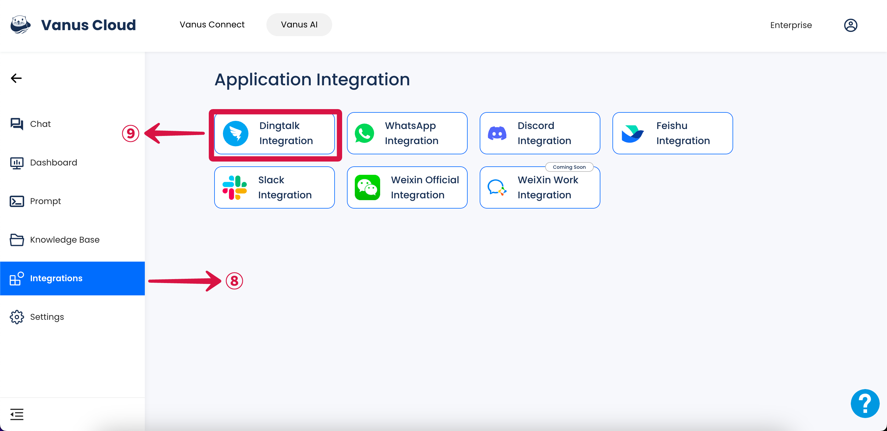

### Step 2: Create a DingTalk App

- Visit the following website [**DingTalk Open Platform**](https://open-dev.dingtalk.com) 
1. Click on **Application development**①.

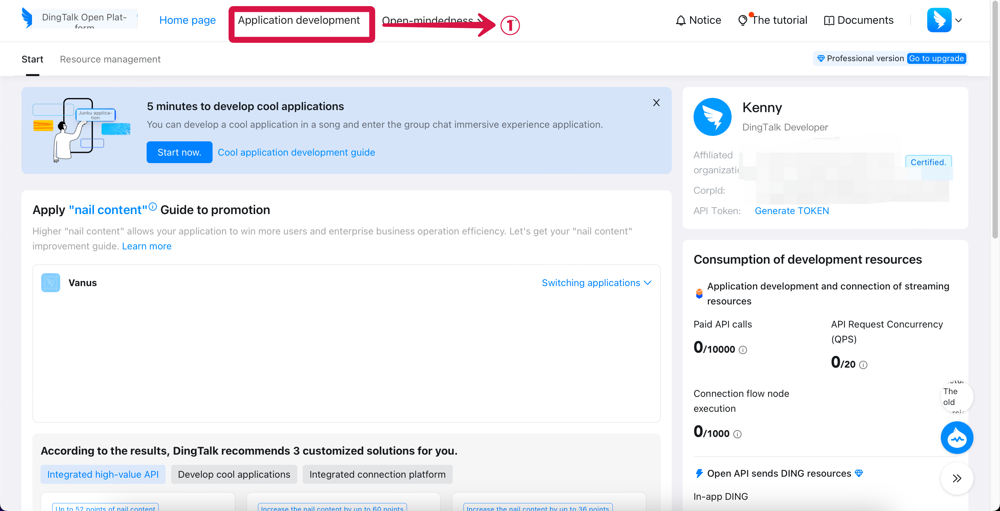

2. Click on **Create an application**②.

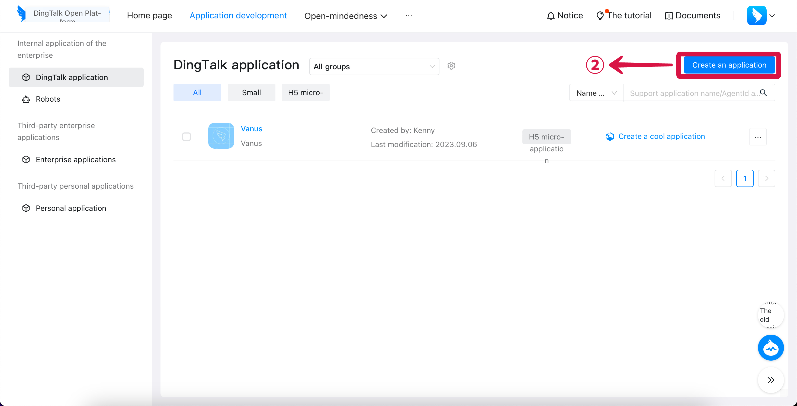

3. Under the Application certificate, copy the **AppKey**③ and **AppSecret**④.

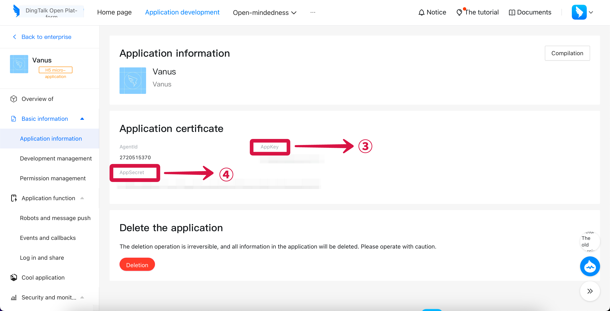

4. Switch to Vanus AI, paste **AppKey**⑤ and **AppSecret**⑥ into each field.

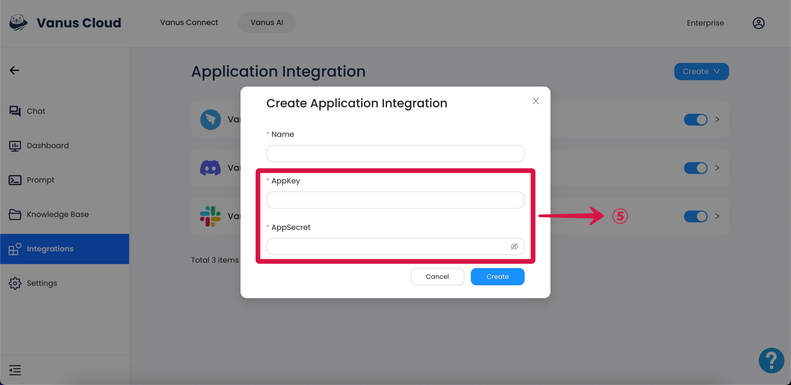

5. Now back to the DingTalk Open Platform, turn on the **Robot configuration**⑥.

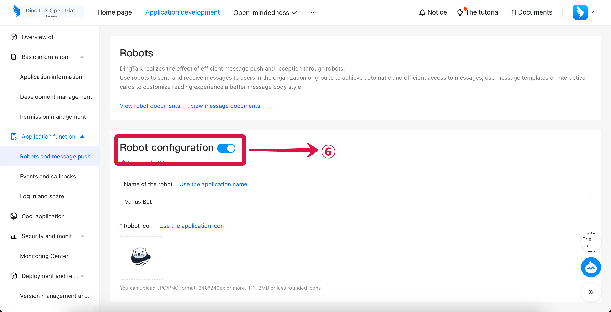

6. Keep the **Stream mode**⑦ and publish.

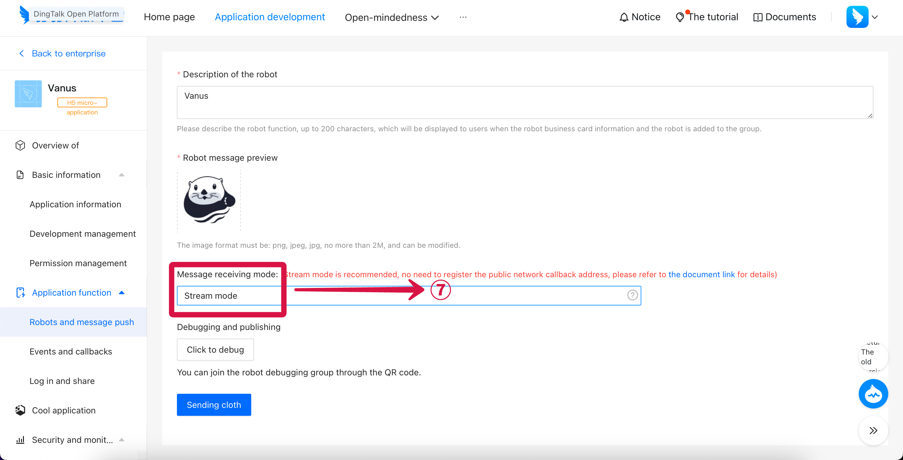

7. Move to the Version Management and release, click the **Confirm the release**⑧.

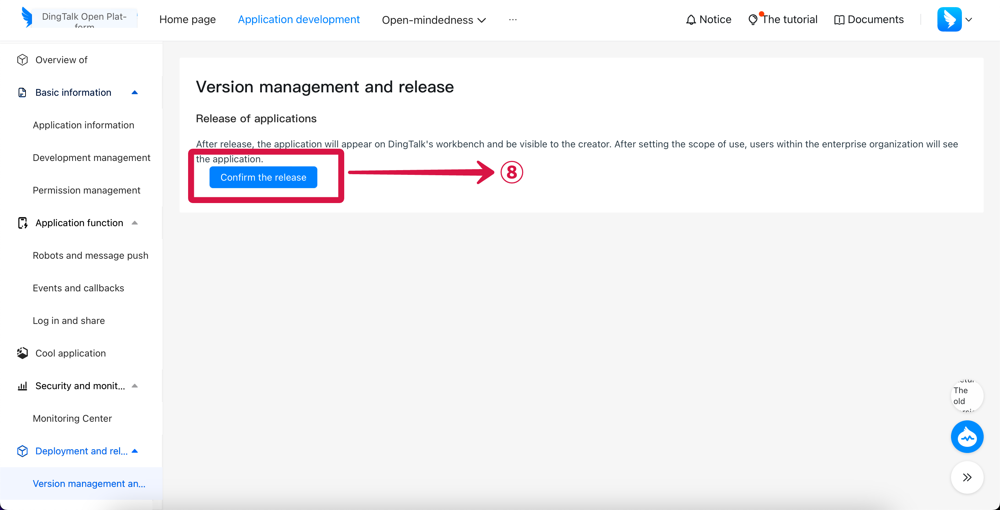

### Step 3: Invite DingTalk Bot

1.  Open the group settings and click the **bot**① under Group Management.

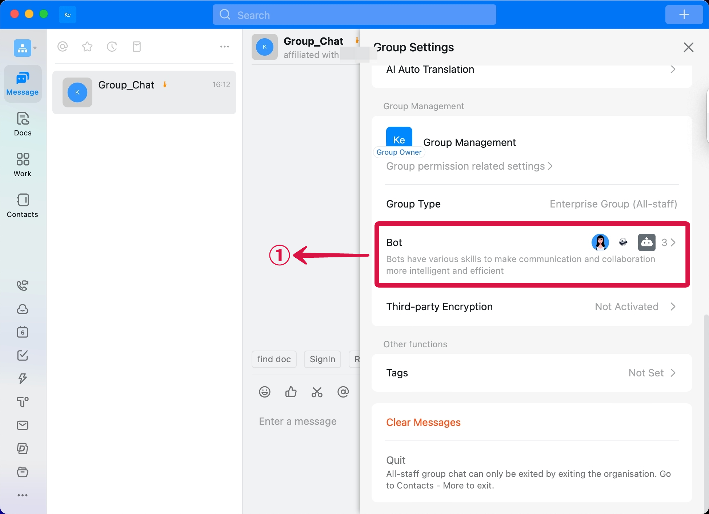

2. Choose the **Bot**② under the Robot Management.

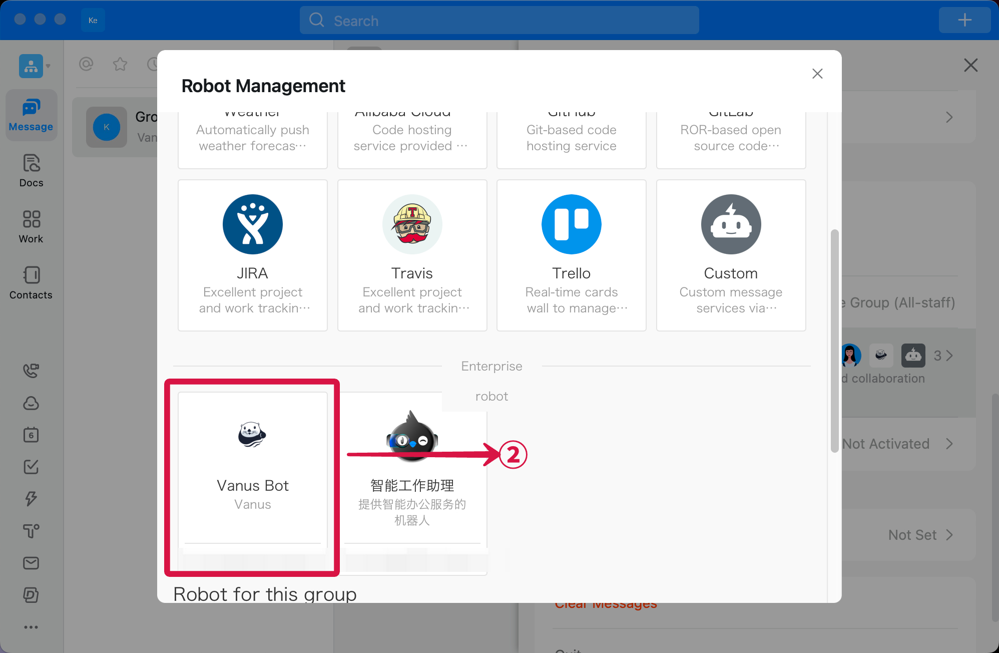

3. Click the **add**③.

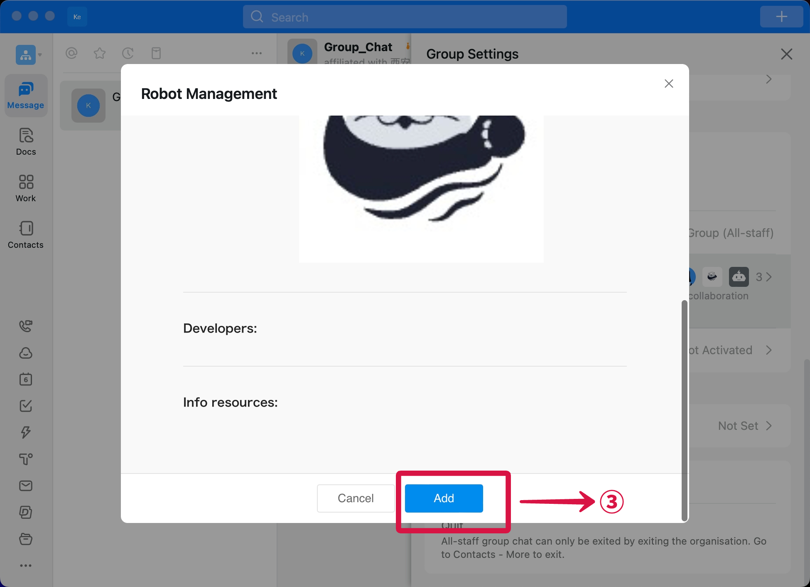

4. Now you can chat with the AI bot, enjoy!

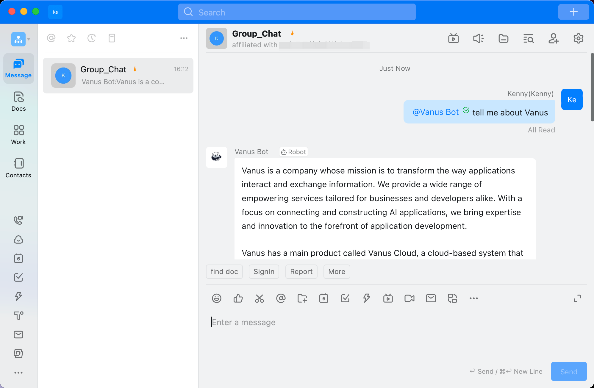
