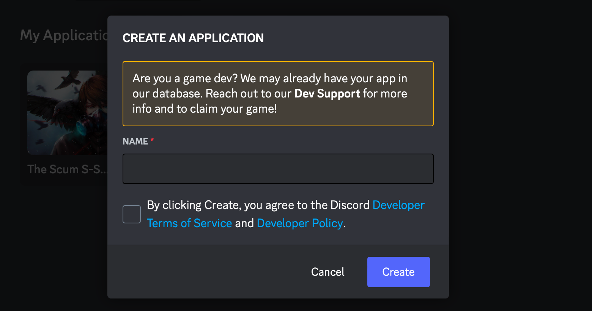
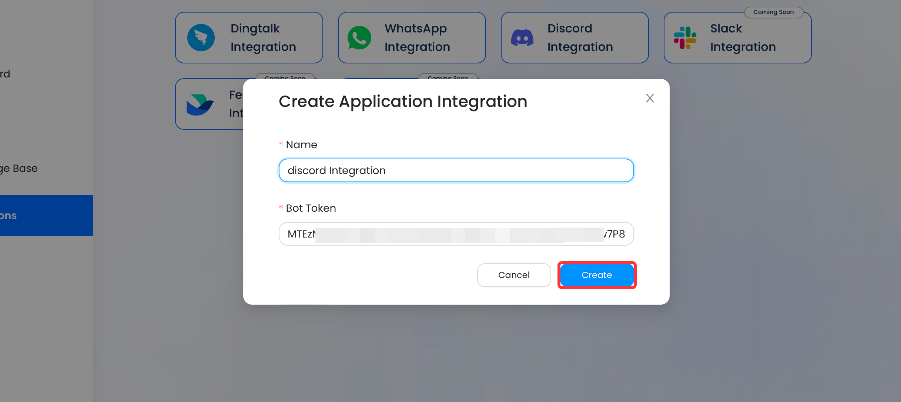

# Discord
This documentation will teach you how to integrate your AI into Discord.
Integration is a paid user feature. Therefore, only users with professional subscriptions and above can use integrations.

## How to Setup a Discord Integration

**Prerequisites:**

- Have a [Discord account](https://discord.com).
- Have a [Vanus AI account](https://ai.vanus.ai).

### Step 1: Create an AI Application
1. Navigate to [Vanus AI](https://ai.vanus.ai) and log in.
2. Initiate a new AI App by hitting the **Create App** button.
   
3. Input a name, select the model, upload to the knowledge base, then click **Create**.
   
4. Direct yourself to the **Integration** tab and select the Discord integration.
   

### Step 2: Establish a Discord Channel
1. Access the Discord App or Webpage at [Discord](https://discord.com)
2. After signing in, you can press the **`+`** button to establish a new channel.
   
3. Hit **Create my own** and finalize the creation of your channel.

### Step 3: Develop a Discord Application
1. Go to [Discord Developer Portal](https://discord.com/developers/applications)
2. Press **New Application**.
   
3. Assign a name to your bot, agree to the terms and conditions, then hit **Create**.
   
4. From the side menu, select **bot**, and under Privileged Gateway Intents, enable **MESSAGE CONTENT INTENT**.
   
5. Press **Reset token** and **Copy**.
   
6. Return to Vanus AI, paste the token, name the integration, and hit **Create**.
   
7. Finally, to add an AI bot to a channel, return to the application within the developer portal.
8. In the sidemenu, find 0Auth2 and URL Generator.
   
9. Choose bot under scopes.

10. Under Bot Permission (ReadMessages/ViewChannel, Send Messages, Mention Everyone, Use External Emojis, Send TTS Messages, Send Messages In threads, Create public, threads Create private threads) or Administrator.
    
11. Copy the URL and open it in a new tab.
    
12. Choose your Server and press **Continue**.
    

### Communicate with the AI.

- To Send a message in a channel, you need to mention the AI.

**Important:** Please be aware that each bot carries a role with a similar name, and trying to mention the role will not yield any results.

- To send a message privately, you can click on the AI bot.

