# Slack
This documentation will teach you how to integrate your AI into Slack.
Integration is a paid user feature. Therefore, only users with professional subscriptions and above can use integrations.

## How to Setup a Slack Integration

**Prerequisites:**

- Have a [Slack Account](https://slack.com).
- Have a [Vanus AI account](https://ai.vanus.ai).

### Step 1: Create an AI Application
1. Navigate to [Vanus AI](https://ai.vanus.ai) and log in.
2. Initiate a new AI App by hitting the **Create App** button.
   
3. Input a name, select the model, upload to the knowledge base, then click **Create**.
   
4. Select the **Integrations** tab and select the Slack integration.
   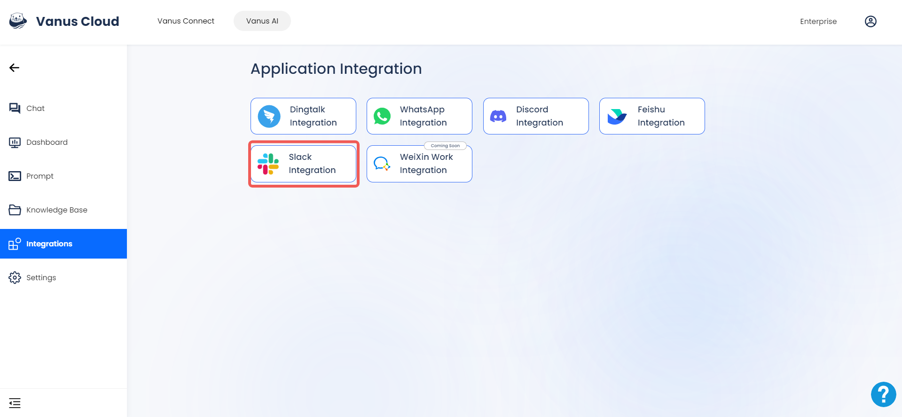
   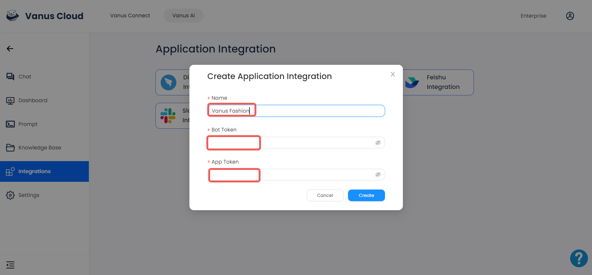

In the next steps, we will go to Slack API website to create our Slack App and get the required credentials to make the connection.

### Step 2: Create a Slack App
1. Go to [Slack API](https://api.slack.com/apps), and click **Create New App**.

2. Select From scratch.

3. Set the App name and Workspace, then click the *Create App* button.
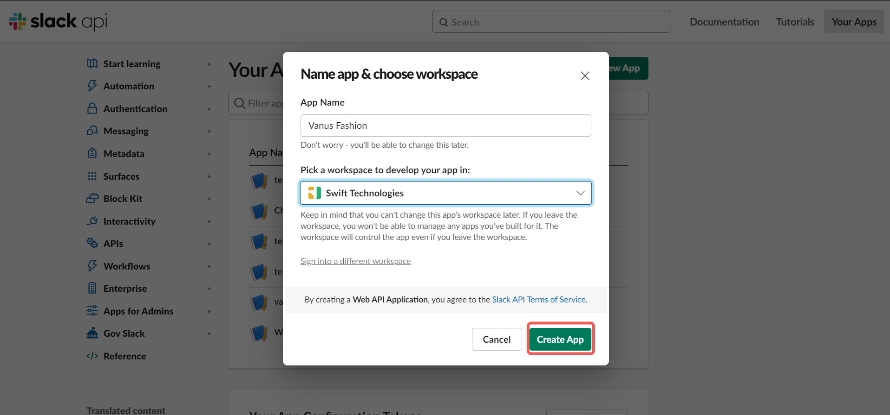

### Step 3: Configure your App
1. Add **Permissions** feature for your app.
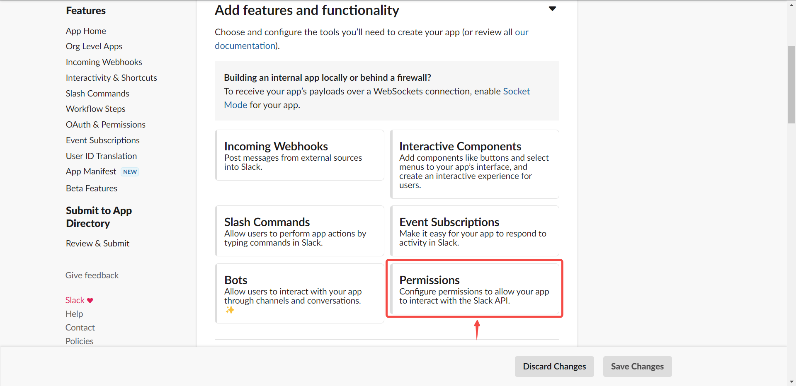
2. Scroll down to `Scopes/Bot Token Scopes`, and click **Add an OAuth Scope**.

3. Add `chat:write`, `chat:write:public`, `app_mentions:read` & `im:history` permission to your app.
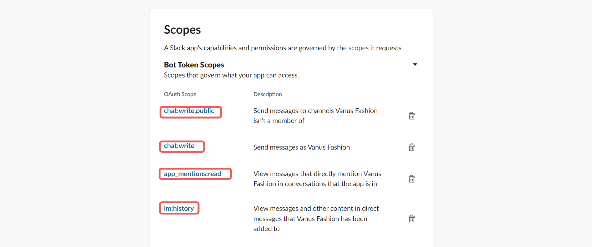
4. Scroll up to the top of the page, and click **Install to Workspace** to install your app.

5. Click **Allow** to install the app.
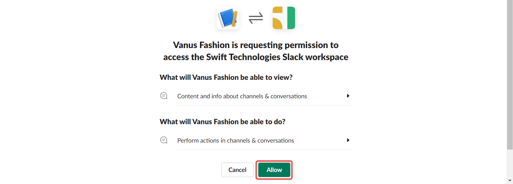
6. Copy the Bot User OAuth Token.
 
7. Paste the Bot User OAuth Token in the `Bot Token` field in Vanus AI
 
8. Click on the **Basic Information** tab, scroll down to **App-Level Tokens** and click on *Generate Tokens and Scopes*
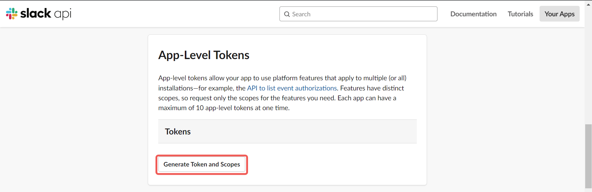
9. Give the token a name and click on the `Add Scope` button
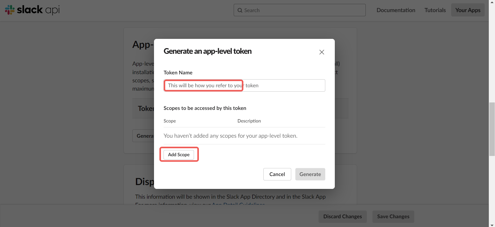
10. Select `connections:write` and click on the **Generate** button.
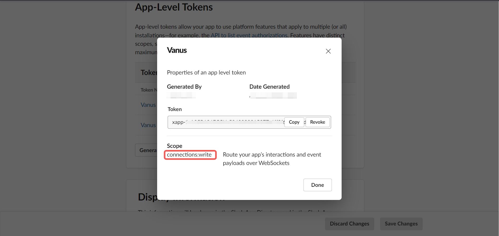
11. Copy the App-Level Tokens and paste in the `App Token` field in Vanus AI and click on the **Create** button

12. Scroll up to **Socket Mode** tab and enable Socket Mode

13. Scroll down to **Event Subscriptions** tab, enable Event Subscription

14. Click on Subscribe to bot events, click on the **Add Bot User Event** and add `app_mention` & `message.im`. Click on **Save Changes** button.
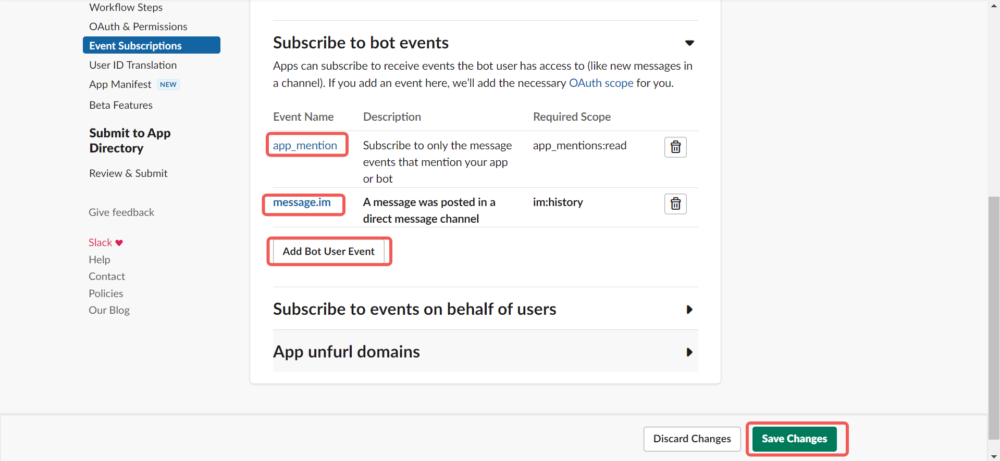

### Communicate with the AI.

- To communicate with the AI in a channel, you need to mention the AI using the `@` and the AI name, then ask your question.
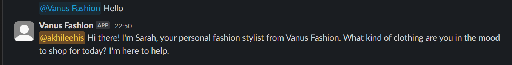

