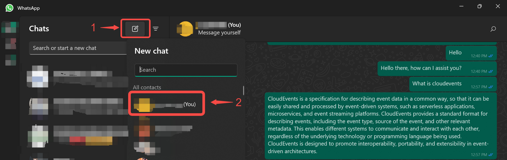
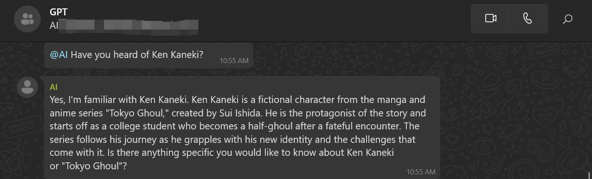

# WhatsApp Integration
This documentation will teach you how to integrate an AI into WhatsApp.
Integration is a paid user feature. Therefore, only users with subscriptions or 14 days trials can use this feature.

## How to Setup a WhatsApp Integration

### Step 1: Create an AI Application
1. Go to [Vanus AI](https://ai.vanus.ai) and sign in.
2. Create a new AI App by clicking **Create App** button.

3. Enter a name, the model, upload to the knowledge base, and click **Create**.

4. Go to the **Integration** tab and click on the WhatsApp integration.

### Step 2: Link WhatsApp to Vanus AI

1. Write a connection name without any spaces.
2. Click `Authorize` to authorize Vanus to establish a connection with your WhatsApp account.
3. Scan the QR Code with your mobile WhatsApp.
4. Click on the `Create` button after successful authorisation

### Step 3: Using Your AI on WhatsApp
The AI you have created can be used on WhatsApp using an Android device, an iOS device, WhatsApp Web, and WhatsApp Desktop.

#### WhatsApp Mobile (Android)
On WhatsApp Android, do the following:

- Click on the `Chat` icon at the bottom-right corner to open the contact list.

- In the contact list, click on the contact with your profile display. It is usually identified as the first contact on the list and also has the word `You` attached to it.

- Simply type a message or ask a question and you will get a response.

#### WhatsApp Mobile (iOS)
On WhatsApp iOS, do the following:

- Click on the `Chats` icon at the bottom menu to open the contact list.

- In the contact list, click on the contact with your profile display. It is usually identified as the first contact on the list and also has the word `You` attached to it.

- Simply type a message or ask a question and you will get a response.

#### WhatsApp Desktop & WhatsApp Web
- On WhatsApp Desktop/Web, The contact button show the users contact list. The Contact button has been identified with the number `1` in the screenshot. Click on the button and a list of all your contacts will be displayed. Select the one with your contact profile, it has been identified with the number `2` and also has the word `You`. This way, you chat with your AI by chatting with yourself.

- Simply type any question you like to ask, the AI will respond to you on the chat.

#### Using your AI in a Group

Your AI can be used on WhatsApp Groups by tagging the contact used to make the connection on Vanus AI. To tag the contact, use the `@` symbol.

